# BÁO CÁO BÀI TẬP LỚN: KIẾN TRÚC PHẦN MỀM

## Hệ thống Quản lý Nhà hàng Thông minh (Intelligent Restaurant Management System - IRMS)

---

# TASK 1: THIẾT KẾ KIẾN TRÚC PHẦN MỀM

## 1. Mô tả chi tiết ngữ cảnh hệ thống IRMS

### 1.1. Giới thiệu tổng quan

Hệ thống Quản lý Nhà hàng Thông minh (IRMS - Intelligent Restaurant Management System) là một ứng dụng phần mềm được thiết kế nhằm tối ưu hóa và tự động hóa các hoạt động cốt lõi của nhà hàng. Hệ thống dựa trên giao diện số hóa, cơ sở dữ liệu dùng chung và logic xử lý bằng phần mềm để quản lý các hoạt động như: duyệt thực đơn, đặt món, quy trình chuẩn bị thức ăn, quản lý trạng thái bàn và cập nhật tồn kho.

IRMS đóng vai trò là xương sống kỹ thuật số trung tâm, hỗ trợ vận hành nhà hàng một cách nhất quán trên nhiều mô hình dịch vụ khác nhau.

### 1.2. Mục tiêu của hệ thống

- **Tối ưu hóa quy trình vận hành**: Đảm bảo sự phối hợp trơn tru giữa nhân viên phục vụ (front-of-house), đội ngũ bếp (kitchen teams) và ban quản lý.
- **Nâng cao hiệu quả phục vụ**: Giảm thiểu độ trễ và lỗi trong quá trình đặt món và phục vụ.
- **Hỗ trợ quy trình làm việc động**: Thích ứng với các điều kiện phục vụ khác nhau như giờ cao điểm hoặc đơn hàng nhóm lớn.
- **Cung cấp công cụ quản lý**: Theo dõi chỉ số hiệu suất, lên lịch nhân viên, cập nhật thực đơn và phân tích xu hướng doanh thu.

### 1.3. Phạm vi hệ thống (Scope)

#### 1.3.1. Đặt món số & Quản lý thực đơn (Digital Ordering & Menu Management)

- Nhân viên sử dụng máy tính bảng hoặc thiết bị đầu cuối để nhận đơn nhanh chóng và chính xác.
- Thực đơn có thể được cập nhật theo thời gian thực (ví dụ: đánh dấu món hết).
- Đơn hàng bao gồm hướng dẫn đặc biệt, ghi chú dị ứng, lựa chọn combo và tùy chỉnh.

#### 1.3.2. Hiển thị đơn bếp & Điều phối quy trình (Kitchen Order Display & Workflow Coordination)

- Đơn hàng được tự động chuyển từ thiết bị đầu cuối sang Hệ thống Hiển thị Bếp (KDS - Kitchen Display System).
- KDS tổ chức đơn theo thời gian chuẩn bị, loại món và trạm làm việc (nướng, chiên, tráng miệng).
- Cảnh báo trực quan thông báo cho đầu bếp khi món sắp đến hạn hoặc có đơn mới.
- Nhân viên bếp có thể cập nhật tiến độ (Đã bắt đầu, Đang nấu, Sẵn sàng phục vụ).

#### 1.3.3. Quản lý bàn & Đặt chỗ (Table & Reservation Management)

- Quản lý sơ đồ chỗ ngồi số hóa, theo dõi bàn trống/đang sử dụng, ước tính thời gian chờ.
- Nhân viên có thể giám sát trạng thái đơn hàng, thời gian phục vụ và trạng thái thanh toán của từng bàn.
- Module đặt chỗ hỗ trợ đặt lịch, danh sách chờ và thông báo cho khách hàng.

#### 1.3.4. Thanh toán & Hóa đơn (Billing, Payments & Receipts)

- Tích hợp hóa đơn bao gồm thức ăn, đồ uống, phí dịch vụ và khuyến mãi.
- Hỗ trợ thanh toán qua tiền mặt, thẻ hoặc ví điện tử.
- Cung cấp tùy chọn chia hóa đơn và quản lý tiền tip.

#### 1.3.5. Giám sát tồn kho (Inventory Monitoring)

- Nhân viên cập nhật thủ công việc sử dụng nguyên liệu sau khi chuẩn bị hoặc phục vụ.
- Cảnh báo khi tồn kho dưới ngưỡng đã định.
- Lịch sử sử dụng giúp dự đoán số lượng đặt hàng lại và quản lý lãng phí.

#### 1.3.6. Phân tích & Báo cáo (Analytics & Reports)

- Báo cáo doanh thu hiển thị giờ cao điểm, món bán chạy và hiệu suất doanh thu.
- Phân tích vận hành làm nổi bật độ trễ, nút thắt cổ chai trong bếp và hiệu suất nhân viên.
- Quản lý có thể xuất báo cáo cho kế toán, lập kế hoạch hoặc đánh giá hiệu suất.

#### 1.3.7. Công cụ quản trị (Administrative Tools)

- Kiểm soát truy cập dựa trên vai trò (Role-based access control) cho quản lý, nhân viên phục vụ, đầu bếp và thu ngân.
- Cấu hình thực đơn, cập nhật giá và quản lý chiến dịch khuyến mãi tập trung.
- Nhật ký kiểm toán (Audit logs) theo dõi các hành động quan trọng như hoàn tiền hoặc hủy đơn.

### 1.4. Yêu cầu chức năng (Functional Requirements)

| ID   | Yêu cầu chức năng      | Mô tả                                                           |
| ---- | ---------------------- | --------------------------------------------------------------- |
| FR01 | Quản lý đơn hàng       | Tạo, sửa, hủy đơn hàng với các tùy chỉnh và ghi chú đặc biệt    |
| FR02 | Quản lý thực đơn       | Thêm, sửa, xóa món; cập nhật giá; đánh dấu món hết              |
| FR03 | Hiển thị đơn bếp (KDS) | Hiển thị đơn hàng theo thứ tự ưu tiên, trạm làm việc và tiến độ |
| FR04 | Quản lý bàn            | Theo dõi trạng thái bàn, gán khách, ước tính thời gian          |
| FR05 | Đặt chỗ trước          | Cho phép đặt bàn trước, quản lý danh sách chờ                   |
| FR06 | Thanh toán             | Xử lý thanh toán đa phương thức, chia hóa đơn, quản lý tip      |
| FR07 | Quản lý tồn kho        | Cập nhật tồn kho, cảnh báo ngưỡng, theo dõi sử dụng             |
| FR08 | Báo cáo & Phân tích    | Tạo báo cáo doanh thu, hiệu suất vận hành                       |
| FR09 | Quản lý người dùng     | Phân quyền theo vai trò, xác thực người dùng                    |
| FR10 | Nhật ký kiểm toán      | Ghi lại các hành động quan trọng trong hệ thống                 |

### 1.5. Yêu cầu phi chức năng (Non-functional Requirements / Architecture Characteristics)

Dựa trên việc phân tích ngữ cảnh domain và các yêu cầu của hệ thống IRMS, các đặc tính kiến trúc (Architecture Characteristics) quan trọng được xác định như sau:

#### 1.5.1. Đặc tính vận hành (Operational Characteristics)

| Đặc tính                           | Mức độ     | Lý do                                                                            |
| ---------------------------------- | ---------- | -------------------------------------------------------------------------------- |
| **Availability (Khả dụng)**        | Cao        | Nhà hàng hoạt động liên tục; hệ thống không được downtime trong giờ phục vụ      |
| **Performance (Hiệu năng)**        | Cao        | Yêu cầu phản hồi thời gian thực cho KDS và đặt món; giờ cao điểm cần xử lý nhanh |
| **Reliability (Độ tin cậy)**       | Cao        | Đơn hàng và thanh toán không được mất mát hoặc sai lệch                          |
| **Scalability (Khả năng mở rộng)** | Trung bình | Hỗ trợ mở rộng khi nhà hàng phát triển hoặc có chuỗi                             |

#### 1.5.2. Đặc tính cấu trúc (Structural Characteristics)

| Đặc tính                               | Mức độ | Lý do                                                      |
| -------------------------------------- | ------ | ---------------------------------------------------------- |
| **Maintainability (Khả năng bảo trì)** | Cao    | Thực đơn, giá cả, quy trình thay đổi thường xuyên          |
| **Modularity (Tính mô-đun)**           | Cao    | Các module độc lập: đặt món, bếp, thanh toán, tồn kho      |
| **Extensibility (Khả năng mở rộng)**   | Cao    | Cần dễ dàng thêm tính năng mới (delivery, loyalty program) |
| **Testability (Khả năng kiểm thử)**    | Cao    | Cần kiểm thử độc lập từng module nghiệp vụ                 |

#### 1.5.3. Đặc tính xuyên suốt (Cross-cutting Characteristics)

| Đặc tính                              | Mức độ         | Lý do                                                      |
| ------------------------------------- | -------------- | ---------------------------------------------------------- |
| **Security (Bảo mật)**                | Cao            | Xử lý thanh toán, dữ liệu khách hàng, phân quyền nhân viên |
| **Usability (Tính dễ sử dụng)**       | Cao            | Nhân viên cần thao tác nhanh, giao diện trực quan          |
| **Auditability (Khả năng kiểm toán)** | Trung bình-Cao | Cần theo dõi hoàn tiền, hủy đơn, thay đổi giá              |

### 1.6. Các bên liên quan (Stakeholders)

Dưới đây là danh sách các bên liên quan cùng với vai trò và mối quan tâm chính (key concerns) đối với hệ thống ITS (Intelligent Restaurant Management System - IRMS):

1. **Nhân viên phục vụ (Servers)**
   - **Vai trò:** Người dùng trực tiếp thao tác ghi nhận đơn hàng (order), phục vụ món ăn và quản lý trạng thái khách tại bàn.
   - **Mối quan tâm chính (Key concerns):** Giao diện thao tác phải nhanh, ổn định, phản hồi tức thì để không để khách chờ lâu; theo dõi dễ dàng trạng thái món ăn đang được chế biến dưới bếp.
2. **Tiếp tân (Hosts)**
   - **Vai trò:** Chào đón khách, quản lý danh sách đặt chỗ trước, danh sách chờ và phân bổ bàn hợp lý.
   - **Mối quan tâm chính:** Nắm bắt chính xác trạng thái bàn theo thời gian thực (trống, đang dùng bữa, sắp dọn); hệ thống ước lượng thời gian chờ chính xác cho khách vãng lai.
3. **Đầu bếp và Nhân viên bếp (Kitchen Staff)**
   - **Vai trò:** Tiếp nhận đơn hàng qua hệ thống hiển thị bếp (KDS), chế biến và cập nhật tiến độ món ăn.
   - **Mối quan tâm chính:** Màn hình hiển thị (KDS) phải trực quan, dễ đọc, tự động phân loại và sắp xếp thứ tự ưu tiên chuẩn xác; có cảnh báo rõ ràng khi món ăn sắp trễ hoặc có lưu ý dị ứng quan trọng.
4. **Thu ngân (Cashiers)**
   - **Vai trò:** Phụ trách khâu thanh toán, xuất hóa đơn, áp dụng khuyến mãi và xử lý các vấn đề tài chính.
   - **Mối quan tâm chính:** Tính toán số tiền, thuế, phí, tiền tip, và chia hóa đơn (split-bill) chính xác tuyệt đối; hỗ trợ thanh toán đa nền tảng nhanh gọn và an toàn.
5. **Quản lý nhà hàng / Quản trị viên (Managers/Administrators)**
   - **Vai trò:** Người điều hành tổng thể, thiết lập hệ thống, phân quyền nhân viên và đánh giá kết quả kinh doanh.
   - **Mối quan tâm chính:** Số liệu báo cáo thống kê trực quan (doanh thu, hàng tồn kho); nắm được nút thắt cổ chai trong quy trình vận hành; hệ thống bảo mật tốt và có nhật ký kiểm toán (audit logs) để ngăn chặn gian lận.
6. **Khách hàng (Customers)**
   - **Vai trò:** Người trực tiếp trải nghiệm dịch vụ của nhà hàng và nhận giá trị từ hệ thống (có thể tương tác gián tiếp qua thông báo SMS/Email).
   - **Mối quan tâm chính:** Trải nghiệm đặt bàn suôn sẻ; yêu cầu cá nhân (ghi chú dị ứng, tùy chỉnh món) được bếp thực hiện chuẩn xác; thời gian phục vụ nhanh và thanh toán minh bạch.
7. **Đội ngũ kỹ thuật (IT Support/Maintenance Team)**
   - **Vai trò:** Triển khai, duy trì, nâng cấp hệ thống phần mềm và phần cứng tại nhà hàng.
   - **Mối quan tâm chính:** Hệ thống dễ dàng bảo trì (Maintainability), ghi nhận lỗi (error logs) rõ ràng, và có khả năng mở rộng (Scalability) khi nhà hàng tăng quy mô.

### 1.7. Các ca sử dụng (Use Cases)

Dưới đây là 30 Use Cases thiết yếu của hệ thống, bám sát các module nghiệp vụ được định nghĩa trong đặc tả. Danh sách được nhóm theo từng Actor (Tác nhân) để đảm bảo không bị lặp ý và thể hiện rõ quyền hạn:

**Nhóm 1: Nhân viên phục vụ (Servers)**

1. Tên Use Case: Xem sơ đồ bàn để nhận biết bàn trống và bàn đang có khách.
2. Tên Use Case: Ghi nhận đơn đặt món (Order) mới từ khách hàng.
3. Tên Use Case: Ghi chú các yêu cầu tùy chỉnh hoặc thông tin dị ứng thực phẩm vào đơn hàng.
4. Tên Use Case: Điều chỉnh hoặc hủy món ăn trong đơn hàng khi bếp chưa bắt đầu chế biến.
5. Tên Use Case: Gửi yêu cầu chuẩn bị món ăn xuống hệ thống hiển thị bếp (KDS).
6. Tên Use Case: Theo dõi trạng thái tiến độ chuẩn bị món ăn của từng bàn.
7. Tên Use Case: Cập nhật trạng thái "Đã phục vụ" sau khi mang món ăn lên cho khách.

**Nhóm 2: Tiếp tân (Hosts)** 8. Tên Use Case: Quản lý danh sách đặt bàn trước của khách hàng. 9. Tên Use Case: Ghi nhận thông tin khách hàng vào danh sách chờ (Waitlist). 10. Tên Use Case: Xếp bàn cho khách dựa trên số lượng người và tình trạng bàn thực tế. 11. Tên Use Case: Gửi thông báo đến khách hàng khi bàn của họ đã sẵn sàng. 12. Tên Use Case: Cập nhật thời gian chờ dự kiến cho các khách hàng đang trong danh sách chờ.

**Nhóm 3: Đầu bếp (Kitchen Staff)** 13. Tên Use Case: Xem danh sách các món cần chế biến trên hệ thống Hiển thị Bếp (KDS). 14. Tên Use Case: Xem chi tiết các ghi chú dị ứng hoặc tùy chỉnh của từng món ăn. 15. Tên Use Case: Xác nhận trạng thái "Bắt đầu chế biến" (Cooking) cho một món. 16. Tên Use Case: Đánh dấu món ăn đã hoàn tất và "Sẵn sàng phục vụ" (Ready to Serve). 17. Tên Use Case: Xem cảnh báo các món ăn sắp trễ thời gian phục vụ quy định. 18. Tên Use Case: Cập nhật thủ công số lượng nguyên liệu đã sử dụng sau khi nấu xong.

**Nhóm 4: Thu ngân (Cashiers)** 19. Tên Use Case: Xuất hóa đơn tổng hợp phí thức ăn, đồ uống và các phụ phí. 20. Tên Use Case: Áp dụng mã khuyến mãi hoặc chương trình giảm giá vào hóa đơn. 21. Tên Use Case: Thực hiện chia hóa đơn (Split-bill) theo yêu cầu của khách hàng. 22. Tên Use Case: Xử lý thanh toán qua tiền mặt, thẻ ngân hàng hoặc ví điện tử. 23. Tên Use Case: Ghi nhận số tiền tip của khách hàng vào hệ thống thanh toán.

**Nhóm 5: Quản lý (Managers)** 24. Tên Use Case: Thêm, sửa, xóa các món ăn trong thực đơn và cấu hình giá bán. 25. Tên Use Case: Đánh dấu món ăn "hết hàng" trên thực đơn theo thời gian thực. 26. Tên Use Case: Theo dõi cảnh báo hàng tồn kho khi mức nguyên liệu xuống dưới ngưỡng an toàn. 27. Tên Use Case: Xem báo cáo phân tích doanh thu theo giờ cao điểm và món bán chạy. 28. Tên Use Case: Phân tích đánh giá hiệu suất nhân viên và độ trễ phục vụ tại bếp. 29. Tên Use Case: Phân quyền và cấp tài khoản truy cập cho từng vai trò nhân sự. 30. Tên Use Case: Truy xuất nhật ký kiểm toán (Audit Logs) để rà soát các thao tác hủy đơn và hoàn tiền.

### 1.8. Đặc tả Use Case Scenario (Phần 1: UC 1-5)

#### Use Case 1: Xem sơ đồ bàn để nhận biết bàn trống và bàn đang có khách

| Thuộc tính                                       | Chi tiết                                                                                                                                                                                                                                                                                                                                                                                      |
| ------------------------------------------------ | --------------------------------------------------------------------------------------------------------------------------------------------------------------------------------------------------------------------------------------------------------------------------------------------------------------------------------------------------------------------------------------------- |
| **Tên Use Case**                                 | UC01. Xem sơ đồ bàn để nhận biết bàn trống và bàn đang có khách                                                                                                                                                                                                                                                                                                                               |
| **Actor chính**                                  | Nhân viên phục vụ (Server)                                                                                                                                                                                                                                                                                                                                                                    |
| **Mục đích**                                     | Giúp nhân viên phục vụ nắm bắt tình trạng các bàn trong nhà hàng (trống, đang phục vụ, chờ dọn dẹp) để hướng dẫn khách hoặc theo dõi tiến độ.                                                                                                                                                                                                                                                 |
| **Tiền điều kiện (Preconditions)**               | Nhân viên đã đăng nhập vào hệ thống (ứng dụng POS trên máy tính bảng hoặc thiết bị di động).                                                                                                                                                                                                                                                                                                  |
| **Hậu điều kiện (Postconditions)**               | Nhân viên xác định được trạng thái thực tế của các bàn.                                                                                                                                                                                                                                                                                                                                       |
| **Luồng sự kiện chính (Main Flow)**              | 1. Nhân viên chọn chức năng "Sơ đồ bàn" (Floor Plan) trên màn hình chính.<br>2. Hệ thống truy xuất dữ liệu trạng thái bàn từ cơ sở dữ liệu.<br>3. Hệ thống hiển thị sơ đồ trực quan, sử dụng màu sắc để phân biệt (ví dụ: xanh = trống, đỏ = đang có khách, vàng = chờ dọn).<br>4. Nhân viên xem thông tin, có thể chạm vào một bàn để xem chi tiết (thời gian đã ngồi, nhân viên phụ trách). |
| **Luồng ngoại lệ (Alternative/Exception Flows)** | 1a. **Lỗi kết nối mạng:**<br>- Hệ thống hiển thị thông báo "Không thể tải sơ đồ bàn. Vui lòng kiểm tra lại kết nối".<br>- Hệ thống cung cấp nút "Thử lại".<br>2a. **Bàn không tồn tại (lỗi đồng bộ):**<br>- Nếu nhân viên chọn một bàn vừa bị xóa bởi quản lý, hệ thống thông báo "Bàn không còn tồn tại trên hệ thống" và tự động làm mới sơ đồ.                                             |

#### Use Case 2: Ghi nhận đơn đặt món (Order) mới từ khách hàng

| Thuộc tính                                       | Chi tiết                                                                                                                                                                                                                                                                                                                                                                                                                                                                                    |
| ------------------------------------------------ | ------------------------------------------------------------------------------------------------------------------------------------------------------------------------------------------------------------------------------------------------------------------------------------------------------------------------------------------------------------------------------------------------------------------------------------------------------------------------------------------- |
| **Tên Use Case**                                 | UC02. Ghi nhận đơn đặt món (Order) mới từ khách hàng                                                                                                                                                                                                                                                                                                                                                                                                                                        |
| **Actor chính**                                  | Nhân viên phục vụ (Server)                                                                                                                                                                                                                                                                                                                                                                                                                                                                  |
| **Mục đích**                                     | Tạo một đơn hàng mới ghi nhận các món ăn, thức uống khách hàng yêu cầu tại bàn.                                                                                                                                                                                                                                                                                                                                                                                                             |
| **Tiền điều kiện (Preconditions)**               | Nhân viên đã đăng nhập; bàn đã được gắn trạng thái "Đang có khách" (Occupied).                                                                                                                                                                                                                                                                                                                                                                                                              |
| **Hậu điều kiện (Postconditions)**               | Một đơn hàng mới được tạo thành công và lưu vào hệ thống dưới trạng thái "Đang chọn món" (Draft/Pending).                                                                                                                                                                                                                                                                                                                                                                                   |
| **Luồng sự kiện chính (Main Flow)**              | 1. Nhân viên chọn bàn đang phục vụ trên sơ đồ và nhấn "Tạo đơn hàng".<br>2. Hệ thống hiển thị giao diện thực đơn (Menu) điện tử với các danh mục (Khai vị, Món chính, Đồ uống...).<br>3. Nhân viên lắng nghe khách hàng và bấm chọn các món tương ứng.<br>4. Hệ thống hiển thị danh sách các món đã chọn kèm theo tổng tiền tạm tính.<br>5. Nhân viên xác nhận lại danh sách với khách hàng và nhấn "Lưu đơn hàng".<br>6. Hệ thống lưu trữ đơn hàng và thông báo "Tạo đơn hàng thành công". |
| **Luồng ngoại lệ (Alternative/Exception Flows)** | 3a. **Món ăn đã hết hàng:**<br>- Hệ thống làm mờ (disable) nút chọn món và hiển thị nhãn "Hết hàng". Nhân viên thông báo để khách đổi món khác.<br>5a. **Khách hàng đổi ý hủy toàn bộ:**<br>- Nhân viên nhấn "Hủy đơn đang tạo". Hệ thống xóa dữ liệu tạm và quay về màn hình sơ đồ bàn.                                                                                                                                                                                                    |

#### Use Case 3: Ghi chú các yêu cầu tùy chỉnh hoặc thông tin dị ứng thực phẩm vào đơn hàng

| Thuộc tính                                       | Chi tiết                                                                                                                                                                                                                                                                                                                                                                                                                                                     |
| ------------------------------------------------ | ------------------------------------------------------------------------------------------------------------------------------------------------------------------------------------------------------------------------------------------------------------------------------------------------------------------------------------------------------------------------------------------------------------------------------------------------------------ |
| **Tên Use Case**                                 | UC03. Ghi chú các yêu cầu tùy chỉnh hoặc thông tin dị ứng thực phẩm vào đơn hàng                                                                                                                                                                                                                                                                                                                                                                             |
| **Actor chính**                                  | Nhân viên phục vụ (Server)                                                                                                                                                                                                                                                                                                                                                                                                                                   |
| **Mục đích**                                     | Bổ sung các thông tin quan trọng (như không hành, ít cay, dị ứng đậu phộng) vào một món ăn cụ thể trong đơn.                                                                                                                                                                                                                                                                                                                                                 |
| **Tiền điều kiện (Preconditions)**               | Đơn hàng đang ở trạng thái chưa được gửi xuống bếp; món ăn đã được chọn vào danh sách đặt món.                                                                                                                                                                                                                                                                                                                                                               |
| **Hậu điều kiện (Postconditions)**               | Ghi chú được đính kèm vào món ăn tương ứng và sẵn sàng để truyền xuống bếp.                                                                                                                                                                                                                                                                                                                                                                                  |
| **Luồng sự kiện chính (Main Flow)**              | 1. Tại màn hình danh sách món đã chọn, nhân viên chọn một món ăn cụ thể cần ghi chú.<br>2. Hệ thống hiển thị popup với các tùy chọn sửa đổi (modifiers) mặc định (ví dụ: Mức độ cay, Kích cỡ) và một ô nhập văn bản tự do.<br>3. Nhân viên tick chọn các modifier hoặc gõ tay ghi chú dị ứng (ví dụ: "Dị ứng đậu phộng").<br>4. Nhân viên nhấn "Xác nhận".<br>5. Hệ thống cập nhật chi tiết món ăn, hiển thị ghi chú bằng chữ màu nổi bật ngay dưới tên món. |
| **Luồng ngoại lệ (Alternative/Exception Flows)** | 4a. **Nhập ký tự không hợp lệ hoặc quá dài:**<br>- Hệ thống báo lỗi "Ghi chú tối đa 100 ký tự" và yêu cầu nhân viên nhập lại.                                                                                                                                                                                                                                                                                                                                |

#### Use Case 4: Điều chỉnh hoặc hủy món ăn trong đơn hàng khi bếp chưa bắt đầu chế biến

| Thuộc tính                                       | Chi tiết                                                                                                                                                                                                                                                                                                                                                                                                                                                                                       |
| ------------------------------------------------ | ---------------------------------------------------------------------------------------------------------------------------------------------------------------------------------------------------------------------------------------------------------------------------------------------------------------------------------------------------------------------------------------------------------------------------------------------------------------------------------------------- |
| **Tên Use Case**                                 | UC04. Điều chỉnh hoặc hủy món ăn trong đơn hàng khi bếp chưa bắt đầu chế biến                                                                                                                                                                                                                                                                                                                                                                                                                  |
| **Actor chính**                                  | Nhân viên phục vụ (Server)                                                                                                                                                                                                                                                                                                                                                                                                                                                                     |
| **Mục đích**                                     | Thay đổi số lượng hoặc xóa bỏ món ăn nếu khách hàng đổi ý trước khi bếp tiến hành nấu.                                                                                                                                                                                                                                                                                                                                                                                                         |
| **Tiền điều kiện (Preconditions)**               | Đơn hàng đã được tạo; trạng thái của món ăn trên hệ thống phải là "Đang chờ" (Pending) hoặc "Đã tiếp nhận" (Received), CHƯA chuyển sang "Đang chế biến" (Cooking).                                                                                                                                                                                                                                                                                                                             |
| **Hậu điều kiện (Postconditions)**               | Đơn hàng được cập nhật (đổi số lượng hoặc xóa món) và tổng tiền được tính toán lại. Bếp được cập nhật thông tin nếu đơn đã gửi đi.                                                                                                                                                                                                                                                                                                                                                             |
| **Luồng sự kiện chính (Main Flow)**              | 1. Nhân viên mở chi tiết đơn hàng của bàn cần chỉnh sửa.<br>2. Hệ thống kiểm tra và hiển thị trạng thái hiện tại của từng món.<br>3. Nhân viên nhấn nút "-" (giảm số lượng) hoặc nút "Xóa" cạnh món ăn khách muốn hủy.<br>4. Hệ thống kiểm tra trạng thái món ăn: xác nhận món chưa bị bếp nấu.<br>5. Hệ thống xóa/giảm số lượng món, cập nhật lại tổng tiền tạm tính.<br>6. (Nếu đơn đã gửi xuống bếp) Hệ thống tự động gửi thông báo cập nhật lên màn hình KDS để bếp ngừng chuẩn bị món đó. |
| **Luồng ngoại lệ (Alternative/Exception Flows)** | 4a. **Bếp đã bắt đầu chế biến (Cooking):**<br>- Hệ thống từ chối thao tác và hiện thông báo "Món này đã bắt đầu được chế biến. Vui lòng liên hệ Quản lý hoặc Bếp trưởng để hủy thao tác này".<br>- Nhân viên phải tìm cách xử lý thủ công (xin phép quản lý).                                                                                                                                                                                                                                  |

#### Use Case 5: Gửi yêu cầu chuẩn bị món ăn xuống hệ thống hiển thị bếp (KDS)

| Thuộc tính                                       | Chi tiết                                                                                                                                                                                                                                                                                                                                                                                                                                             |
| ------------------------------------------------ | ---------------------------------------------------------------------------------------------------------------------------------------------------------------------------------------------------------------------------------------------------------------------------------------------------------------------------------------------------------------------------------------------------------------------------------------------------- |
| **Tên Use Case**                                 | UC05. Gửi yêu cầu chuẩn bị món ăn xuống hệ thống hiển thị bếp (KDS)                                                                                                                                                                                                                                                                                                                                                                                  |
| **Actor chính**                                  | Nhân viên phục vụ (Server)                                                                                                                                                                                                                                                                                                                                                                                                                           |
| **Mục đích**                                     | Chuyển thông tin các món đã chốt xuống bộ phận bếp để họ bắt đầu chuẩn bị.                                                                                                                                                                                                                                                                                                                                                                           |
| **Tiền điều kiện (Preconditions)**               | Đơn hàng có ít nhất một món; nhân viên và khách đã chốt danh sách; hệ thống KDS đang hoạt động.                                                                                                                                                                                                                                                                                                                                                      |
| **Hậu điều kiện (Postconditions)**               | Các món ăn trong đơn được phân phối đến đúng màn hình trạm bếp (Station) và trạng thái đơn đổi thành "Đã chuyển bếp".                                                                                                                                                                                                                                                                                                                                |
| **Luồng sự kiện chính (Main Flow)**              | 1. Tại màn hình đơn hàng, nhân viên nhấn nút "Gửi Bếp" (Send to Kitchen).<br>2. Hệ thống phân tích danh sách các món ăn (ví dụ: phân loại đồ uống ra quầy Bar, đồ nướng ra trạm Nướng).<br>3. Hệ thống tạo các phiếu nấu (kitchen tickets) số hóa và truyền tới các màn hình KDS tương ứng.<br>4. Hệ thống cập nhật trạng thái đơn hàng trên POS thành "Đã chuyển bếp".<br>5. Màn hình của nhân viên hiển thị thông báo "Đã gửi yêu cầu thành công". |
| **Luồng ngoại lệ (Alternative/Exception Flows)** | 3a. **Hệ thống KDS bị mất kết nối mạng:**<br>- Hệ thống cảnh báo "Không thể kết nối với Bếp. Đơn hàng lưu tạm trạng thái Chờ gửi".<br>- Hệ thống tự động thử gửi lại (retry) ngầm, hoặc in tạm ra máy in dự phòng (nếu có cấu hình).                                                                                                                                                                                                                 |

### 1.9. Đặc tả Use Case Scenario (Phần 2: UC 6-10)

#### Use Case 6: Theo dõi trạng thái tiến độ chuẩn bị món ăn của từng bàn

| Thuộc tính                                       | Chi tiết                                                                                                                                                                                                                                                                                                             |
| ------------------------------------------------ | -------------------------------------------------------------------------------------------------------------------------------------------------------------------------------------------------------------------------------------------------------------------------------------------------------------------- |
| **Tên Use Case**                                 | UC06. Theo dõi trạng thái tiến độ chuẩn bị món ăn của từng bàn                                                                                                                                                                                                                                                       |
| **Actor chính**                                  | Nhân viên phục vụ (Server)                                                                                                                                                                                                                                                                                           |
| **Mục đích**                                     | Cho phép nhân viên biết được tiến độ món ăn dưới bếp (đã làm xong chưa, món nào đang chờ) để phản hồi cho khách khi được hỏi.                                                                                                                                                                                        |
| **Tiền điều kiện (Preconditions)**               | Đơn hàng đã được gửi xuống bếp thành công (Trạng thái: Đã chuyển bếp).                                                                                                                                                                                                                                               |
| **Hậu điều kiện (Postconditions)**               | Nhân viên nhận biết được trạng thái mới nhất của các món ăn.                                                                                                                                                                                                                                                         |
| **Luồng sự kiện chính (Main Flow)**              | 1. Nhân viên chọn bàn cần kiểm tra trên giao diện POS.<br>2. Hệ thống truy vấn trạng thái đồng bộ hóa từ KDS.<br>3. Hệ thống hiển thị danh sách các món ăn của bàn, kèm theo nhãn trạng thái (ví dụ: Chờ chế biến, Đang chế biến, Sẵn sàng phục vụ).<br>4. Nhân viên xem màn hình để nắm thông tin tiến độ tổng thể. |
| **Luồng ngoại lệ (Alternative/Exception Flows)** | 2a. **Bếp chưa cập nhật trạng thái:**<br>- Hệ thống tiếp tục hiển thị trạng thái cũ nhất (Chờ chế biến).<br>2b. **Mất kết nối với KDS:**<br>- Hệ thống hiển thị dòng cảnh báo "Trạng thái có thể không chính xác do mất kết nối với Bếp" cùng thời gian cập nhật lần cuối.                                           |

#### Use Case 7: Cập nhật trạng thái "Đã phục vụ" sau khi mang món ăn lên cho khách

| Thuộc tính                                       | Chi tiết                                                                                                                                                                                                                                                                                                                                                           |
| ------------------------------------------------ | ------------------------------------------------------------------------------------------------------------------------------------------------------------------------------------------------------------------------------------------------------------------------------------------------------------------------------------------------------------------ |
| **Tên Use Case**                                 | UC07. Cập nhật trạng thái "Đã phục vụ" sau khi mang món ăn lên cho khách                                                                                                                                                                                                                                                                                           |
| **Actor chính**                                  | Nhân viên phục vụ (Server)                                                                                                                                                                                                                                                                                                                                         |
| **Mục đích**                                     | Đánh dấu các món đã được giao đến tận bàn cho khách, giúp hoàn tất quy trình phục vụ của một món ăn.                                                                                                                                                                                                                                                               |
| **Tiền điều kiện (Preconditions)**               | Món ăn đã ở trạng thái "Sẵn sàng phục vụ" (Ready to Serve) từ bếp và nhân viên đã mang món ra bàn.                                                                                                                                                                                                                                                                 |
| **Hậu điều kiện (Postconditions)**               | Món ăn được cập nhật thành "Đã phục vụ" (Served), hỗ trợ chính xác cho việc in hóa đơn sau này.                                                                                                                                                                                                                                                                    |
| **Luồng sự kiện chính (Main Flow)**              | 1. Sau khi đặt món xuống bàn, nhân viên mở giao diện đơn hàng của bàn đó trên POS.<br>2. Hệ thống hiển thị các món đang chờ phục vụ.<br>3. Nhân viên đánh dấu tick (hoặc lướt) vào món ăn vừa mang ra.<br>4. Hệ thống cập nhật trạng thái món thành "Đã phục vụ" và lưu vào cơ sở dữ liệu.<br>5. Hệ thống ẩn món ăn đó khỏi danh sách "Cần phục vụ" trên màn hình. |
| **Luồng ngoại lệ (Alternative/Exception Flows)** | 3a. **Đánh dấu nhầm món:**<br>- Nhân viên nhấn nút "Hoàn tác" (Undo) ngay cạnh món ăn vừa đánh dấu. Hệ thống đưa món ăn quay lại trạng thái "Sẵn sàng phục vụ".                                                                                                                                                                                                    |

#### Use Case 8: Quản lý danh sách đặt bàn trước của khách hàng

| Thuộc tính                                       | Chi tiết                                                                                                                                                                                                                                                                                                                                                                                                                                                                           |
| ------------------------------------------------ | ---------------------------------------------------------------------------------------------------------------------------------------------------------------------------------------------------------------------------------------------------------------------------------------------------------------------------------------------------------------------------------------------------------------------------------------------------------------------------------- |
| **Tên Use Case**                                 | UC08. Quản lý danh sách đặt bàn trước của khách hàng                                                                                                                                                                                                                                                                                                                                                                                                                               |
| **Actor chính**                                  | Tiếp tân (Host)                                                                                                                                                                                                                                                                                                                                                                                                                                                                    |
| **Mục đích**                                     | Tạo, sửa, hủy các yêu cầu đặt bàn trước (Reservation) để đảm bảo có đủ chỗ ngồi theo đúng thời gian yêu cầu.                                                                                                                                                                                                                                                                                                                                                                       |
| **Tiền điều kiện (Preconditions)**               | Tiếp tân đã đăng nhập vào module Quản lý Đặt chỗ (Reservation Module).                                                                                                                                                                                                                                                                                                                                                                                                             |
| **Hậu điều kiện (Postconditions)**               | Yêu cầu đặt bàn được cập nhật vào lịch của nhà hàng và bàn được giữ chỗ tương ứng.                                                                                                                                                                                                                                                                                                                                                                                                 |
| **Luồng sự kiện chính (Main Flow)**              | 1. Tiếp tân chọn chức năng "Đặt bàn mới".<br>2. Hệ thống hiển thị form điền thông tin (Tên khách, SĐT, Giờ đến, Số lượng người, Ghi chú đặc biệt).<br>3. Tiếp tân nhập thông tin khách cung cấp và nhấn "Kiểm tra chỗ trống".<br>4. Hệ thống kiểm tra dữ liệu sơ đồ bàn trong khung giờ đó và đề xuất các bàn phù hợp.<br>5. Tiếp tân chọn bàn và nhấn "Xác nhận đặt bàn".<br>6. Hệ thống lưu trạng thái đặt chỗ, gửi tin nhắn SMS/Email tự động (nếu có tích hợp) đến khách hàng. |
| **Luồng ngoại lệ (Alternative/Exception Flows)** | 4a. **Nhà hàng đã hết bàn trống trong khung giờ:**<br>- Hệ thống cảnh báo "Không đủ bàn trống cho khung giờ này". Tiếp tân có thể đề xuất giờ khác hoặc chuyển khách vào danh sách chờ.                                                                                                                                                                                                                                                                                            |

#### Use Case 9: Ghi nhận thông tin khách hàng vào danh sách chờ (Waitlist)

| Thuộc tính                                       | Chi tiết                                                                                                                                                                                                                                                                                                                                            |
| ------------------------------------------------ | --------------------------------------------------------------------------------------------------------------------------------------------------------------------------------------------------------------------------------------------------------------------------------------------------------------------------------------------------- |
| **Tên Use Case**                                 | UC09. Ghi nhận thông tin khách hàng vào danh sách chờ (Waitlist)                                                                                                                                                                                                                                                                                    |
| **Actor chính**                                  | Tiếp tân (Host)                                                                                                                                                                                                                                                                                                                                     |
| **Mục đích**                                     | Đưa khách hàng vãng lai (walk-in) vào danh sách chờ khi nhà hàng đang hết bàn, giúp quản lý hàng đợi một cách công bằng.                                                                                                                                                                                                                            |
| **Tiền điều kiện (Preconditions)**               | Nhà hàng đang trong tình trạng kín bàn (hết bàn trống).                                                                                                                                                                                                                                                                                             |
| **Hậu điều kiện (Postconditions)**               | Khách hàng được thêm vào hàng đợi với số thứ tự và thời gian chờ dự kiến.                                                                                                                                                                                                                                                                           |
| **Luồng sự kiện chính (Main Flow)**              | 1. Tiếp tân mở màn hình "Danh sách chờ" (Waitlist).<br>2. Tiếp tân nhập Tên khách hàng, SĐT và số lượng người vào form thêm mới.<br>3. Hệ thống tính toán và hiển thị thời gian chờ dự kiến dựa trên số lượng bàn sắp ăn xong.<br>4. Tiếp tân nhấn "Lưu vào danh sách".<br>5. Hệ thống hiển thị thông tin khách ở cuối danh sách hàng đợi hiện tại. |
| **Luồng ngoại lệ (Alternative/Exception Flows)** | 2a. **Khách hàng từ chối chờ:**<br>- Tiếp tân nhấn "Hủy thao tác", hệ thống xóa form nhập liệu và không lưu dữ liệu.                                                                                                                                                                                                                                |

#### Use Case 10: Xếp bàn cho khách dựa trên số lượng người và tình trạng bàn thực tế

| Thuộc tính                                       | Chi tiết                                                                                                                                                                                                                                                                                                                                                                       |
| ------------------------------------------------ | ------------------------------------------------------------------------------------------------------------------------------------------------------------------------------------------------------------------------------------------------------------------------------------------------------------------------------------------------------------------------------ |
| **Tên Use Case**                                 | UC10. Xếp bàn cho khách dựa trên số lượng người và tình trạng bàn thực tế                                                                                                                                                                                                                                                                                                      |
| **Actor chính**                                  | Tiếp tân (Host)                                                                                                                                                                                                                                                                                                                                                                |
| **Mục đích**                                     | Gán một bàn trống thực tế cho khách vãng lai hoặc khách từ danh sách chờ, bắt đầu quy trình phục vụ.                                                                                                                                                                                                                                                                           |
| **Tiền điều kiện (Preconditions)**               | Hệ thống ghi nhận có ít nhất một bàn trống đủ chỗ cho số lượng khách.                                                                                                                                                                                                                                                                                                          |
| **Hậu điều kiện (Postconditions)**               | Trạng thái bàn được chuyển sang "Đang có khách" (Occupied) và có thể bắt đầu nhận order.                                                                                                                                                                                                                                                                                       |
| **Luồng sự kiện chính (Main Flow)**              | 1. Tiếp tân chọn một nhóm khách từ danh sách chờ hoặc tạo lượt khách mới.<br>2. Hệ thống hiển thị các bàn trống có sức chứa phù hợp.<br>3. Tiếp tân chọn bàn tương ứng trên sơ đồ và nhấn "Xếp bàn" (Seat Guest).<br>4. Hệ thống cập nhật trạng thái của bàn đó từ "Trống" sang "Đang có khách".<br>5. Hệ thống xóa tên nhóm khách khỏi danh sách chờ (nếu họ thuộc Waitlist). |
| **Luồng ngoại lệ (Alternative/Exception Flows)** | 2a. **Không có bàn nào đủ lớn (VD: khách đi nhóm 10 nhưng chỉ có bàn 4 người):**<br>- Hệ thống đề xuất tính năng ghép bàn (Merge Tables). Tiếp tân chọn 2 bàn gần nhau và gộp lại để xếp chỗ.                                                                                                                                                                                  |

### 1.10. Đặc tả Use Case Scenario (Phần 3: UC 11-15)

#### Use Case 11: Gửi thông báo đến khách hàng khi bàn của họ đã sẵn sàng

| Thuộc tính                                       | Chi tiết                                                                                                                                                                                                                                                                                                                                                                                                                                                                                                                                                                                |
| ------------------------------------------------ | --------------------------------------------------------------------------------------------------------------------------------------------------------------------------------------------------------------------------------------------------------------------------------------------------------------------------------------------------------------------------------------------------------------------------------------------------------------------------------------------------------------------------------------------------------------------------------------- |
| **Tên Use Case**                                 | UC11. Gửi thông báo đến khách hàng khi bàn của họ đã sẵn sàng                                                                                                                                                                                                                                                                                                                                                                                                                                                                                                                           |
| **Actor chính**                                  | Tiếp tân (Host)                                                                                                                                                                                                                                                                                                                                                                                                                                                                                                                                                                         |
| **Mục đích**                                     | Thông báo tự động cho khách hàng đang chờ (ở xa hoặc trong khu vực chờ) quay lại nhận bàn để không làm mất thời gian và tối ưu hóa vòng quay bàn.                                                                                                                                                                                                                                                                                                                                                                                                                                       |
| **Tiền điều kiện (Preconditions)**               | Khách hàng đã được ghi nhận số điện thoại trong danh sách chờ (Waitlist) hoặc danh sách đặt bàn (Reservation); có một bàn trống phù hợp vừa được dọn dẹp xong.                                                                                                                                                                                                                                                                                                                                                                                                                          |
| **Hậu điều kiện (Postconditions)**               | Thông báo (SMS/Notification) được gửi thành công đến thiết bị của khách hàng; trạng thái của khách trên hệ thống chuyển sang "Đã thông báo" (Notified).                                                                                                                                                                                                                                                                                                                                                                                                                                 |
| **Luồng sự kiện chính (Main Flow)**              | 1. Hệ thống nhận tín hiệu một bàn phù hợp vừa chuyển sang trạng thái "Trống" (Clean/Available).<br>2. Hệ thống làm nổi bật (highlight) nhóm khách hàng ưu tiên tiếp theo trong danh sách chờ trên màn hình của Tiếp tân.<br>3. Tiếp tân nhấn nút "Gửi thông báo nhận bàn" cạnh tên khách hàng.<br>4. Hệ thống kết nối với dịch vụ SMS Gateway (hoặc ứng dụng khách hàng) để gửi nội dung: "Bàn của quý khách đã sẵn sàng, vui lòng quay lại quầy tiếp tân trong 5 phút".<br>5. Hệ thống cập nhật trạng thái của khách hàng thành "Đã thông báo" và bắt đầu đếm ngược thời gian giữ bàn. |
| **Luồng ngoại lệ (Alternative/Exception Flows)** | 4a. **Lỗi hệ thống gửi tin nhắn (SMS Gateway timeout):**<br>- Hệ thống hiển thị cảnh báo "Không thể gửi SMS. Vui lòng gọi trực tiếp cho khách". Hệ thống hiển thị to số điện thoại của khách trên màn hình để Tiếp tân gọi.<br>5a. **Khách hàng quá hạn không xuất hiện:**<br>- Khi hết thời gian đếm ngược (VD: 5 phút), hệ thống đổi màu cảnh báo đỏ. Tiếp tân có thể nhấn "Hủy giữ bàn" để nhường bàn cho khách tiếp theo.                                                                                                                                                           |

#### Use Case 12: Cập nhật thời gian chờ dự kiến cho các khách hàng đang trong danh sách chờ

| Thuộc tính                                       | Chi tiết                                                                                                                                                                                                                                                                                                                                                                                                                                                                                                                          |
| ------------------------------------------------ | --------------------------------------------------------------------------------------------------------------------------------------------------------------------------------------------------------------------------------------------------------------------------------------------------------------------------------------------------------------------------------------------------------------------------------------------------------------------------------------------------------------------------------- |
| **Tên Use Case**                                 | UC12. Cập nhật thời gian chờ dự kiến cho các khách hàng đang trong danh sách chờ                                                                                                                                                                                                                                                                                                                                                                                                                                                  |
| **Actor chính**                                  | Tiếp tân (Host), Hệ thống (Tự động)                                                                                                                                                                                                                                                                                                                                                                                                                                                                                               |
| **Mục đích**                                     | Cung cấp thông tin ước lượng thời gian chờ (ETA) liên tục và chính xác nhất cho khách hàng, giúp họ dễ dàng sắp xếp thời gian.                                                                                                                                                                                                                                                                                                                                                                                                    |
| **Tiền điều kiện (Preconditions)**               | Có khách hàng đang nằm trong danh sách chờ; hệ thống liên tục ghi nhận dữ liệu về các bàn đang ăn (thời gian đã ngồi, tốc độ lên món).                                                                                                                                                                                                                                                                                                                                                                                            |
| **Hậu điều kiện (Postconditions)**               | Thời gian chờ dự kiến của mỗi khách trong danh sách được cập nhật và hiển thị trên màn hình Waitlist.                                                                                                                                                                                                                                                                                                                                                                                                                             |
| **Luồng sự kiện chính (Main Flow)**              | 1. Hệ thống tự động quét trạng thái tất cả các bàn hiện tại (Occupied) mỗi 5 phút hoặc khi có một bàn chuyển trạng thái (VD: từ "Đang ăn" sang "Đã thanh toán").<br>2. Hệ thống tính toán lại thời gian chờ trung bình dựa trên thuật toán dự đoán (phụ thuộc vào lịch sử ăn uống và số món còn lại của bàn đang phục vụ).<br>3. Hệ thống làm mới (refresh) cột "Thời gian chờ dự kiến" trên màn hình Danh sách chờ của Tiếp tân.<br>4. Tiếp tân xem thông tin mới nhất và thông báo miệng lại cho khách nếu họ hỏi thăm tiến độ. |
| **Luồng ngoại lệ (Alternative/Exception Flows)** | 2a. **Sự cố kéo dài thời gian ăn của bàn hiện tại (Khách ngồi nán lại lâu sau khi thanh toán):**<br>- Hệ thống phát hiện bàn quá giờ dự kiến nhưng chưa dọn dẹp, sẽ tự động cộng dồn thời gian trễ vào thời gian chờ của danh sách Waitlist và bôi vàng thời gian mới để Tiếp tân chú ý xin lỗi khách.                                                                                                                                                                                                                            |

#### Use Case 13: Xem danh sách các món cần chế biến trên hệ thống Hiển thị Bếp (KDS)

| Thuộc tính                                       | Chi tiết                                                                                                                                                                                                                                                                                                                                                                                                                            |
| ------------------------------------------------ | ----------------------------------------------------------------------------------------------------------------------------------------------------------------------------------------------------------------------------------------------------------------------------------------------------------------------------------------------------------------------------------------------------------------------------------- |
| **Tên Use Case**                                 | UC13. Xem danh sách các món cần chế biến trên hệ thống Hiển thị Bếp (KDS)                                                                                                                                                                                                                                                                                                                                                           |
| **Actor chính**                                  | Đầu bếp (Kitchen Staff)                                                                                                                                                                                                                                                                                                                                                                                                             |
| **Mục đích**                                     | Hiển thị các "phiếu gọi món" (tickets) một cách trực quan, có sắp xếp theo ưu tiên để đầu bếp phân bổ công việc chế biến.                                                                                                                                                                                                                                                                                                           |
| **Tiền điều kiện (Preconditions)**               | Nhân viên phục vụ đã chốt đơn và nhấn "Gửi Bếp".                                                                                                                                                                                                                                                                                                                                                                                    |
| **Hậu điều kiện (Postconditions)**               | Đầu bếp đọc hiểu được món ăn cần làm, số lượng và thuộc trạm (station) nào.                                                                                                                                                                                                                                                                                                                                                         |
| **Luồng sự kiện chính (Main Flow)**              | 1. Hệ thống KDS nhận dữ liệu đơn hàng mới từ máy chủ.<br>2. Hệ thống tách đơn hàng thành các món nhỏ và phân bổ về màn hình KDS của từng trạm tương ứng (ví dụ: màn hình trạm Nướng chỉ hiện món thịt nướng).<br>3. Hệ thống tạo phiếu ảo trên màn hình, sắp xếp từ trái sang phải theo thứ tự thời gian đặt hàng (cũ nhất ở trước).<br>4. Đầu bếp nhìn lên màn hình, đọc Tên món, Số lượng và Bàn yêu cầu để chuẩn bị nguyên liệu. |
| **Luồng ngoại lệ (Alternative/Exception Flows)** | 3a. **Đơn hàng ưu tiên (VIP/Khách phàn nàn do đợi lâu):**<br>- Quản lý gắn cờ (flag) ưu tiên cho một đơn hàng trên POS. Hệ thống KDS tự động đẩy phiếu đó lên đầu hàng đợi và nhấp nháy viền màu đỏ để gây sự chú ý.                                                                                                                                                                                                                |

#### Use Case 14: Xem chi tiết các ghi chú dị ứng hoặc tùy chỉnh của từng món ăn

| Thuộc tính                                       | Chi tiết                                                                                                                                                                                                                                                                                                                                                                                                               |
| ------------------------------------------------ | ---------------------------------------------------------------------------------------------------------------------------------------------------------------------------------------------------------------------------------------------------------------------------------------------------------------------------------------------------------------------------------------------------------------------- |
| **Tên Use Case**                                 | UC14. Xem chi tiết các ghi chú dị ứng hoặc tùy chỉnh của từng món ăn                                                                                                                                                                                                                                                                                                                                                   |
| **Actor chính**                                  | Đầu bếp (Kitchen Staff)                                                                                                                                                                                                                                                                                                                                                                                                |
| **Mục đích**                                     | Đảm bảo đầu bếp tuân thủ chính xác các yêu cầu sức khỏe (dị ứng) hoặc sở thích cá nhân (không hành) của khách.                                                                                                                                                                                                                                                                                                         |
| **Tiền điều kiện (Preconditions)**               | Món ăn hiển thị trên màn hình KDS có đi kèm dữ liệu ghi chú (modifier/allergy note).                                                                                                                                                                                                                                                                                                                                   |
| **Hậu điều kiện (Postconditions)**               | Đầu bếp đọc được và ghi nhớ yêu cầu đặc biệt khi tiến hành nấu.                                                                                                                                                                                                                                                                                                                                                        |
| **Luồng sự kiện chính (Main Flow)**              | 1. Hệ thống phân tích dữ liệu phiếu gọi món trước khi hiển thị lên KDS.<br>2. Nếu món ăn có ghi chú (ví dụ: "Dị ứng hải sản"), hệ thống tự động bôi đậm dòng ghi chú đó bằng màu đỏ hoặc vàng ngay dưới tên món ăn.<br>3. Hệ thống có thể phát thêm âm thanh cảnh báo ngắn (bíp) nếu đó là ghi chú dị ứng nghiêm trọng.<br>4. Đầu bếp quan sát màn hình, đọc kỹ yêu cầu trước khi chế biến món ăn đó để tránh sai sót. |
| **Luồng ngoại lệ (Alternative/Exception Flows)** | 2a. **Ghi chú quá dài bị che khuất trên KDS:**<br>- Hệ thống hiển thị dòng chữ "Chạm để xem thêm" (nếu là màn hình cảm ứng) hoặc tự động cuộn chữ (marquee) để đầu bếp đọc được toàn bộ nội dung.                                                                                                                                                                                                                      |

#### Use Case 15: Xác nhận trạng thái "Bắt đầu chế biến" (Cooking) cho một món

| Thuộc tính                                       | Chi tiết                                                                                                                                                                                                                                                                                                                                                                                                                                                                                 |
| ------------------------------------------------ | ---------------------------------------------------------------------------------------------------------------------------------------------------------------------------------------------------------------------------------------------------------------------------------------------------------------------------------------------------------------------------------------------------------------------------------------------------------------------------------------- |
| **Tên Use Case**                                 | UC15. Xác nhận trạng thái "Bắt đầu chế biến" (Cooking) cho một món                                                                                                                                                                                                                                                                                                                                                                                                                       |
| **Actor chính**                                  | Đầu bếp (Kitchen Staff)                                                                                                                                                                                                                                                                                                                                                                                                                                                                  |
| **Mục đích**                                     | Đánh dấu việc bắt đầu sử dụng tài nguyên bếp để nấu một món ăn cụ thể, thông báo ngược lại cho POS tiến độ hiện tại.                                                                                                                                                                                                                                                                                                                                                                     |
| **Tiền điều kiện (Preconditions)**               | Phiếu gọi món đang ở trạng thái "Chờ chế biến" (Pending) trên màn hình KDS.                                                                                                                                                                                                                                                                                                                                                                                                              |
| **Hậu điều kiện (Postconditions)**               | Món ăn chuyển trạng thái sang "Đang chế biến" (Cooking) trên toàn hệ thống; thời gian nấu bắt đầu được tính toán.                                                                                                                                                                                                                                                                                                                                                                        |
| **Luồng sự kiện chính (Main Flow)**              | 1. Đầu bếp bắt tay vào làm một món ăn có trên màn hình KDS.<br>2. Đầu bếp chạm vào phiếu món ăn đó trên màn hình cảm ứng (hoặc bấm nút Bump/Action bar tương ứng).<br>3. Hệ thống đổi màu nền của phiếu (ví dụ từ màu trắng sang màu vàng) và cập nhật trạng thái món thành "Đang chế biến".<br>4. Hệ thống bắt đầu bấm giờ đếm ngược (dựa trên thời gian tiêu chuẩn của món ăn đó).<br>5. Hệ thống gửi tín hiệu cập nhật về máy chủ để nhân viên phục vụ bên ngoài POS có thể xem được. |
| **Luồng ngoại lệ (Alternative/Exception Flows)** | 2a. **Đầu bếp chạm nhầm nút:**<br>- Đầu bếp có thể chạm và giữ (long press) vào phiếu vừa chuyển trạng thái để "Hoàn tác" (Undo), hệ thống trả phiếu về trạng thái "Chờ chế biến" và hủy bộ đếm thời gian.                                                                                                                                                                                                                                                                               |

### 1.11. Đặc tả Use Case Scenario (Phần 4: UC 16-20)

#### Use Case 16: Đánh dấu món ăn đã hoàn tất và "Sẵn sàng phục vụ" (Ready to Serve)

| Thuộc tính                                       | Chi tiết                                                                                                                                                                                                                                                                                                                                                                                                                                                        |
| ------------------------------------------------ | --------------------------------------------------------------------------------------------------------------------------------------------------------------------------------------------------------------------------------------------------------------------------------------------------------------------------------------------------------------------------------------------------------------------------------------------------------------- |
| **Tên Use Case**                                 | UC16. Đánh dấu món ăn đã hoàn tất và "Sẵn sàng phục vụ" (Ready to Serve)                                                                                                                                                                                                                                                                                                                                                                                        |
| **Actor chính**                                  | Đầu bếp (Kitchen Staff)                                                                                                                                                                                                                                                                                                                                                                                                                                         |
| **Mục đích**                                     | Ghi nhận món ăn đã nấu xong, báo cho hệ thống để điều phối nhân viên phục vụ mang món ra bàn.                                                                                                                                                                                                                                                                                                                                                                   |
| **Tiền điều kiện (Preconditions)**               | Món ăn đang ở trạng thái "Đang chế biến" (Cooking) trên màn hình KDS.                                                                                                                                                                                                                                                                                                                                                                                           |
| **Hậu điều kiện (Postconditions)**               | Trạng thái món ăn đổi thành "Sẵn sàng phục vụ"; thông báo được chuyển đến màn hình POS/thiết bị của nhân viên phục vụ.                                                                                                                                                                                                                                                                                                                                          |
| **Luồng sự kiện chính (Main Flow)**              | 1. Đầu bếp hoàn tất việc chế biến và bày món ăn ra khay chờ (Expo window).<br>2. Đầu bếp chạm/bấm nút "Hoàn thành" (Done/Bump) trên phiếu món ăn tương ứng tại KDS.<br>3. Hệ thống xóa phiếu món ăn đó khỏi màn hình của Đầu bếp (hoặc chuyển sang danh sách Đã xong).<br>4. Hệ thống cập nhật trạng thái món thành "Sẵn sàng phục vụ" trên toàn hệ thống.<br>5. Hệ thống gửi thông báo nhấp nháy hoặc âm thanh đến POS của nhân viên phục vụ phụ trách bàn đó. |
| **Luồng ngoại lệ (Alternative/Exception Flows)** | 2a. **Bấm nhầm nút khi chưa nấu xong:**<br>- Đầu bếp truy cập vào tab "Đã hoàn thành" (History/Done), chọn phiếu vừa bấm và nhấn "Hoàn tác" (Recall). Hệ thống đưa phiếu trở lại màn hình chính đang nấu.                                                                                                                                                                                                                                                       |

#### Use Case 17: Xem cảnh báo các món ăn sắp trễ thời gian phục vụ quy định

| Thuộc tính                                       | Chi tiết                                                                                                                                                                                                                                                                                                                                                                                                                                                                                                                               |
| ------------------------------------------------ | -------------------------------------------------------------------------------------------------------------------------------------------------------------------------------------------------------------------------------------------------------------------------------------------------------------------------------------------------------------------------------------------------------------------------------------------------------------------------------------------------------------------------------------- |
| **Tên Use Case**                                 | UC17. Xem cảnh báo các món ăn sắp trễ thời gian phục vụ quy định                                                                                                                                                                                                                                                                                                                                                                                                                                                                       |
| **Actor chính**                                  | Đầu bếp (Kitchen Staff)                                                                                                                                                                                                                                                                                                                                                                                                                                                                                                                |
| **Mục đích**                                     | Hệ thống hỗ trợ đầu bếp phân bổ lại sự tập trung vào các món ăn sắp hoặc đã vượt quá thời gian chế biến tiêu chuẩn (SLA - Service Level Agreement).                                                                                                                                                                                                                                                                                                                                                                                    |
| **Tiền điều kiện (Preconditions)**               | Hệ thống đang đếm ngược thời gian nấu của ít nhất một món ăn; KDS đang hoạt động bình thường.                                                                                                                                                                                                                                                                                                                                                                                                                                          |
| **Hậu điều kiện (Postconditions)**               | Đầu bếp nhận biết được sự khẩn cấp và ưu tiên xử lý món bị trễ.                                                                                                                                                                                                                                                                                                                                                                                                                                                                        |
| **Luồng sự kiện chính (Main Flow)**              | 1. Hệ thống liên tục so sánh thời gian đã trôi qua của một phiếu nấu với Thời gian chuẩn bị dự kiến (Prep Time) trong cơ sở dữ liệu.<br>2. Khi phiếu đạt đến 80% thời gian cho phép, hệ thống chuyển viền phiếu sang màu vàng (Cảnh báo sắp trễ).<br>3. Khi phiếu vượt quá 100% thời gian, hệ thống chuyển toàn bộ nền phiếu sang màu đỏ và nhấp nháy liên tục.<br>4. Đầu bếp nhìn thấy cảnh báo trực quan trên KDS và điều chỉnh ưu tiên nấu nướng.<br>5. (Tuỳ chọn) Hệ thống tự động gửi cảnh báo cho Quản lý bếp qua màn hình tổng. |
| **Luồng ngoại lệ (Alternative/Exception Flows)** | 2a. **Món ăn bị đình trệ do thiếu nguyên liệu khẩn cấp:**<br>- Đầu bếp nhấn vào phiếu và chọn "Tạm ngưng" (Hold) kèm lý do (Hết nguyên liệu). Hệ thống dừng đếm thời gian trễ và báo lại cho quản lý/nhân viên phục vụ để xử lý với khách.                                                                                                                                                                                                                                                                                             |

#### Use Case 18: Cập nhật thủ công số lượng nguyên liệu đã sử dụng sau khi nấu xong

| Thuộc tính                                       | Chi tiết                                                                                                                                                                                                                                                                                                                                                                                                                                            |
| ------------------------------------------------ | --------------------------------------------------------------------------------------------------------------------------------------------------------------------------------------------------------------------------------------------------------------------------------------------------------------------------------------------------------------------------------------------------------------------------------------------------- |
| **Tên Use Case**                                 | UC18. Cập nhật thủ công số lượng nguyên liệu đã sử dụng sau khi nấu xong                                                                                                                                                                                                                                                                                                                                                                            |
| **Actor chính**                                  | Đầu bếp (Kitchen Staff)                                                                                                                                                                                                                                                                                                                                                                                                                             |
| **Mục đích**                                     | Trừ đi lượng nguyên liệu bổ sung, hư hỏng hoặc làm rơi vãi không theo định lượng chuẩn, giúp số liệu tồn kho luôn chính xác.                                                                                                                                                                                                                                                                                                                        |
| **Tiền điều kiện (Preconditions)**               | Đầu bếp có quyền truy cập vào module quản lý nguyên liệu/tồn kho tại bếp.                                                                                                                                                                                                                                                                                                                                                                           |
| **Hậu điều kiện (Postconditions)**               | Cơ sở dữ liệu tồn kho được trừ số lượng tương ứng; lịch sử trừ kho được ghi nhận cho tài khoản Đầu bếp.                                                                                                                                                                                                                                                                                                                                             |
| **Luồng sự kiện chính (Main Flow)**              | 1. Đầu bếp mở chức năng "Cập nhật tồn kho" trên màn hình quản lý (có thể là một thiết bị riêng hoặc tab riêng trên KDS).<br>2. Đầu bếp tìm kiếm tên nguyên liệu (ví dụ: Cá hồi fillet, Dầu ăn).<br>3. Hệ thống hiển thị số lượng tồn khả dụng hiện tại.<br>4. Đầu bếp nhập số lượng cần trừ đi (báo hỏng, hao hụt) và ghi chú lý do (VD: "Làm rớt").<br>5. Hệ thống xác nhận giao dịch, cập nhật lại số tồn thực tế và lưu vào nhật ký (audit log). |
| **Luồng ngoại lệ (Alternative/Exception Flows)** | 4a. **Số lượng trừ vượt quá tồn kho hiện tại:**<br>- Hệ thống cảnh báo "Số lượng trừ không hợp lệ (Vượt quá tồn kho)". Đầu bếp phải nhập lại số chính xác hoặc yêu cầu quản lý kiểm kê kho vật lý.                                                                                                                                                                                                                                                  |

#### Use Case 19: Xuất hóa đơn tổng hợp phí thức ăn, đồ uống và các phụ phí

| Thuộc tính                                       | Chi tiết                                                                                                                                                                                                                                                                                                                                                                                                                                                                                                            |
| ------------------------------------------------ | ------------------------------------------------------------------------------------------------------------------------------------------------------------------------------------------------------------------------------------------------------------------------------------------------------------------------------------------------------------------------------------------------------------------------------------------------------------------------------------------------------------------- |
| **Tên Use Case**                                 | UC19. Xuất hóa đơn tổng hợp phí thức ăn, đồ uống và các phụ phí                                                                                                                                                                                                                                                                                                                                                                                                                                                     |
| **Actor chính**                                  | Thu ngân (Cashiers)                                                                                                                                                                                                                                                                                                                                                                                                                                                                                                 |
| **Mục đích**                                     | Hệ thống tự động tính toán tổng số tiền khách hàng cần thanh toán, bao gồm mọi loại phí, để tiến hành thu tiền.                                                                                                                                                                                                                                                                                                                                                                                                     |
| **Tiền điều kiện (Preconditions)**               | Bàn đã ăn xong, khách yêu cầu tính tiền; toàn bộ món ăn trong đơn đã được đánh dấu "Đã phục vụ" (Served).                                                                                                                                                                                                                                                                                                                                                                                                           |
| **Hậu điều kiện (Postconditions)**               | Hóa đơn tạm tính (Pre-receipt) được in ra hoặc hiển thị thành công với con số chính xác tuyệt đối.                                                                                                                                                                                                                                                                                                                                                                                                                  |
| **Luồng sự kiện chính (Main Flow)**              | 1. Thu ngân (hoặc nhân viên) chọn bàn yêu cầu tính tiền trên POS và nhấn "Thanh toán" (Checkout).<br>2. Hệ thống tổng hợp tất cả các món ăn đã gọi và giá tiền tương ứng từ cơ sở dữ liệu.<br>3. Hệ thống tự động tính toán các phụ phí: Thuế VAT (VD: 8% hoặc 10%), Phí phục vụ (Service charge).<br>4. Hệ thống hiển thị màn hình hóa đơn chi tiết với Tạm tính, Tổng phí và Thành tiền cuối cùng.<br>5. Thu ngân nhấn "In hóa đơn tạm tính". Hệ thống điều khiển máy in nhiệt xuất ra giấy để mang ra cho khách. |
| **Luồng ngoại lệ (Alternative/Exception Flows)** | 2a. **Có món ăn đang kẹt ở trạng thái "Đang chế biến":**<br>- Hệ thống cảnh báo "Bàn này vẫn còn món chưa phục vụ. Bạn có chắc muốn tính tiền?". Thu ngân phải kiểm tra lại với phục vụ để hủy món hoặc chờ phục vụ nốt.                                                                                                                                                                                                                                                                                            |

#### Use Case 20: Áp dụng mã khuyến mãi hoặc chương trình giảm giá vào hóa đơn

| Thuộc tính                                       | Chi tiết                                                                                                                                                                                                                                                                                                                                                                                                                                                                                                                                                                   |
| ------------------------------------------------ | -------------------------------------------------------------------------------------------------------------------------------------------------------------------------------------------------------------------------------------------------------------------------------------------------------------------------------------------------------------------------------------------------------------------------------------------------------------------------------------------------------------------------------------------------------------------------- |
| **Tên Use Case**                                 | UC20. Áp dụng mã khuyến mãi hoặc chương trình giảm giá vào hóa đơn                                                                                                                                                                                                                                                                                                                                                                                                                                                                                                         |
| **Actor chính**                                  | Thu ngân (Cashiers)                                                                                                                                                                                                                                                                                                                                                                                                                                                                                                                                                        |
| **Mục đích**                                     | Hệ thống xác thực và giảm trừ số tiền thanh toán của khách dựa trên mã voucher, hạng thành viên hoặc chương trình khuyến mãi hiện hành.                                                                                                                                                                                                                                                                                                                                                                                                                                    |
| **Tiền điều kiện (Preconditions)**               | Đơn hàng đang ở màn hình Thanh toán, chưa chốt phương thức thanh toán cuối cùng (chưa đóng bill).                                                                                                                                                                                                                                                                                                                                                                                                                                                                          |
| **Hậu điều kiện (Postconditions)**               | Hóa đơn được cập nhật lại số tiền phải trả sau khi áp dụng giảm giá hợp lệ.                                                                                                                                                                                                                                                                                                                                                                                                                                                                                                |
| **Luồng sự kiện chính (Main Flow)**              | 1. Tại màn hình Thanh toán, Thu ngân chọn mục "Khuyến mãi / Giảm giá".<br>2. Thu ngân quét mã QR voucher, nhập mã code bằng tay hoặc quét thẻ thành viên của khách.<br>3. Hệ thống kết nối với dịch vụ Khuyến mãi (Admin/Promotion Module) để xác thực tính hợp lệ của mã (hạn sử dụng, điều kiện áp dụng).<br>4. Hệ thống tính toán số tiền được giảm (Ví dụ: giảm 10% trên tổng bill, tối đa 50k).<br>5. Hệ thống hiển thị dòng "Chiết khấu khuyến mãi" có giá trị âm trên hóa đơn và cập nhật lại Thành tiền mới.<br>6. Thu ngân thông báo cho khách số tiền cuối cùng. |
| **Luồng ngoại lệ (Alternative/Exception Flows)** | 3a. **Mã không hợp lệ hoặc hết hạn:**<br>- Hệ thống báo lỗi đỏ: "Mã khuyến mãi không tồn tại, đã hết hạn hoặc không đủ điều kiện (hóa đơn dưới 500k)".<br>- Thu ngân thông báo lại cho khách và xóa mã khỏi hóa đơn.<br>3b. **Mã giảm giá trùng lặp:**<br>- Khách cung cấp 2 mã nhưng hệ thống cấu hình "Không áp dụng đồng thời". Hệ thống báo lỗi và yêu cầu Thu ngân chỉ chọn 1 mã có lợi nhất cho khách.                                                                                                                                                               |

### 1.12. Đặc tả Use Case Scenario (Phần 5: UC 21-25)

#### Use Case 21: Thực hiện chia hóa đơn (Split-bill) theo yêu cầu của khách hàng

| Thuộc tính                                       | Chi tiết                                                                                                                                                                                                                                                                                                                                                                                                                                                                                                            |
| ------------------------------------------------ | ------------------------------------------------------------------------------------------------------------------------------------------------------------------------------------------------------------------------------------------------------------------------------------------------------------------------------------------------------------------------------------------------------------------------------------------------------------------------------------------------------------------- |
| **Tên Use Case**                                 | UC21. Thực hiện chia hóa đơn (Split-bill) theo yêu cầu của khách hàng                                                                                                                                                                                                                                                                                                                                                                                                                                               |
| **Actor chính**                                  | Thu ngân (Cashiers)                                                                                                                                                                                                                                                                                                                                                                                                                                                                                                 |
| **Mục đích**                                     | Hệ thống tự động phân chia tổng tiền thành nhiều hóa đơn nhỏ để khách hàng dễ dàng trả tiền theo phần ăn của mỗi người hoặc cưa đều.                                                                                                                                                                                                                                                                                                                                                                                |
| **Tiền điều kiện (Preconditions)**               | Bàn đã ăn xong, khách yêu cầu chia bill; hóa đơn tổng chưa được thanh toán thành công.                                                                                                                                                                                                                                                                                                                                                                                                                              |
| **Hậu điều kiện (Postconditions)**               | Hệ thống tách thành nhiều hóa đơn con, mỗi hóa đơn có thể thanh toán bằng các phương thức khác nhau.                                                                                                                                                                                                                                                                                                                                                                                                                |
| **Luồng sự kiện chính (Main Flow)**              | 1. Tại màn hình Thanh toán, Thu ngân chọn "Chia hóa đơn" (Split Bill).<br>2. Hệ thống cung cấp hai lựa chọn: "Chia đều" (Split evenly) hoặc "Chia theo món" (Split by items).<br>3. Thu ngân chọn phương thức (ví dụ: Chia theo món).<br>4. Hệ thống mở giao diện kéo-thả (drag-and-drop). Thu ngân kéo các món ăn tương ứng sang "Hóa đơn khách A", "Hóa đơn khách B".<br>5. Hệ thống tự động tính lại Thuế và Phí phục vụ cho từng hóa đơn con.<br>6. Thu ngân tiến hành thanh toán tuần tự cho từng hóa đơn nhỏ. |
| **Luồng ngoại lệ (Alternative/Exception Flows)** | 5a. **Món ăn có số lượng 1 nhưng 2 khách muốn cưa đôi tiền:**<br>- Thu ngân chọn món ăn đó và bấm "Chia tỉ lệ" (Split by fraction). Hệ thống cắt món đó thành 2 phần (ví dụ: mỗi phần 50% giá trị) để đưa vào 2 hóa đơn con.                                                                                                                                                                                                                                                                                        |

#### Use Case 22: Xử lý thanh toán qua tiền mặt, thẻ ngân hàng hoặc ví điện tử

| Thuộc tính                                       | Chi tiết                                                                                                                                                                                                                                                                                                                                                                                                                                                                                                                                                                     |
| ------------------------------------------------ | ---------------------------------------------------------------------------------------------------------------------------------------------------------------------------------------------------------------------------------------------------------------------------------------------------------------------------------------------------------------------------------------------------------------------------------------------------------------------------------------------------------------------------------------------------------------------------- |
| **Tên Use Case**                                 | UC22. Xử lý thanh toán qua tiền mặt, thẻ ngân hàng hoặc ví điện tử                                                                                                                                                                                                                                                                                                                                                                                                                                                                                                           |
| **Actor chính**                                  | Thu ngân (Cashiers)                                                                                                                                                                                                                                                                                                                                                                                                                                                                                                                                                          |
| **Mục đích**                                     | Ghi nhận phương thức khách hàng dùng để trả tiền, kết nối với bên thứ 3 (nếu cần) và hoàn tất vòng đời của đơn hàng.                                                                                                                                                                                                                                                                                                                                                                                                                                                         |
| **Tiền điều kiện (Preconditions)**               | Số tiền cuối cùng trên hóa đơn đã được chốt.                                                                                                                                                                                                                                                                                                                                                                                                                                                                                                                                 |
| **Hậu điều kiện (Postconditions)**               | Giao dịch được ghi nhận "Thành công"; đơn hàng chuyển sang trạng thái "Đã thanh toán" (Paid); bàn được giải phóng.                                                                                                                                                                                                                                                                                                                                                                                                                                                           |
| **Luồng sự kiện chính (Main Flow)**              | 1. Thu ngân hỏi khách phương thức thanh toán và chọn tương ứng trên POS (Tiền mặt / Thẻ / Ví điện tử).<br>2. **Nếu Tiền mặt:** Thu ngân nhập số tiền khách đưa. Hệ thống tự động tính số tiền thối lại (Change due). Thu ngân bấm "Hoàn tất".<br>3. **Nếu Thẻ/Ví điện tử:** Hệ thống truyền số tiền sang máy POS quẹt thẻ hoặc màn hình hiển thị mã QR động.<br>4. Khách hàng quẹt thẻ hoặc quét mã QR.<br>5. Hệ thống nhận tín hiệu "Thành công" từ Payment Gateway trả về.<br>6. Hệ thống đổi trạng thái đơn thành "Đã thanh toán" và in hóa đơn chính thức (VAT/Receipt). |
| **Luồng ngoại lệ (Alternative/Exception Flows)** | 5a. **Thẻ bị từ chối hoặc quét QR lỗi (Payment Failed):**<br>- Hệ thống hiển thị popup đỏ "Giao dịch thất bại" kèm mã lỗi từ ngân hàng (VD: Số dư không đủ).<br>- Thu ngân thông báo khách và hệ thống giữ nguyên hóa đơn để chờ đổi phương thức thanh toán.                                                                                                                                                                                                                                                                                                                 |

#### Use Case 23: Ghi nhận số tiền tip của khách hàng vào hệ thống thanh toán

| Thuộc tính                                       | Chi tiết                                                                                                                                                                                                                                                                                                                                                                                                                                                      |
| ------------------------------------------------ | ------------------------------------------------------------------------------------------------------------------------------------------------------------------------------------------------------------------------------------------------------------------------------------------------------------------------------------------------------------------------------------------------------------------------------------------------------------- |
| **Tên Use Case**                                 | UC23. Ghi nhận số tiền tip của khách hàng vào hệ thống thanh toán                                                                                                                                                                                                                                                                                                                                                                                             |
| **Actor chính**                                  | Thu ngân (Cashiers)                                                                                                                                                                                                                                                                                                                                                                                                                                           |
| **Mục đích**                                     | Lưu vết số tiền khách bo (tip) thêm ngoài hóa đơn để báo cáo doanh thu và phân chia cho nhân viên vào cuối ngày.                                                                                                                                                                                                                                                                                                                                              |
| **Tiền điều kiện (Preconditions)**               | Đơn hàng đang được thanh toán bằng Thẻ tín dụng (nếu có form tip trên bill) hoặc khách đưa dư tiền mặt và bảo giữ lại làm tip.                                                                                                                                                                                                                                                                                                                                |
| **Hậu điều kiện (Postconditions)**               | Số tiền Tip được ghi nhận riêng biệt so với Doanh thu bán hàng, phục vụ cho báo cáo tài chính.                                                                                                                                                                                                                                                                                                                                                                |
| **Luồng sự kiện chính (Main Flow)**              | 1. Trước khi chốt giao dịch thẻ, hệ thống hiển thị màn hình (hoặc in pre-receipt) yêu cầu nhập số tiền Tip.<br>2. Khách hàng viết tay số tiền tip hoặc chọn % tip trên màn hình phụ (Customer Display).<br>3. Thu ngân (hoặc khách) nhập con số đó vào ô "Tiền Tip" trên POS.<br>4. Hệ thống cộng dồn tiền món ăn và tiền tip để ra tổng số tiền thực tế cần trừ vào thẻ khách.<br>5. Hệ thống ghi nhận giao dịch: Tách rõ phần "Doanh thu món" và "Quỹ Tip". |
| **Luồng ngoại lệ (Alternative/Exception Flows)** | 3a. **Nhập nhầm tiền Tip quá lớn:**<br>- Nếu số tiền Tip nhập vào lớn hơn 50% giá trị hóa đơn, hệ thống bật popup cảnh báo "Số tiền tip bất thường. Xác nhận?". Thu ngân phải kiểm tra lại với khách trước khi bấm "Tiếp tục".                                                                                                                                                                                                                                |

#### Use Case 24: Thêm, sửa, xóa các món ăn trong thực đơn và cấu hình giá bán

| Thuộc tính                                       | Chi tiết                                                                                                                                                                                                                                                                                                                                                                                                                                                     |
| ------------------------------------------------ | ------------------------------------------------------------------------------------------------------------------------------------------------------------------------------------------------------------------------------------------------------------------------------------------------------------------------------------------------------------------------------------------------------------------------------------------------------------ |
| **Tên Use Case**                                 | UC24. Thêm, sửa, xóa các món ăn trong thực đơn và cấu hình giá bán                                                                                                                                                                                                                                                                                                                                                                                           |
| **Actor chính**                                  | Quản lý (Managers)                                                                                                                                                                                                                                                                                                                                                                                                                                           |
| **Mục đích**                                     | Cập nhật bộ thực đơn cốt lõi của nhà hàng (thêm món mới theo mùa, đổi giá) để POS và KDS đồng bộ ngay lập tức.                                                                                                                                                                                                                                                                                                                                               |
| **Tiền điều kiện (Preconditions)**               | Quản lý đã đăng nhập vào hệ thống Admin Web với quyền "Admin" hoặc "Manager".                                                                                                                                                                                                                                                                                                                                                                                |
| **Hậu điều kiện (Postconditions)**               | Cơ sở dữ liệu thực đơn được cập nhật; mọi thiết bị POS/App của nhân viên tự động tải về thực đơn mới nhất.                                                                                                                                                                                                                                                                                                                                                   |
| **Luồng sự kiện chính (Main Flow)**              | 1. Quản lý truy cập mục "Quản lý Thực đơn" (Menu Management).<br>2. Quản lý nhấn "Thêm món mới" hoặc chọn một món hiện có để "Sửa".<br>3. Hệ thống hiển thị biểu mẫu chi tiết: Tên món, Hình ảnh, Mô tả, Giá bán, Phân loại (Tráng miệng, Đồ uống), Trạm bếp phụ trách (Nướng, Pha chế).<br>4. Quản lý nhập thông tin và nhấn "Lưu thay đổi".<br>5. Hệ thống lưu vào Database và phát broadcast event báo cho tất cả thiết bị POS tải lại cache (Menu sync). |
| **Luồng ngoại lệ (Alternative/Exception Flows)** | 4a. **Xóa món ăn đang nằm trong đơn hàng chưa phục vụ xong:**<br>- Hệ thống chặn lệnh Xóa và báo lỗi "Không thể xóa món này vì đang có 3 đơn hàng đang chờ phục vụ. Vui lòng chuyển sang trạng thái Ẩn/Hết hàng tạm thời".                                                                                                                                                                                                                                   |

#### Use Case 25: Đánh dấu món ăn "hết hàng" trên thực đơn theo thời gian thực

| Thuộc tính                                       | Chi tiết                                                                                                                                                                                                                                                                                                                                                                                                                                                                                           |
| ------------------------------------------------ | -------------------------------------------------------------------------------------------------------------------------------------------------------------------------------------------------------------------------------------------------------------------------------------------------------------------------------------------------------------------------------------------------------------------------------------------------------------------------------------------------- |
| **Tên Use Case**                                 | UC25. Đánh dấu món ăn "hết hàng" trên thực đơn theo thời gian thực                                                                                                                                                                                                                                                                                                                                                                                                                                 |
| **Actor chính**                                  | Quản lý (Managers) / Đầu bếp trưởng (Head Chef)                                                                                                                                                                                                                                                                                                                                                                                                                                                    |
| **Mục đích**                                     | Ngăn chặn việc nhân viên phục vụ tiếp tục order một món ăn đã hết nguyên liệu dưới bếp, tránh việc phải ra bàn xin lỗi khách.                                                                                                                                                                                                                                                                                                                                                                      |
| **Tiền điều kiện (Preconditions)**               | Người dùng có quyền "Cập nhật trạng thái thực đơn".                                                                                                                                                                                                                                                                                                                                                                                                                                                |
| **Hậu điều kiện (Postconditions)**               | Món ăn bị làm mờ (gray out) trên tất cả các màn hình gọi món, nhân viên không thể bấm chọn.                                                                                                                                                                                                                                                                                                                                                                                                        |
| **Luồng sự kiện chính (Main Flow)**              | 1. Đầu bếp báo hết nguyên liệu cho Quản lý, hoặc Quản lý tự nhận thấy qua cảnh báo tồn kho.<br>2. Quản lý mở ứng dụng POS hoặc Admin Web, vào chức năng "Trạng thái Menu 86" (Menu 86 status/Sold out).<br>3. Quản lý tìm món ăn đó và bật công tắc (toggle) từ "Còn hàng" (In stock) sang "Hết hàng" (Sold out).<br>4. Hệ thống ngay lập tức đẩy bản cập nhật xuống tất cả các iPad/POS đang mở của nhân viên phục vụ.<br>5. Món ăn tự động hiển thị mờ đi kèm chữ "Hết hàng" không thể bấm chọn. |
| **Luồng ngoại lệ (Alternative/Exception Flows)** | 3a. **Hết hàng có định mức (Chỉ còn đúng 5 phần):**<br>- Thay vì chọn hết hàng hoàn toàn, quản lý chọn "Giới hạn số lượng" và nhập số "5". Hệ thống sẽ đếm lùi trên POS mỗi khi nhân viên order món đó, về 0 sẽ tự động khóa lại.                                                                                                                                                                                                                                                                  |

### 1.13. Đặc tả Use Case Scenario (Phần 6: UC 26-30)

#### Use Case 26: Theo dõi cảnh báo hàng tồn kho khi mức nguyên liệu xuống dưới ngưỡng an toàn

| Thuộc tính                                       | Chi tiết                                                                                                                                                                                                                                                                                                                                                                                                                                                                                                                                                |
| ------------------------------------------------ | ------------------------------------------------------------------------------------------------------------------------------------------------------------------------------------------------------------------------------------------------------------------------------------------------------------------------------------------------------------------------------------------------------------------------------------------------------------------------------------------------------------------------------------------------------- |
| **Tên Use Case**                                 | UC26. Theo dõi cảnh báo hàng tồn kho khi mức nguyên liệu xuống dưới ngưỡng an toàn                                                                                                                                                                                                                                                                                                                                                                                                                                                                      |
| **Actor chính**                                  | Quản lý (Managers)                                                                                                                                                                                                                                                                                                                                                                                                                                                                                                                                      |
| **Mục đích**                                     | Đảm bảo nhà hàng luôn có đủ nguyên liệu để phục vụ bằng cách nhắc nhở Quản lý đặt hàng kịp thời trước khi cạn kiệt.                                                                                                                                                                                                                                                                                                                                                                                                                                     |
| **Tiền điều kiện (Preconditions)**               | Module Quản lý Tồn kho (Inventory) đã được thiết lập mức "Ngưỡng an toàn" (Reorder level) cho từng loại nguyên liệu.                                                                                                                                                                                                                                                                                                                                                                                                                                    |
| **Hậu điều kiện (Postconditions)**               | Quản lý nhận được thông tin để lên kế hoạch nhập hàng mới.                                                                                                                                                                                                                                                                                                                                                                                                                                                                                              |
| **Luồng sự kiện chính (Main Flow)**              | 1. Hệ thống liên tục ghi nhận lượng nguyên liệu bị trừ đi sau mỗi lần bán món ăn (theo định lượng công thức) hoặc trừ thủ công từ bếp.<br>2. Ngay khi số lượng một nguyên liệu (VD: Thịt bò) giảm xuống dưới ngưỡng an toàn (VD: dưới 5kg).<br>3. Hệ thống tạo một cảnh báo tự động trên màn hình Dashboard của Admin Web.<br>4. (Tuỳ chọn) Hệ thống gửi email hoặc thông báo qua App quản lý nội dung "Nguyên liệu Thịt bò sắp hết (Còn 4.5kg)".<br>5. Quản lý xem cảnh báo, nhấn vào để xem lịch sử tiêu thụ và dự đoán thời gian cạn kiệt hoàn toàn. |
| **Luồng ngoại lệ (Alternative/Exception Flows)** | 1a. **Lỗi sai lệch định lượng:**<br>- Nếu tồn kho thực tế khác với hệ thống (do hao hụt không khai báo), cảnh báo có thể hiển thị muộn. Quản lý phải dùng chức năng "Kiểm kê kho" (Stock-take) để điều chỉnh lại số liệu chuẩn trước.                                                                                                                                                                                                                                                                                                                   |

#### Use Case 27: Xem báo cáo phân tích doanh thu theo giờ cao điểm và món bán chạy

| Thuộc tính                                       | Chi tiết                                                                                                                                                                                                                                                                                                                                                                                                                                                                                                                                         |
| ------------------------------------------------ | ------------------------------------------------------------------------------------------------------------------------------------------------------------------------------------------------------------------------------------------------------------------------------------------------------------------------------------------------------------------------------------------------------------------------------------------------------------------------------------------------------------------------------------------------ |
| **Tên Use Case**                                 | UC27. Xem báo cáo phân tích doanh thu theo giờ cao điểm và món bán chạy                                                                                                                                                                                                                                                                                                                                                                                                                                                                          |
| **Actor chính**                                  | Quản lý (Managers)                                                                                                                                                                                                                                                                                                                                                                                                                                                                                                                               |
| **Mục đích**                                     | Cung cấp cái nhìn tổng quan về hiệu quả kinh doanh, giúp Quản lý đưa ra quyết định thay đổi menu hoặc tăng cường nhân sự.                                                                                                                                                                                                                                                                                                                                                                                                                        |
| **Tiền điều kiện (Preconditions)**               | Quản lý đã đăng nhập; có đủ dữ liệu giao dịch từ module Thanh toán trong khoảng thời gian muốn xem.                                                                                                                                                                                                                                                                                                                                                                                                                                              |
| **Hậu điều kiện (Postconditions)**               | Báo cáo trực quan (biểu đồ) được hiển thị hoặc xuất ra file thành công.                                                                                                                                                                                                                                                                                                                                                                                                                                                                          |
| **Luồng sự kiện chính (Main Flow)**              | 1. Quản lý truy cập vào module "Báo cáo & Phân tích" (Analytics & Reports).<br>2. Chọn loại báo cáo "Doanh thu" và thiết lập bộ lọc (ví dụ: Xem theo Hôm nay, Tuần này, Tháng này).<br>3. Hệ thống truy vấn dữ liệu từ cơ sở dữ liệu báo cáo (Reporting DB) để không ảnh hưởng đến DB giao dịch.<br>4. Hệ thống vẽ biểu đồ đường biểu diễn doanh thu theo từng khung giờ trong ngày (nhận diện giờ cao điểm) và biểu đồ tròn/cột cho Top 5 món bán chạy nhất.<br>5. Quản lý xem xét biểu đồ, có thể di chuột vào biểu đồ để xem con số chi tiết. |
| **Luồng ngoại lệ (Alternative/Exception Flows)** | 3a. **Dữ liệu quá lớn gây tải chậm:**<br>- Nếu Quản lý chọn khung thời gian 1 năm, hệ thống có thể mất vài giây. Hệ thống sẽ hiển thị thanh tiến trình (Loading bar) và thông báo "Đang tổng hợp dữ liệu, vui lòng chờ...".                                                                                                                                                                                                                                                                                                                      |

#### Use Case 28: Phân tích đánh giá hiệu suất nhân viên và độ trễ phục vụ tại bếp

| Thuộc tính                                       | Chi tiết                                                                                                                                                                                                                                                                                                                                                                                                                                                                                                                                 |
| ------------------------------------------------ | ---------------------------------------------------------------------------------------------------------------------------------------------------------------------------------------------------------------------------------------------------------------------------------------------------------------------------------------------------------------------------------------------------------------------------------------------------------------------------------------------------------------------------------------- |
| **Tên Use Case**                                 | UC28. Phân tích đánh giá hiệu suất nhân viên và độ trễ phục vụ tại bếp                                                                                                                                                                                                                                                                                                                                                                                                                                                                   |
| **Actor chính**                                  | Quản lý (Managers)                                                                                                                                                                                                                                                                                                                                                                                                                                                                                                                       |
| **Mục đích**                                     | Phát hiện các nút thắt cổ chai (bottlenecks) trong vận hành, đánh giá đầu bếp nào làm việc nhanh nhất, phục vụ nào xử lý đơn tốt nhất.                                                                                                                                                                                                                                                                                                                                                                                                   |
| **Tiền điều kiện (Preconditions)**               | Hệ thống lưu trữ đầy đủ tem thời gian (timestamps) của mọi hành động trên POS và KDS.                                                                                                                                                                                                                                                                                                                                                                                                                                                    |
| **Hậu điều kiện (Postconditions)**               | Báo cáo hiệu suất vận hành (Operational Analytics) được xuất ra chi tiết.                                                                                                                                                                                                                                                                                                                                                                                                                                                                |
| **Luồng sự kiện chính (Main Flow)**              | 1. Quản lý chọn tab "Hiệu suất Vận hành" trong module Báo cáo.<br>2. Hệ thống tổng hợp các chỉ số: Thời gian trung bình từ lúc "Chờ chế biến" đến "Sẵn sàng" (Prep Time), thời gian từ "Sẵn sàng" đến "Đã phục vụ" (Service Time).<br>3. Hệ thống nhóm dữ liệu theo từng Trạm bếp (Station) hoặc từng Nhân viên (Staff ID).<br>4. Hệ thống hiển thị bảng xếp hạng nhân viên/trạm bếp, tô đỏ các trạm có tỷ lệ trễ SLA (SLA breach rate) cao nhất.<br>5. Quản lý dùng thông tin này để đào tạo lại hoặc sắp xếp lại nhân sự trong ca làm. |
| **Luồng ngoại lệ (Alternative/Exception Flows)** | 2a. **Dữ liệu nhiễu (Nhân viên quên bấm nút hoàn thành):**<br>- Nếu có một phiếu bị bỏ quên dẫn đến thời gian nấu ghi nhận là "10 tiếng", hệ thống tự động loại bỏ các giá trị ngoại lai (outliers) này khỏi công thức tính trung bình để báo cáo không bị sai lệch.                                                                                                                                                                                                                                                                     |

#### Use Case 29: Phân quyền và cấp tài khoản truy cập cho từng vai trò nhân sự

| Thuộc tính                                       | Chi tiết                                                                                                                                                                                                                                                                                                                                                                                                                                                                                                                                               |
| ------------------------------------------------ | ------------------------------------------------------------------------------------------------------------------------------------------------------------------------------------------------------------------------------------------------------------------------------------------------------------------------------------------------------------------------------------------------------------------------------------------------------------------------------------------------------------------------------------------------------ |
| **Tên Use Case**                                 | UC29. Phân quyền và cấp tài khoản truy cập cho từng vai trò nhân sự                                                                                                                                                                                                                                                                                                                                                                                                                                                                                    |
| **Actor chính**                                  | Quản lý (Managers) / Quản trị hệ thống (Admin)                                                                                                                                                                                                                                                                                                                                                                                                                                                                                                         |
| **Mục đích**                                     | Đảm bảo tính bảo mật của hệ thống bằng cách kiểm soát quyền truy cập dựa trên vai trò (Role-Based Access Control - RBAC).                                                                                                                                                                                                                                                                                                                                                                                                                              |
| **Tiền điều kiện (Preconditions)**               | Quản lý đăng nhập bằng tài khoản có đặc quyền cao nhất (Super Admin / Manager).                                                                                                                                                                                                                                                                                                                                                                                                                                                                        |
| **Hậu điều kiện (Postconditions)**               | Tài khoản mới được tạo hoặc quyền của tài khoản cũ được thay đổi, có hiệu lực ngay trong lần đăng nhập tiếp theo.                                                                                                                                                                                                                                                                                                                                                                                                                                      |
| **Luồng sự kiện chính (Main Flow)**              | 1. Quản lý truy cập chức năng "Quản lý Nhân sự / Tài khoản".<br>2. Quản lý nhấn "Tạo tài khoản mới" và nhập thông tin (Tên, Mã NV, Mật khẩu tạm).<br>3. Quản lý gán vai trò (Role) cho tài khoản, ví dụ chọn "Thu ngân".<br>4. Hệ thống tự động ánh xạ vai trò "Thu ngân" với các nhóm quyền cụ thể (Được thanh toán, In bill; KHÔNG được xóa bill đã in, KHÔNG xem báo cáo doanh thu tổng).<br>5. Quản lý nhấn "Lưu".<br>6. Hệ thống tạo tài khoản trong cơ sở dữ liệu và nhân viên có thể dùng mã ID/Mật khẩu này để đăng nhập vào POS ngay lập tức. |
| **Luồng ngoại lệ (Alternative/Exception Flows)** | 3a. **Trùng lặp ID Nhân viên:**<br>- Hệ thống cảnh báo "Mã Nhân viên này đã tồn tại trong hệ thống. Vui lòng nhập mã khác". Khóa nút Lưu cho đến khi nhập đúng.                                                                                                                                                                                                                                                                                                                                                                                        |

#### Use Case 30: Truy xuất nhật ký kiểm toán (Audit Logs) để rà soát các thao tác hủy đơn và hoàn tiền

| Thuộc tính                                       | Chi tiết                                                                                                                                                                                                                                                                                                                                                                                                                                                                        |
| ------------------------------------------------ | ------------------------------------------------------------------------------------------------------------------------------------------------------------------------------------------------------------------------------------------------------------------------------------------------------------------------------------------------------------------------------------------------------------------------------------------------------------------------------- |
| **Tên Use Case**                                 | UC30. Truy xuất nhật ký kiểm toán (Audit Logs) để rà soát các thao tác hủy đơn và hoàn tiền                                                                                                                                                                                                                                                                                                                                                                                     |
| **Actor chính**                                  | Quản lý (Managers) / Kế toán (Accountant)                                                                                                                                                                                                                                                                                                                                                                                                                                       |
| **Mục đích**                                     | Phát hiện và ngăn ngừa gian lận (ví dụ: nhân viên cố tình xóa đơn hàng đã thu tiền khách), đảm bảo tính minh bạch.                                                                                                                                                                                                                                                                                                                                                              |
| **Tiền điều kiện (Preconditions)**               | Người dùng có quyền truy cập module "Nhật ký Hệ thống" (Audit Logs). Hệ thống đã bật chức năng ghi log cho mọi thao tác nhạy cảm.                                                                                                                                                                                                                                                                                                                                               |
| **Hậu điều kiện (Postconditions)**               | Quản lý xem được lịch sử chi tiết "Ai đã làm gì, vào lúc nào" để đối soát.                                                                                                                                                                                                                                                                                                                                                                                                      |
| **Luồng sự kiện chính (Main Flow)**              | 1. Quản lý truy cập chức năng "Nhật ký Kiểm toán".<br>2. Quản lý thiết lập bộ lọc: Hành động = "Hủy đơn" (Void) hoặc "Hoàn tiền" (Refund); Khung thời gian = "Hôm qua".<br>3. Hệ thống trả về danh sách các sự kiện khớp với bộ lọc.<br>4. Quản lý nhấn vào một dòng bất kỳ để xem chi tiết.<br>5. Hệ thống hiển thị: Người thực hiện (Tên & ID), Thời gian chính xác, Lý do hủy (do nhân viên nhập), ID Đơn hàng bị ảnh hưởng, và Quản lý nào đã duyệt (nếu có yêu cầu duyệt). |
| **Luồng ngoại lệ (Alternative/Exception Flows)** | 3a. **Hành vi đáng ngờ số lượng lớn:**<br>- Hệ thống tích hợp thuật toán đơn giản: Nếu một nhân viên có hơn 3 lượt hủy đơn trong cùng 1 ca làm, hệ thống bôi đỏ tên nhân viên đó trên dòng log để Quản lý đặc biệt chú ý kiểm tra.                                                                                                                                                                                                                                              |

---

## 2. So sánh và lựa chọn phong cách kiến trúc phù hợp

### 2.1. Tổng quan các phong cách kiến trúc

Dựa trên kiến thức từ chương 5 (Architectural Styles), có hai loại kiến trúc chính:

- **Monolithic (Đơn khối)**: Toàn bộ mã nguồn được triển khai như một đơn vị duy nhất
- **Distributed (Phân tán)**: Nhiều đơn vị triển khai kết nối qua giao thức truy cập từ xa

### 2.2. Phân tích các phong cách kiến trúc

#### 2.2.1. Layered Architecture (Kiến trúc phân tầng)

**Mô tả**: Tổ chức các component thành các tầng logic ngang (Presentation, Business, Persistence, Database). Mỗi tầng đảm nhận vai trò riêng biệt.

| Tiêu chí              | Đánh giá   | Ghi chú                               |
| --------------------- | ---------- | ------------------------------------- |
| Simplicity (Đơn giản) | ⭐⭐⭐⭐⭐ | Dễ hiểu, phổ biến                     |
| Cost (Chi phí)        | ⭐⭐⭐⭐⭐ | Thấp, không cần hạ tầng phức tạp      |
| Deployability         | ⭐⭐       | Phải triển khai toàn bộ               |
| Modularity            | ⭐⭐⭐     | Phân tách kỹ thuật, không theo domain |
| Scalability           | ⭐         | Khó scale từng phần                   |
| Fault Tolerance       | ⭐         | Lỗi một phần ảnh hưởng toàn bộ        |

**Phù hợp với IRMS?** Phù hợp một phần. Đơn giản nhưng không hỗ trợ tốt việc mở rộng và tách biệt domain.

#### 2.2.2. Pipeline Architecture (Kiến trúc ống dẫn)

**Mô tả**: Dữ liệu di chuyển qua các filter (Producer → Transformer → Tester → Consumer) thông qua các pipe một chiều.

| Tiêu chí    | Đánh giá | Ghi chú                    |
| ----------- | -------- | -------------------------- |
| Simplicity  | ⭐⭐⭐⭐ | Đơn giản cho xử lý tuần tự |
| Modularity  | ⭐⭐⭐   | Filter độc lập             |
| Performance | ⭐⭐⭐   | Tốt cho xử lý batch        |

**Phù hợp với IRMS?** **Không phù hợp**. Pipeline phù hợp cho xử lý dữ liệu tuần tự (ETL, streaming), không phù hợp với hệ thống tương tác thời gian thực như IRMS.

#### 2.2.3. Microkernel Architecture (Kiến trúc vi nhân)

**Mô tả**: Gồm Core System (hệ thống lõi) và Plug-in Components (thành phần cắm vào). Cung cấp khả năng mở rộng và cô lập tính năng.

| Tiêu chí        | Đánh giá   | Ghi chú                          |
| --------------- | ---------- | -------------------------------- |
| Extensibility   | ⭐⭐⭐⭐⭐ | Dễ thêm plugin mới               |
| Maintainability | ⭐⭐⭐⭐   | Plugin độc lập, dễ bảo trì       |
| Testability     | ⭐⭐⭐⭐   | Test từng plugin riêng           |
| Scalability     | ⭐⭐       | Vẫn là monolithic                |
| Fault Tolerance | ⭐⭐       | Plugin lỗi có thể ảnh hưởng core |

**Phù hợp với IRMS?** Phù hợp một phần. Tốt cho khả năng mở rộng tính năng (thêm module khuyến mãi, loyalty) nhưng vẫn có hạn chế về scale.

#### 2.2.4. Service-Based Architecture (Kiến trúc dựa trên dịch vụ)

**Mô tả**: Kiến trúc phân tán với các domain service coarse-grained (hạt thô), cơ sở dữ liệu tập trung hoặc được phân vùng. Số lượng service thường từ 4-12 (trung bình 7 service).

| Tiêu chí              | Đánh giá   | Ghi chú                             |
| --------------------- | ---------- | ----------------------------------- |
| Domain Partitioning   | ⭐⭐⭐⭐⭐ | Phân chia theo domain nghiệp vụ     |
| Agility               | ⭐⭐⭐⭐   | Thay đổi nhanh chóng                |
| Deployability         | ⭐⭐⭐⭐   | Deploy từng service độc lập         |
| Testability           | ⭐⭐⭐⭐   | Test từng service riêng             |
| Fault Tolerance       | ⭐⭐⭐⭐   | Service lỗi không ảnh hưởng toàn bộ |
| Scalability           | ⭐⭐⭐     | Scale được nhưng hạt thô            |
| Simplicity/Cost       | ⭐⭐⭐⭐   | Đơn giản hơn microservices          |
| Data Integrity (ACID) | ⭐⭐⭐⭐⭐ | Hỗ trợ ACID transaction             |

**Phù hợp với IRMS?** **Rất phù hợp**. Cân bằng tốt giữa modularity và độ phức tạp.

#### 2.2.5. Microservices Architecture (Kiến trúc vi dịch vụ)

**Mô tả**: Các service đơn chức năng, fine-grained (hạt mịn), mỗi service sở hữu dữ liệu riêng (bounded context). Dựa trên Domain-Driven Design (DDD).

| Tiêu chí        | Đánh giá   | Ghi chú                                 |
| --------------- | ---------- | --------------------------------------- |
| Scalability     | ⭐⭐⭐⭐⭐ | Scale từng service độc lập              |
| Deployability   | ⭐⭐⭐⭐⭐ | CI/CD từng service                      |
| Fault Tolerance | ⭐⭐⭐⭐⭐ | Cô lập lỗi tốt                          |
| Complexity      | ⭐         | Rất phức tạp                            |
| Cost            | ⭐⭐       | Chi phí hạ tầng cao                     |
| Data Integrity  | ⭐⭐       | BASE thay vì ACID, eventual consistency |
| Performance     | ⭐⭐       | Network latency giữa services           |

**Phù hợp với IRMS?** **Quá phức tạp**. IRMS là hệ thống cho một/vài nhà hàng, không cần mức độ decoupling cao của microservices. Chi phí và độ phức tạp không hợp lý.

#### 2.2.6. Event-Driven Architecture (Kiến trúc hướng sự kiện)

**Mô tả**: Xử lý sự kiện bất đồng bộ, có hai topology chính: Mediator (có điều phối trung tâm) và Broker (không có điều phối trung tâm).

| Tiêu chí       | Đánh giá   | Ghi chú                           |
| -------------- | ---------- | --------------------------------- |
| Performance    | ⭐⭐⭐⭐⭐ | Xử lý bất đồng bộ, phản hồi nhanh |
| Scalability    | ⭐⭐⭐⭐⭐ | Dễ scale                          |
| Responsiveness | ⭐⭐⭐⭐⭐ | Fire-and-forget                   |
| Complexity     | ⭐⭐       | Phức tạp, khó debug               |
| Error Handling | ⭐⭐       | Xử lý lỗi trong async khó khăn    |
| Data Loss Risk | ⭐⭐       | Rủi ro mất dữ liệu trong async    |

**Phù hợp với IRMS?** **Phù hợp một phần**. Có thể kết hợp cho một số workflow như thông báo KDS, nhưng không nên là kiến trúc chính do độ phức tạp và rủi ro với transaction thanh toán.

### 2.3. Bảng so sánh tổng hợp

| Tiêu chí            | Layered    | Pipeline | Microkernel | Service-Based | Microservices | Event-Driven |
| ------------------- | ---------- | -------- | ----------- | ------------- | ------------- | ------------ |
| **Modularity**      | ⭐⭐⭐     | ⭐⭐⭐   | ⭐⭐⭐⭐    | ⭐⭐⭐⭐      | ⭐⭐⭐⭐⭐    | ⭐⭐⭐⭐     |
| **Extensibility**   | ⭐⭐       | ⭐⭐     | ⭐⭐⭐⭐⭐  | ⭐⭐⭐⭐      | ⭐⭐⭐⭐⭐    | ⭐⭐⭐⭐     |
| **Maintainability** | ⭐⭐⭐     | ⭐⭐⭐   | ⭐⭐⭐⭐    | ⭐⭐⭐⭐      | ⭐⭐⭐        | ⭐⭐⭐       |
| **Testability**     | ⭐⭐⭐     | ⭐⭐⭐   | ⭐⭐⭐⭐    | ⭐⭐⭐⭐      | ⭐⭐⭐⭐      | ⭐⭐⭐       |
| **Scalability**     | ⭐         | ⭐⭐     | ⭐⭐        | ⭐⭐⭐        | ⭐⭐⭐⭐⭐    | ⭐⭐⭐⭐⭐   |
| **Fault Tolerance** | ⭐         | ⭐       | ⭐⭐        | ⭐⭐⭐⭐      | ⭐⭐⭐⭐⭐    | ⭐⭐⭐⭐     |
| **Simplicity**      | ⭐⭐⭐⭐⭐ | ⭐⭐⭐⭐ | ⭐⭐⭐⭐    | ⭐⭐⭐⭐      | ⭐⭐          | ⭐⭐         |
| **Cost**            | ⭐⭐⭐⭐⭐ | ⭐⭐⭐⭐ | ⭐⭐⭐⭐    | ⭐⭐⭐⭐      | ⭐⭐          | ⭐⭐⭐       |
| **ACID Support**    | ⭐⭐⭐⭐⭐ | ⭐⭐⭐⭐ | ⭐⭐⭐⭐⭐  | ⭐⭐⭐⭐⭐    | ⭐⭐          | ⭐⭐         |

### 2.4. Lựa chọn kiến trúc cho IRMS

#### 2.4.1. Kiến trúc được chọn: **Service-Based Architecture**

Sau khi phân tích các yêu cầu của IRMS và so sánh với các phong cách kiến trúc, **Service-Based Architecture** được chọn là kiến trúc phù hợp nhất cho hệ thống IRMS.

#### 2.4.2. Lý do lựa chọn

**1. Phù hợp với Domain Partitioning (Phân vùng theo domain)**

IRMS có các domain nghiệp vụ rõ ràng và tương đối độc lập:

- **Order Service**: Quản lý đặt món
- **Kitchen Service**: Quản lý quy trình bếp (KDS)
- **Table Service**: Quản lý bàn và đặt chỗ
- **Payment Service**: Quản lý thanh toán
- **Inventory Service**: Quản lý tồn kho
- **Reporting Service**: Báo cáo và phân tích
- **Admin Service**: Quản trị hệ thống

Service-Based Architecture cho phép phân chia hệ thống theo các domain này (domain-partitioned), phù hợp với Domain-Driven Design.

**2. Hỗ trợ ACID Transaction**

Hệ thống nhà hàng yêu cầu tính toàn vẹn dữ liệu cao:

- Đơn hàng không được mất mát
- Thanh toán phải chính xác
- Tồn kho phải đồng bộ

Service-Based Architecture sử dụng các service hạt thô (coarse-grained) với cơ sở dữ liệu tập trung hoặc được phân vùng, cho phép sử dụng **ACID transaction** thay vì BASE (eventual consistency) như trong Microservices.

**3. Cân bằng giữa Modularity và Complexity**

- Không quá đơn giản như Layered Architecture (khó mở rộng, khó scale)
- Không quá phức tạp như Microservices (chi phí cao, eventual consistency)
- Số lượng service vừa phải (4-12 services) phù hợp với quy mô IRMS

**4. Fault Tolerance và Deployability**

- Mỗi domain service có thể được deploy độc lập
- Lỗi ở một service (ví dụ: Reporting) không ảnh hưởng đến các service quan trọng khác (Order, Payment)
- Dễ dàng maintain và update từng service

**5. Chi phí và độ phức tạp hợp lý**

Theo slide: _"Service-based architecture is considered one of the most practical architecture styles, mostly due to its architectural flexibility. It doesn't have the same level of complexity and cost as other distributed architectures, such as microservices."_

#### 2.4.3. Kết hợp với các pattern khác

Để tận dụng ưu điểm của các kiến trúc khác, IRMS có thể kết hợp:

1. **Microkernel Pattern** cho Admin Service:
   - Core system: Cấu hình cơ bản
   - Plugins: Các module khuyến mãi, loyalty program, tích hợp bên thứ ba

2. **Event-Driven elements** cho Kitchen Display:
   - Đơn hàng mới → Event → KDS (thông báo real-time)
   - Cập nhật trạng thái món → Event → Server notification

3. **Layered Architecture** bên trong mỗi service:
   - Mỗi domain service có thể được tổ chức theo layers (Presentation, Business, Persistence)

#### 2.4.4. Topology đề xuất cho IRMS

```
┌─────────────────────────────────────────────────────────────────┐
│                      User Interfaces                            │
│  ┌─────────┐  ┌─────────┐  ┌─────────┐  ┌─────────┐            │
│  │ POS UI  │  │ KDS UI  │  │ Admin UI│  │ Host UI │            │
│  └────┬────┘  └────┬────┘  └────┬────┘  └────┬────┘            │
└───────┼────────────┼────────────┼────────────┼──────────────────┘
        │            │            │            │
        ▼            ▼            ▼            ▼
┌─────────────────────────────────────────────────────────────────┐
│                      API Gateway Layer                          │
└─────────────────────────────────────────────────────────────────┘
        │            │            │            │
        ▼            ▼            ▼            ▼
┌─────────────────────────────────────────────────────────────────┐
│                     Domain Services                              │
│  ┌─────────┐  ┌─────────┐  ┌─────────┐  ┌─────────┐            │
│  │  Order  │  │ Kitchen │  │  Table  │  │ Payment │            │
│  │ Service │  │ Service │  │ Service │  │ Service │            │
│  └─────────┘  └─────────┘  └─────────┘  └─────────┘            │
│  ┌─────────┐  ┌─────────┐  ┌─────────┐                         │
│  │Inventory│  │Reporting│  │  Admin  │                         │
│  │ Service │  │ Service │  │ Service │                         │
│  └─────────┘  └─────────┘  └─────────┘                         │
└─────────────────────────────────────────────────────────────────┘
        │            │            │            │
        ▼            ▼            ▼            ▼
┌─────────────────────────────────────────────────────────────────┐
│                    Shared Database Layer                        │
│  (với logical partitioning theo domain)                         │
└─────────────────────────────────────────────────────────────────┘
```

---

## 3. Thiết kế kiến trúc phần mềm cho IRMS

Phần này trình bày kiến trúc phần mềm của hệ thống IRMS thông qua ba góc nhìn (views) theo phương pháp "Views and Beyond":

1. **Module View**: Thể hiện cấu trúc mã nguồn ở mức thiết kế (design-time)
2. **Component-and-Connector View**: Thể hiện các thành phần runtime và tương tác giữa chúng
3. **Allocation View**: Thể hiện việc ánh xạ phần mềm lên phần cứng và môi trường triển khai

### 3.1. Module View (Góc nhìn Module)

#### 3.1.1. Giới thiệu

Module View thể hiện cách hệ thống được phân rã thành các đơn vị mã nguồn (modules) và mối quan hệ giữa chúng. Đây là góc nhìn quan trọng nhất ở giai đoạn thiết kế vì nó cho thấy:

- **Decomposition (Phân rã)**: Cách hệ thống được chia thành các module nhỏ hơn
- **Uses relation (Quan hệ sử dụng)**: Module nào sử dụng module nào
- **Layered structure (Cấu trúc phân tầng)**: Tổ chức các module theo layers

Theo kiến thức về **Modularity** (Chapter 3), một module tốt cần có:

- **High Cohesion**: Các thành phần trong module liên quan chặt chẽ với nhau
- **Low Coupling**: Giảm thiểu sự phụ thuộc giữa các module

#### 3.1.2. Phân rã hệ thống theo Domain Services

Dựa trên Service-Based Architecture đã chọn, IRMS được phân rã thành **7 Domain Services** chính:

| Module               | Trách nhiệm                                           | Cohesion Type       |
| -------------------- | ----------------------------------------------------- | ------------------- |
| **Order Module**     | Quản lý vòng đời đơn hàng (tạo, sửa, hủy, trạng thái) | Functional Cohesion |
| **Menu Module**      | Quản lý thực đơn, món ăn, giá cả, tùy chỉnh           | Functional Cohesion |
| **Kitchen Module**   | Điều phối quy trình bếp, KDS, ưu tiên món             | Functional Cohesion |
| **Table Module**     | Quản lý bàn, đặt chỗ, sơ đồ nhà hàng                  | Functional Cohesion |
| **Payment Module**   | Xử lý thanh toán, hóa đơn, hoàn tiền                  | Functional Cohesion |
| **Inventory Module** | Theo dõi tồn kho, cảnh báo, lịch sử sử dụng           | Functional Cohesion |
| **Reporting Module** | Tạo báo cáo, phân tích dữ liệu, xuất file             | Functional Cohesion |
| **Admin Module**     | Quản lý người dùng, phân quyền, cấu hình              | Functional Cohesion |

#### 3.1.3. Biểu đồ Module View - Decomposition

```plantuml
@startuml IRMS_Module_Decomposition
!theme plain
skinparam packageStyle rectangle
skinparam linetype ortho

title IRMS - Module View: Decomposition Structure

package "IRMS System" {

    package "Presentation Layer" <<Frame>> #LightBlue {
        package "UI Modules" {
            [POS UI Module] as POS_UI
            [KDS UI Module] as KDS_UI
            [Admin UI Module] as Admin_UI
            [Host UI Module] as Host_UI
        }
    }

    package "API Gateway Layer" <<Frame>> #LightGreen {
        [API Gateway Module] as API_GW
        [Authentication Module] as Auth
        [Request Router Module] as Router
    }

    package "Business Logic Layer" <<Frame>> #LightYellow {
        package "Order Domain" {
            [Order Service Module] as Order_Svc
            [Order Validator] as Order_Val
            [Order State Machine] as Order_SM
        }

        package "Menu Domain" {
            [Menu Service Module] as Menu_Svc
            [Menu Catalog] as Menu_Cat
            [Price Calculator] as Price_Calc
        }

        package "Kitchen Domain" {
            [Kitchen Service Module] as Kitchen_Svc
            [KDS Controller] as KDS_Ctrl
            [Order Prioritizer] as Order_Prior
            [Station Manager] as Station_Mgr
        }

        package "Table Domain" {
            [Table Service Module] as Table_Svc
            [Reservation Manager] as Res_Mgr
            [Floor Plan Manager] as Floor_Mgr
        }

        package "Payment Domain" {
            [Payment Service Module] as Payment_Svc
            [Payment Processor] as Pay_Proc
            [Invoice Generator] as Invoice_Gen
            [Refund Handler] as Refund_Hdlr
        }

        package "Inventory Domain" {
            [Inventory Service Module] as Inv_Svc
            [Stock Tracker] as Stock_Track
            [Alert Manager] as Alert_Mgr
        }

        package "Reporting Domain" {
            [Reporting Service Module] as Report_Svc
            [Report Generator] as Report_Gen
            [Analytics Engine] as Analytics
        }

        package "Admin Domain" {
            [Admin Service Module] as Admin_Svc
            [User Manager] as User_Mgr
            [Role Manager] as Role_Mgr
            [Audit Logger] as Audit_Log
        }
    }

    package "Data Access Layer" <<Frame>> #LightPink {
        [Order Repository] as Order_Repo
        [Menu Repository] as Menu_Repo
        [Kitchen Repository] as Kitchen_Repo
        [Table Repository] as Table_Repo
        [Payment Repository] as Payment_Repo
        [Inventory Repository] as Inv_Repo
        [Report Repository] as Report_Repo
        [User Repository] as User_Repo
    }

    package "Shared/Common Layer" <<Frame>> #LightGray {
        [Domain Models] as Models
        [Utilities] as Utils
        [Exceptions] as Exceptions
        [Constants] as Constants
    }
}

' Layer relationships (uses)
POS_UI --> API_GW
KDS_UI --> API_GW
Admin_UI --> API_GW
Host_UI --> API_GW

API_GW --> Auth
API_GW --> Router

Router --> Order_Svc
Router --> Menu_Svc
Router --> Kitchen_Svc
Router --> Table_Svc
Router --> Payment_Svc
Router --> Inv_Svc
Router --> Report_Svc
Router --> Admin_Svc

' Service to Repository
Order_Svc --> Order_Repo
Menu_Svc --> Menu_Repo
Kitchen_Svc --> Kitchen_Repo
Table_Svc --> Table_Repo
Payment_Svc --> Payment_Repo
Inv_Svc --> Inv_Repo
Report_Svc --> Report_Repo
Admin_Svc --> User_Repo

' Shared dependencies
Order_Svc --> Models
Menu_Svc --> Models
Kitchen_Svc --> Models
Payment_Svc --> Models

@enduml
```

#### 3.1.4. Biểu đồ Module View - Uses Relation

Biểu đồ này thể hiện quan hệ **"uses"** giữa các module - module A "uses" module B nếu A cần B để hoàn thành chức năng của mình.

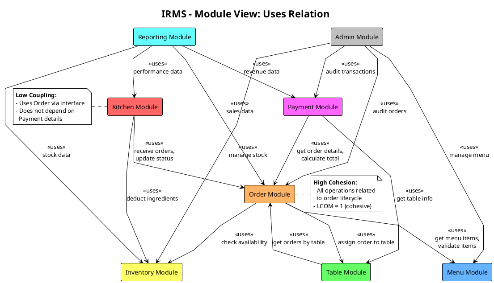

#### 3.1.5. Biểu đồ Module View - Layered Structure

Theo kiến thức về **Layered Architecture** (Chapter 5), mỗi Domain Service bên trong được tổ chức theo layers với nguyên tắc **closed layers** để duy trì **layers of isolation**.

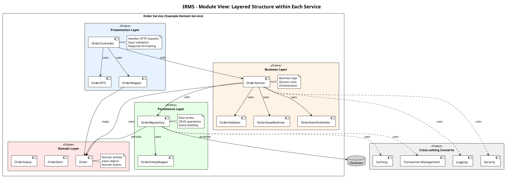

#### 3.1.6. Mô tả chi tiết các Module chính

##### A. Order Module

| Thành phần           | Trách nhiệm                                                                           |
| -------------------- | ------------------------------------------------------------------------------------- |
| `OrderController`    | Xử lý HTTP requests (REST API endpoints)                                              |
| `OrderService`       | Business logic: tạo, cập nhật, hủy đơn hàng                                           |
| `OrderValidator`     | Kiểm tra tính hợp lệ của đơn hàng                                                     |
| `OrderStateMachine`  | Quản lý trạng thái đơn hàng (PENDING → CONFIRMED → PREPARING → READY → SERVED → PAID) |
| `OrderRepository`    | Thao tác CRUD với database                                                            |
| `Order`, `OrderItem` | Domain entities                                                                       |

##### B. Kitchen Module

| Thành phần          | Trách nhiệm                                        |
| ------------------- | -------------------------------------------------- |
| `KitchenController` | API endpoints cho KDS                              |
| `KitchenService`    | Logic điều phối bếp                                |
| `KDSController`     | Điều khiển màn hình hiển thị bếp                   |
| `OrderPrioritizer`  | Sắp xếp thứ tự ưu tiên món                         |
| `StationManager`    | Phân công món đến các trạm (grill, fryer, dessert) |
| `KitchenRepository` | Lưu trữ trạng thái bếp                             |

##### C. Payment Module

| Thành phần          | Trách nhiệm                                                      |
| ------------------- | ---------------------------------------------------------------- |
| `PaymentController` | API endpoints thanh toán                                         |
| `PaymentService`    | Logic xử lý thanh toán                                           |
| `PaymentProcessor`  | Tích hợp các phương thức thanh toán (Cash, Card, Digital Wallet) |
| `InvoiceGenerator`  | Tạo hóa đơn                                                      |
| `RefundHandler`     | Xử lý hoàn tiền                                                  |
| `PaymentRepository` | Lưu trữ giao dịch                                                |

---

### 3.2. Component-and-Connector View (Góc nhìn Component-Connector)

#### 3.2.1. Giới thiệu

Component-and-Connector (C&C) View thể hiện các **thành phần runtime** của hệ thống và cách chúng **tương tác** với nhau. Khác với Module View (design-time), C&C View tập trung vào:

- **Components**: Các đơn vị thực thi (processes, services, clients, servers, data stores)
- **Connectors**: Cơ chế tương tác (REST API, message queues, database connections)
- **Runtime behavior**: Cách hệ thống hoạt động khi chạy

#### 3.2.2. Component Types trong IRMS

| Component Type     | Mô tả                  | Ví dụ trong IRMS                 |
| ------------------ | ---------------------- | -------------------------------- |
| **Client**         | Ứng dụng người dùng    | POS App, KDS App, Admin Web      |
| **Service**        | Domain service độc lập | Order Service, Kitchen Service   |
| **Data Store**     | Lưu trữ dữ liệu        | PostgreSQL Database, Redis Cache |
| **Message Broker** | Truyền tin bất đồng bộ | RabbitMQ (cho KDS notifications) |

#### 3.2.3. Connector Types trong IRMS

| Connector Type          | Mô tả                                                    | Protocol             |
| ----------------------- | -------------------------------------------------------- | -------------------- |
| **REST API**            | Giao tiếp đồng bộ giữa client-service và service-service | HTTP/HTTPS, JSON     |
| **Database Connection** | Kết nối đến data store                                   | JDBC/Connection Pool |
| **Message Queue**       | Giao tiếp bất đồng bộ cho events                         | AMQP (RabbitMQ)      |
| **WebSocket**           | Real-time updates cho KDS                                | WebSocket            |

#### 3.2.4. Biểu đồ C&C View - Tổng quan hệ thống

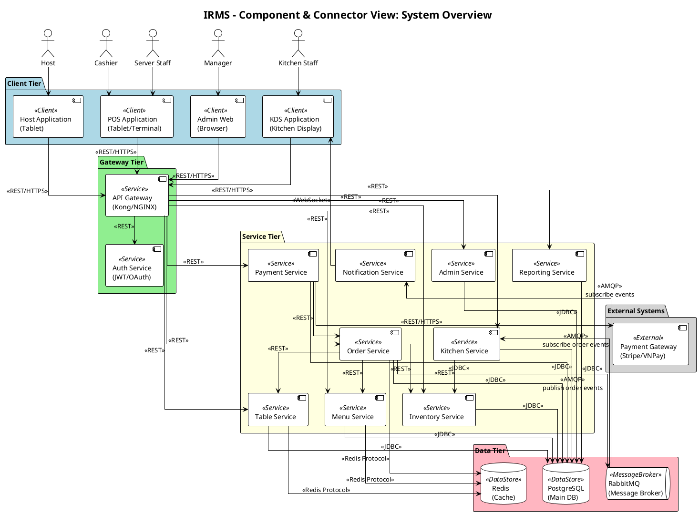

#### 3.2.5. Biểu đồ C&C View - Luồng đặt món (Order Flow)

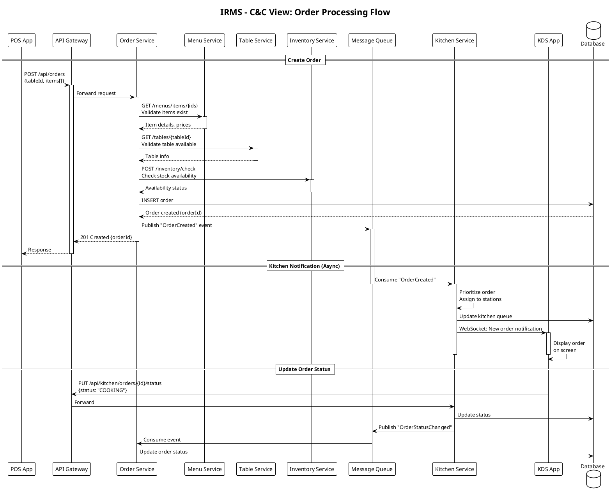

#### 3.2.6. Biểu đồ C&C View - Luồng thanh toán (Payment Flow)

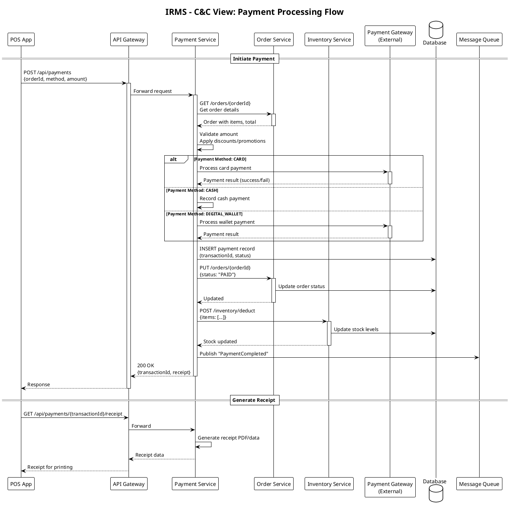

#### 3.2.7. Chi tiết các Connector

##### A. REST API Connector

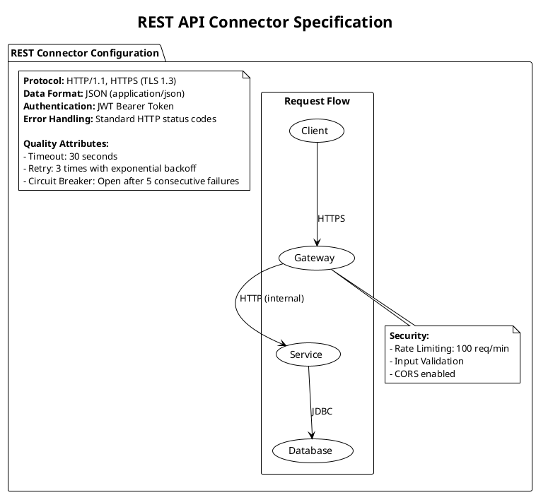

##### B. Message Queue Connector

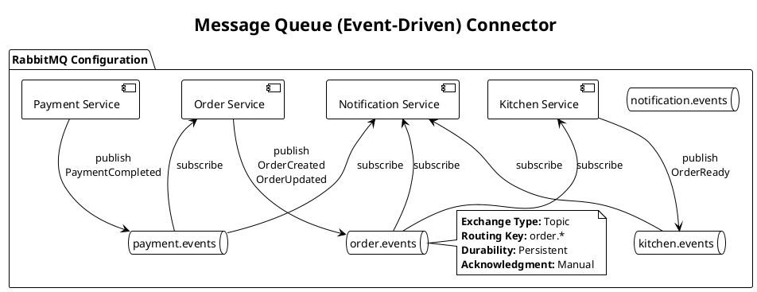

---

### 3.3. Allocation View (Góc nhìn Phân bổ)

#### 3.3.1. Giới thiệu

Allocation View thể hiện cách các thành phần phần mềm được **ánh xạ** lên các phần tử phi phần mềm:

- **Deployment View**: Ánh xạ components lên hardware/infrastructure
- **Implementation View**: Ánh xạ modules lên file system
- **Work Assignment View**: Ánh xạ modules lên development teams

#### 3.3.2. Deployment View - Kiến trúc triển khai

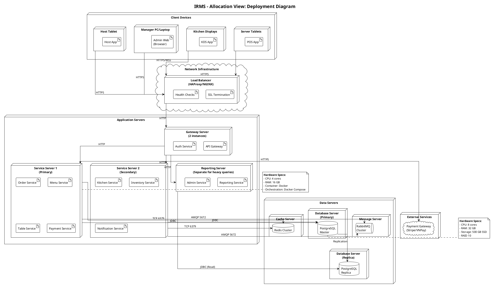

#### 3.3.3. Deployment View - Container Deployment (Docker)

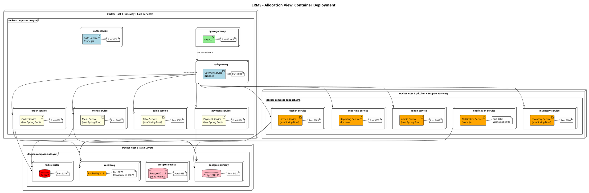

#### 3.3.4. Implementation View - Cấu trúc thư mục dự án

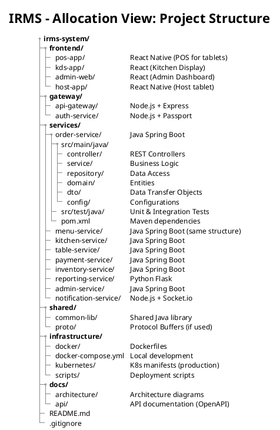

#### 3.3.5. Work Assignment View - Phân công phát triển

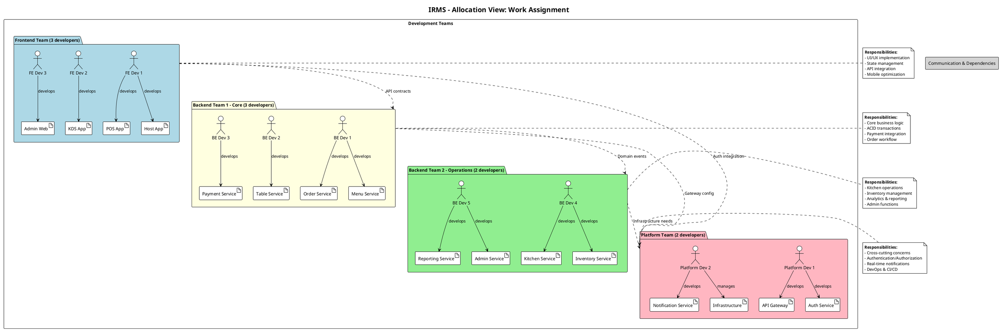

#### 3.3.6. Bảng tổng hợp Hardware Requirements

| Component                        | CPU     | RAM   | Storage    | Network | Instances |
| -------------------------------- | ------- | ----- | ---------- | ------- | --------- |
| **Load Balancer**                | 2 cores | 4 GB  | 50 GB SSD  | 1 Gbps  | 2 (HA)    |
| **Gateway Server**               | 4 cores | 8 GB  | 100 GB SSD | 1 Gbps  | 2         |
| **Application Server (Core)**    | 4 cores | 16 GB | 100 GB SSD | 1 Gbps  | 2         |
| **Application Server (Support)** | 4 cores | 8 GB  | 100 GB SSD | 1 Gbps  | 1         |
| **Database Server (Primary)**    | 8 cores | 32 GB | 500 GB SSD | 1 Gbps  | 1         |
| **Database Server (Replica)**    | 4 cores | 16 GB | 500 GB SSD | 1 Gbps  | 1         |
| **Cache Server (Redis)**         | 2 cores | 8 GB  | 50 GB SSD  | 1 Gbps  | 1         |
| **Message Server (RabbitMQ)**    | 2 cores | 4 GB  | 100 GB SSD | 1 Gbps  | 1         |

#### 3.3.7. Environment Configuration

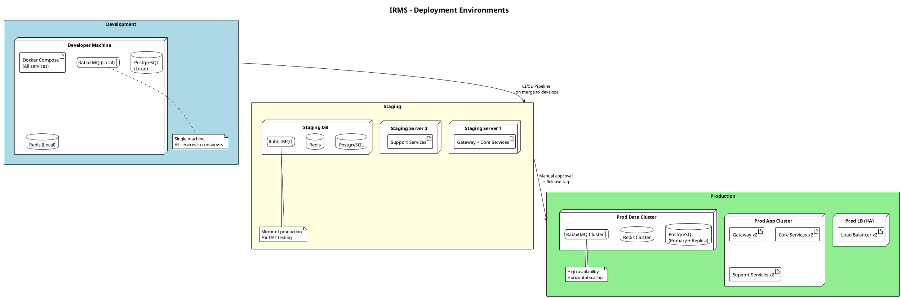

---

## 4. UML Class Diagram cho các module cốt lõi

### 4.1. Giới thiệu

Phần này trình bày biểu đồ lớp UML (UML Class Diagram) cho các module cốt lõi của hệ thống IRMS. Biểu đồ được thiết kế tuân thủ các nguyên lý SOLID và phản ánh kiến trúc Service-Based đã chọn.

Các module cốt lõi bao gồm:

- **Order Module**: Quản lý đơn hàng
- **Menu Module**: Quản lý thực đơn
- **Kitchen Module**: Quản lý quy trình bếp
- **Payment Module**: Quản lý thanh toán

### 4.2. Biểu đồ lớp tổng quan - Core Domain Classes

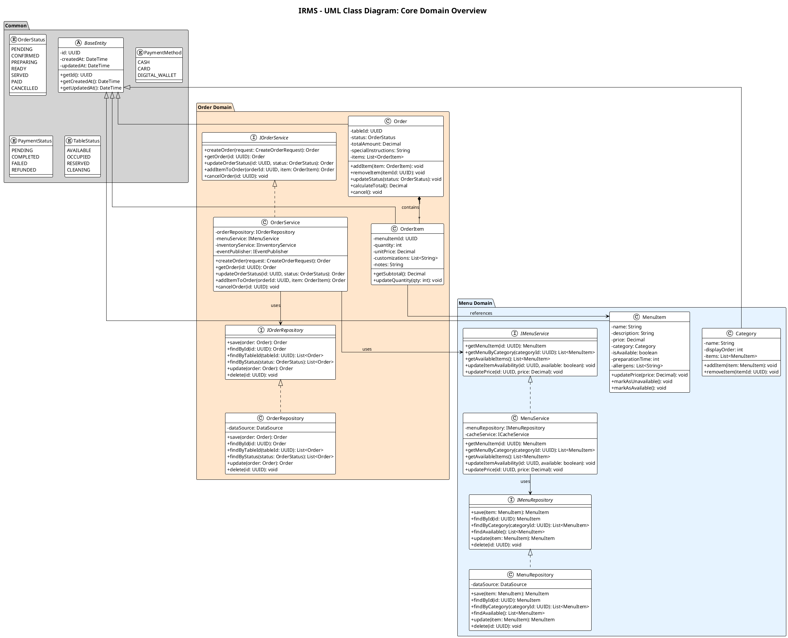

### 4.3. Biểu đồ lớp - Kitchen & Payment Modules

```plantuml
@startuml IRMS_Class_Kitchen_Payment
!theme plain
skinparam classAttributeIconSize 0
skinparam linetype ortho

title IRMS - UML Class Diagram: Kitchen & Payment Modules

' ========== KITCHEN DOMAIN ==========
package "Kitchen Domain" #FFE6E6 {

    enum KitchenOrderStatus {
        QUEUED
        IN_PROGRESS
        READY
        SERVED
    }

    enum Station {
        GRILL
        FRY
        SALAD
        DESSERT
        BEVERAGE
    }

    class KitchenOrder {
        - orderId: UUID
        - status: KitchenOrderStatus
        - priority: int
        - estimatedTime: int
        - assignedStation: Station
        - startedAt: DateTime
        - completedAt: DateTime
        - items: List<KitchenOrderItem>
        + start(): void
        + markReady(): void
        + updatePriority(priority: int): void
    }

    class KitchenOrderItem {
        - orderItemId: UUID
        - menuItemName: String
        - quantity: int
        - status: KitchenOrderStatus
        - station: Station
        + startPreparing(): void
        + markComplete(): void
    }

    interface IKitchenOrderRepository {
        + save(order: KitchenOrder): KitchenOrder
        + findById(id: UUID): KitchenOrder
        + findByStatus(status: KitchenOrderStatus): List<KitchenOrder>
        + findByStation(station: Station): List<KitchenOrder>
        + update(order: KitchenOrder): KitchenOrder
    }

    interface IKitchenService {
        + receiveOrder(orderId: UUID): KitchenOrder
        + getQueuedOrders(): List<KitchenOrder>
        + getOrdersByStation(station: Station): List<KitchenOrder>
        + updateOrderStatus(id: UUID, status: KitchenOrderStatus): void
        + assignToStation(orderId: UUID, station: Station): void
    }

    class KitchenService {
        - kitchenRepository: IKitchenOrderRepository
        - orderService: IOrderService
        - notificationService: INotificationService
        - orderPrioritizer: IOrderPrioritizer
        + receiveOrder(orderId: UUID): KitchenOrder
        + getQueuedOrders(): List<KitchenOrder>
        + getOrdersByStation(station: Station): List<KitchenOrder>
        + updateOrderStatus(id: UUID, status: KitchenOrderStatus): void
        + assignToStation(orderId: UUID, station: Station): void
    }

    class KitchenOrderRepository {
        - dataSource: DataSource
        + save(order: KitchenOrder): KitchenOrder
        + findById(id: UUID): KitchenOrder
        + findByStatus(status: KitchenOrderStatus): List<KitchenOrder>
        + findByStation(station: Station): List<KitchenOrder>
        + update(order: KitchenOrder): KitchenOrder
    }

    interface IOrderPrioritizer {
        + calculatePriority(order: KitchenOrder): int
        + sortByPriority(orders: List<KitchenOrder>): List<KitchenOrder>
    }

    class FIFOPrioritizer {
        + calculatePriority(order: KitchenOrder): int
        + sortByPriority(orders: List<KitchenOrder>): List<KitchenOrder>
    }

    class SmartPrioritizer {
        - preparationTimeWeight: float
        - waitingTimeWeight: float
        + calculatePriority(order: KitchenOrder): int
        + sortByPriority(orders: List<KitchenOrder>): List<KitchenOrder>
    }
}

' ========== PAYMENT DOMAIN ==========
package "Payment Domain" #E6FFE6 {

    enum PaymentMethod {
        CASH
        CARD
        DIGITAL_WALLET
    }

    enum PaymentStatus {
        PENDING
        COMPLETED
        FAILED
        REFUNDED
    }

    class Payment {
        - orderId: UUID
        - amount: Decimal
        - method: PaymentMethod
        - status: PaymentStatus
        - transactionId: String
        - paidAt: DateTime
        + process(): boolean
        + refund(): boolean
        + generateReceipt(): Receipt
    }

    class Receipt {
        - paymentId: UUID
        - items: List<ReceiptItem>
        - subtotal: Decimal
        - tax: Decimal
        - discount: Decimal
        - total: Decimal
        - paidAt: DateTime
        + print(): void
        + toJson(): String
    }

    class ReceiptItem {
        - name: String
        - quantity: int
        - unitPrice: Decimal
        - subtotal: Decimal
    }

    interface IPaymentRepository {
        + save(payment: Payment): Payment
        + findById(id: UUID): Payment
        + findByOrderId(orderId: UUID): Payment
        + findByDateRange(from: DateTime, to: DateTime): List<Payment>
        + update(payment: Payment): Payment
    }

    interface IPaymentService {
        + processPayment(request: PaymentRequest): Payment
        + getPayment(id: UUID): Payment
        + refundPayment(id: UUID): Payment
        + generateReceipt(paymentId: UUID): Receipt
    }

    interface IPaymentProcessor {
        + process(payment: Payment): PaymentResult
        + refund(payment: Payment): PaymentResult
    }

    class PaymentService {
        - paymentRepository: IPaymentRepository
        - orderService: IOrderService
        - paymentProcessorFactory: IPaymentProcessorFactory
        - eventPublisher: IEventPublisher
        + processPayment(request: PaymentRequest): Payment
        + getPayment(id: UUID): Payment
        + refundPayment(id: UUID): Payment
        + generateReceipt(paymentId: UUID): Receipt
    }

    class PaymentRepository {
        - dataSource: DataSource
        + save(payment: Payment): Payment
        + findById(id: UUID): Payment
        + findByOrderId(orderId: UUID): Payment
        + findByDateRange(from: DateTime, to: DateTime): List<Payment>
        + update(payment: Payment): Payment
    }

    class CashPaymentProcessor {
        + process(payment: Payment): PaymentResult
        + refund(payment: Payment): PaymentResult
    }

    class CardPaymentProcessor {
        - paymentGateway: IPaymentGateway
        + process(payment: Payment): PaymentResult
        + refund(payment: Payment): PaymentResult
    }

    class DigitalWalletProcessor {
        - walletProvider: IWalletProvider
        + process(payment: Payment): PaymentResult
        + refund(payment: Payment): PaymentResult
    }

    interface IPaymentProcessorFactory {
        + createProcessor(method: PaymentMethod): IPaymentProcessor
    }

    class PaymentProcessorFactory {
        + createProcessor(method: PaymentMethod): IPaymentProcessor
    }
}

' Kitchen relationships
KitchenOrder "1" *-- "*" KitchenOrderItem : contains
IKitchenService <|.. KitchenService
IKitchenOrderRepository <|.. KitchenOrderRepository
IOrderPrioritizer <|.. FIFOPrioritizer
IOrderPrioritizer <|.. SmartPrioritizer

KitchenService --> IKitchenOrderRepository : uses
KitchenService --> IOrderPrioritizer : uses

' Payment relationships
Payment "1" --> "1" Receipt : generates
Receipt "1" *-- "*" ReceiptItem : contains

IPaymentService <|.. PaymentService
IPaymentRepository <|.. PaymentRepository
IPaymentProcessor <|.. CashPaymentProcessor
IPaymentProcessor <|.. CardPaymentProcessor
IPaymentProcessor <|.. DigitalWalletProcessor
IPaymentProcessorFactory <|.. PaymentProcessorFactory

PaymentService --> IPaymentRepository : uses
PaymentService --> IPaymentProcessorFactory : uses
PaymentProcessorFactory ..> IPaymentProcessor : creates

@enduml
```

### 4.4. Biểu đồ lớp - Table & Notification Modules

```plantuml
@startuml IRMS_Class_Table_Notification
!theme plain
skinparam classAttributeIconSize 0
skinparam linetype ortho

title IRMS - UML Class Diagram: Table & Notification Modules

' ========== TABLE DOMAIN ==========
package "Table Domain" #F0E6FF {

    enum TableStatus {
        AVAILABLE
        OCCUPIED
        RESERVED
        CLEANING
    }

    class Table {
        - tableNumber: String
        - capacity: int
        - status: TableStatus
        - currentOrderId: UUID
        - section: String
        + occupy(): void
        + release(): void
        + reserve(reservation: Reservation): void
        + startCleaning(): void
    }

    class Reservation {
        - tableId: UUID
        - customerName: String
        - customerPhone: String
        - partySize: int
        - reservationTime: DateTime
        - status: ReservationStatus
        - notes: String
        + confirm(): void
        + cancel(): void
        + checkIn(): void
    }

    enum ReservationStatus {
        PENDING
        CONFIRMED
        CHECKED_IN
        CANCELLED
        NO_SHOW
    }

    class FloorPlan {
        - name: String
        - tables: List<Table>
        + addTable(table: Table): void
        + removeTable(tableId: UUID): void
        + getAvailableTables(capacity: int): List<Table>
    }

    interface ITableRepository {
        + save(table: Table): Table
        + findById(id: UUID): Table
        + findByStatus(status: TableStatus): List<Table>
        + findAvailable(capacity: int): List<Table>
        + update(table: Table): Table
    }

    interface IReservationRepository {
        + save(reservation: Reservation): Reservation
        + findById(id: UUID): Reservation
        + findByDate(date: Date): List<Reservation>
        + findByPhone(phone: String): List<Reservation>
        + update(reservation: Reservation): Reservation
        + delete(id: UUID): void
    }

    interface ITableService {
        + getTable(id: UUID): Table
        + getAvailableTables(capacity: int): List<Table>
        + occupyTable(id: UUID, orderId: UUID): void
        + releaseTable(id: UUID): void
        + getTableStatus(id: UUID): TableStatus
    }

    interface IReservationService {
        + createReservation(request: ReservationRequest): Reservation
        + getReservation(id: UUID): Reservation
        + confirmReservation(id: UUID): void
        + cancelReservation(id: UUID): void
        + checkIn(id: UUID): void
        + getReservationsByDate(date: Date): List<Reservation>
    }

    class TableService {
        - tableRepository: ITableRepository
        - orderService: IOrderService
        + getTable(id: UUID): Table
        + getAvailableTables(capacity: int): List<Table>
        + occupyTable(id: UUID, orderId: UUID): void
        + releaseTable(id: UUID): void
        + getTableStatus(id: UUID): TableStatus
    }

    class ReservationService {
        - reservationRepository: IReservationRepository
        - tableService: ITableService
        - notificationService: INotificationService
        + createReservation(request: ReservationRequest): Reservation
        + getReservation(id: UUID): Reservation
        + confirmReservation(id: UUID): void
        + cancelReservation(id: UUID): void
        + checkIn(id: UUID): void
        + getReservationsByDate(date: Date): List<Reservation>
    }
}

' ========== NOTIFICATION/EVENT DOMAIN ==========
package "Event & Notification" #FFFDE6 {

    interface IEventPublisher {
        + publish(event: DomainEvent): void
    }

    interface IEventSubscriber {
        + subscribe(eventType: Class, handler: EventHandler): void
        + unsubscribe(eventType: Class): void
    }

    abstract class DomainEvent {
        - eventId: UUID
        - occurredAt: DateTime
        - eventType: String
        + getEventId(): UUID
        + getOccurredAt(): DateTime
    }

    class OrderCreatedEvent {
        - orderId: UUID
        - tableId: UUID
        - items: List<OrderItem>
    }

    class OrderStatusChangedEvent {
        - orderId: UUID
        - oldStatus: OrderStatus
        - newStatus: OrderStatus
    }

    class PaymentCompletedEvent {
        - paymentId: UUID
        - orderId: UUID
        - amount: Decimal
    }

    class KitchenOrderReadyEvent {
        - kitchenOrderId: UUID
        - orderId: UUID
        - tableId: UUID
    }

    interface INotificationService {
        + notifyKDS(event: OrderCreatedEvent): void
        + notifyServer(event: KitchenOrderReadyEvent): void
        + notifyCustomer(phone: String, message: String): void
    }

    class NotificationService {
        - webSocketHandler: IWebSocketHandler
        - smsProvider: ISmsProvider
        + notifyKDS(event: OrderCreatedEvent): void
        + notifyServer(event: KitchenOrderReadyEvent): void
        + notifyCustomer(phone: String, message: String): void
    }

    class EventPublisher {
        - messageQueue: IMessageQueue
        + publish(event: DomainEvent): void
    }
}

' Table relationships
FloorPlan "1" *-- "*" Table : contains
Table "1" --> "*" Reservation : has

ITableService <|.. TableService
ITableRepository <|.. TableRepository : implements
IReservationService <|.. ReservationService
IReservationRepository <|.. ReservationRepository : implements

TableService --> ITableRepository : uses
ReservationService --> IReservationRepository : uses
ReservationService --> ITableService : uses
ReservationService --> INotificationService : uses

' Event relationships
DomainEvent <|-- OrderCreatedEvent
DomainEvent <|-- OrderStatusChangedEvent
DomainEvent <|-- PaymentCompletedEvent
DomainEvent <|-- KitchenOrderReadyEvent

IEventPublisher <|.. EventPublisher
INotificationService <|.. NotificationService

class TableRepository
class ReservationRepository

@enduml
```

### 4.5. Biểu đồ lớp - Inventory & Admin Modules

```plantuml
@startuml IRMS_Class_Inventory_Admin
!theme plain
skinparam classAttributeIconSize 0
skinparam linetype ortho

title IRMS - UML Class Diagram: Inventory & Admin Modules

' ========== INVENTORY DOMAIN ==========
package "Inventory Domain" #E6FFF0 {

    class InventoryItem {
        - name: String
        - unit: String
        - currentStock: Decimal
        - minimumStock: Decimal
        - reorderPoint: Decimal
        - lastRestocked: DateTime
        + deduct(amount: Decimal): void
        + restock(amount: Decimal): void
        + isLowStock(): boolean
        + needsReorder(): boolean
    }

    class StockMovement {
        - inventoryItemId: UUID
        - quantity: Decimal
        - movementType: MovementType
        - reason: String
        - performedBy: UUID
        - performedAt: DateTime
    }

    enum MovementType {
        RESTOCK
        CONSUMPTION
        WASTE
        ADJUSTMENT
    }

    interface IInventoryRepository {
        + save(item: InventoryItem): InventoryItem
        + findById(id: UUID): InventoryItem
        + findLowStock(): List<InventoryItem>
        + findAll(): List<InventoryItem>
        + update(item: InventoryItem): InventoryItem
    }

    interface IStockMovementRepository {
        + save(movement: StockMovement): StockMovement
        + findByItemId(itemId: UUID): List<StockMovement>
        + findByDateRange(from: DateTime, to: DateTime): List<StockMovement>
    }

    interface IInventoryService {
        + getInventoryItem(id: UUID): InventoryItem
        + checkAvailability(itemId: UUID, quantity: Decimal): boolean
        + deductStock(itemId: UUID, quantity: Decimal, reason: String): void
        + restockItem(itemId: UUID, quantity: Decimal): void
        + getLowStockItems(): List<InventoryItem>
        + getStockHistory(itemId: UUID): List<StockMovement>
    }

    class InventoryService {
        - inventoryRepository: IInventoryRepository
        - movementRepository: IStockMovementRepository
        - alertService: IAlertService
        + getInventoryItem(id: UUID): InventoryItem
        + checkAvailability(itemId: UUID, quantity: Decimal): boolean
        + deductStock(itemId: UUID, quantity: Decimal, reason: String): void
        + restockItem(itemId: UUID, quantity: Decimal): void
        + getLowStockItems(): List<InventoryItem>
        + getStockHistory(itemId: UUID): List<StockMovement>
    }

    interface IAlertService {
        + sendLowStockAlert(item: InventoryItem): void
        + sendReorderAlert(item: InventoryItem): void
    }

    class EmailAlertService {
        - emailSender: IEmailSender
        + sendLowStockAlert(item: InventoryItem): void
        + sendReorderAlert(item: InventoryItem): void
    }

    class PushAlertService {
        - pushService: IPushService
        + sendLowStockAlert(item: InventoryItem): void
        + sendReorderAlert(item: InventoryItem): void
    }
}

' ========== ADMIN/USER DOMAIN ==========
package "Admin Domain" #FFF0E6 {

    enum Role {
        ADMIN
        MANAGER
        SERVER
        CASHIER
        KITCHEN_STAFF
        HOST
    }

    class User {
        - username: String
        - passwordHash: String
        - email: String
        - role: Role
        - isActive: boolean
        - lastLogin: DateTime
        + authenticate(password: String): boolean
        + changePassword(newPassword: String): void
        + deactivate(): void
        + activate(): void
    }

    class Permission {
        - name: String
        - description: String
        - resource: String
        - actions: List<String>
    }

    class RolePermission {
        - role: Role
        - permissions: List<Permission>
        + hasPermission(resource: String, action: String): boolean
    }

    class AuditLog {
        - userId: UUID
        - action: String
        - resource: String
        - resourceId: UUID
        - oldValue: String
        - newValue: String
        - ipAddress: String
        - timestamp: DateTime
    }

    interface IUserRepository {
        + save(user: User): User
        + findById(id: UUID): User
        + findByUsername(username: String): User
        + findByRole(role: Role): List<User>
        + update(user: User): User
        + delete(id: UUID): void
    }

    interface IAuditLogRepository {
        + save(log: AuditLog): AuditLog
        + findByUserId(userId: UUID): List<AuditLog>
        + findByResource(resource: String): List<AuditLog>
        + findByDateRange(from: DateTime, to: DateTime): List<AuditLog>
    }

    interface IAuthService {
        + authenticate(username: String, password: String): AuthToken
        + validateToken(token: String): User
        + refreshToken(token: String): AuthToken
        + logout(token: String): void
    }

    interface IUserService {
        + createUser(request: CreateUserRequest): User
        + getUser(id: UUID): User
        + updateUser(id: UUID, request: UpdateUserRequest): User
        + changePassword(id: UUID, oldPassword: String, newPassword: String): void
        + deactivateUser(id: UUID): void
        + getUsersByRole(role: Role): List<User>
    }

    interface IAuditService {
        + log(action: String, resource: String, resourceId: UUID, oldValue: String, newValue: String): void
        + getAuditLogs(filter: AuditLogFilter): List<AuditLog>
    }

    class AuthService {
        - userRepository: IUserRepository
        - tokenProvider: ITokenProvider
        - passwordHasher: IPasswordHasher
        + authenticate(username: String, password: String): AuthToken
        + validateToken(token: String): User
        + refreshToken(token: String): AuthToken
        + logout(token: String): void
    }

    class UserService {
        - userRepository: IUserRepository
        - passwordHasher: IPasswordHasher
        - auditService: IAuditService
        + createUser(request: CreateUserRequest): User
        + getUser(id: UUID): User
        + updateUser(id: UUID, request: UpdateUserRequest): User
        + changePassword(id: UUID, oldPassword: String, newPassword: String): void
        + deactivateUser(id: UUID): void
        + getUsersByRole(role: Role): List<User>
    }

    class AuditService {
        - auditRepository: IAuditLogRepository
        - currentUserProvider: ICurrentUserProvider
        + log(action: String, resource: String, resourceId: UUID, oldValue: String, newValue: String): void
        + getAuditLogs(filter: AuditLogFilter): List<AuditLog>
    }
}

' Inventory relationships
InventoryItem "1" --> "*" StockMovement : has

IInventoryService <|.. InventoryService
IInventoryRepository <|.. InventoryRepository : implements
IStockMovementRepository <|.. StockMovementRepository : implements
IAlertService <|.. EmailAlertService
IAlertService <|.. PushAlertService

InventoryService --> IInventoryRepository : uses
InventoryService --> IStockMovementRepository : uses
InventoryService --> IAlertService : uses

' Admin relationships
User "*" --> "1" Role : has
RolePermission "1" --> "1" Role : for
RolePermission "1" --> "*" Permission : contains

IAuthService <|.. AuthService
IUserService <|.. UserService
IAuditService <|.. AuditService
IUserRepository <|.. UserRepository : implements
IAuditLogRepository <|.. AuditLogRepository : implements

AuthService --> IUserRepository : uses
UserService --> IUserRepository : uses
UserService --> IAuditService : uses
AuditService --> IAuditLogRepository : uses

class InventoryRepository
class StockMovementRepository
class UserRepository
class AuditLogRepository

@enduml
```

### 4.6. Bảng tóm tắt các lớp chính

| Module        | Entity Classes                             | Service Interfaces                        | Repository Interfaces                          |
| ------------- | ------------------------------------------ | ----------------------------------------- | ---------------------------------------------- |
| **Order**     | Order, OrderItem                           | IOrderService                             | IOrderRepository                               |
| **Menu**      | MenuItem, Category                         | IMenuService                              | IMenuRepository                                |
| **Kitchen**   | KitchenOrder, KitchenOrderItem             | IKitchenService                           | IKitchenOrderRepository                        |
| **Payment**   | Payment, Receipt, ReceiptItem              | IPaymentService, IPaymentProcessor        | IPaymentRepository                             |
| **Table**     | Table, Reservation, FloorPlan              | ITableService, IReservationService        | ITableRepository, IReservationRepository       |
| **Inventory** | InventoryItem, StockMovement               | IInventoryService, IAlertService          | IInventoryRepository, IStockMovementRepository |
| **Admin**     | User, Permission, RolePermission, AuditLog | IAuthService, IUserService, IAuditService | IUserRepository, IAuditLogRepository           |

---

## 5. Áp dụng nguyên lý SOLID vào thiết kế

### 5.1. Giới thiệu về SOLID

Theo slide Chapter 2, **SOLID** là tập hợp 5 nguyên lý thiết kế hướng đối tượng giúp tạo ra các cấu trúc phần mềm:

- **Chịu được thay đổi** (Tolerate change)
- **Dễ hiểu** (Easy to understand)
- **Là nền tảng cho các component có thể tái sử dụng** (Basis of reusable components)

### 5.2. Single Responsibility Principle (SRP)

#### 5.2.1. Định nghĩa

> **"A module should be responsible to one, and only one, actor."**
> (Một module chỉ nên chịu trách nhiệm với một và chỉ một actor.)

Theo slide, SRP đảm bảo mỗi module chỉ có **một lý do để thay đổi** - tức là chỉ phục vụ một nhóm người dùng/stakeholder.

#### 5.2.2. Áp dụng trong thiết kế IRMS

**A. Tách biệt Service theo Domain**

Thay vì tạo một class `RestaurantService` khổng lồ xử lý tất cả, hệ thống được tách thành các service riêng biệt:

| Service              | Actor (Stakeholder) | Trách nhiệm duy nhất      |
| -------------------- | ------------------- | ------------------------- |
| `OrderService`       | Server Staff        | Quản lý vòng đời đơn hàng |
| `KitchenService`     | Kitchen Staff       | Điều phối quy trình bếp   |
| `PaymentService`     | Cashier             | Xử lý thanh toán          |
| `TableService`       | Host                | Quản lý bàn và chỗ ngồi   |
| `ReservationService` | Host                | Quản lý đặt chỗ           |
| `InventoryService`   | Manager             | Quản lý tồn kho           |
| `ReportingService`   | Manager             | Tạo báo cáo và phân tích  |
| `UserService`        | Admin               | Quản lý người dùng        |

**B. Tách biệt Repository khỏi Service**

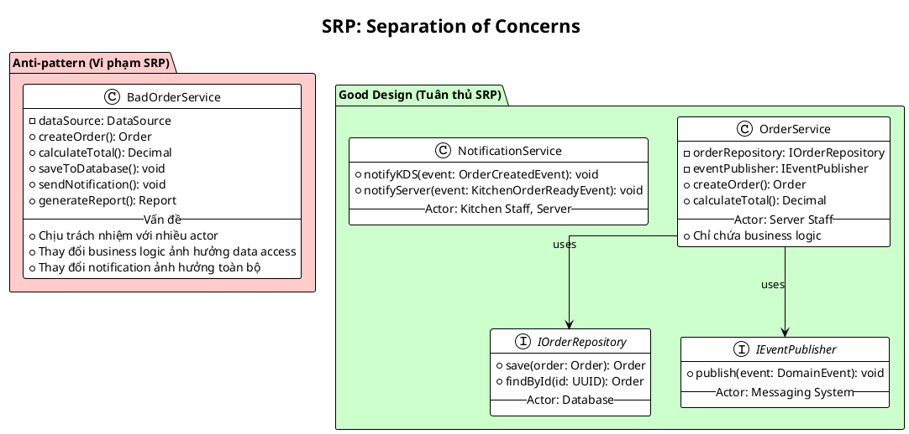

**C. Ví dụ cụ thể trong code**

```
// VI PHẠM SRP - Một class làm quá nhiều việc
class BadPaymentService {
    + processPayment()      // Business logic - cho Cashier
    + savePayment()         // Data access - cho Database
    + sendReceipt()         // Notification - cho Customer
    + generateReport()      // Reporting - cho Manager
}

// TUÂN THỦ SRP - Mỗi class một trách nhiệm
class PaymentService {
    + processPayment()  // Chỉ chứa business logic thanh toán
}

class PaymentRepository {
    + save()            // Chỉ chứa logic data access
}

class NotificationService {
    + sendReceipt()     // Chỉ chứa logic thông báo
}

class ReportingService {
    + generateReport()  // Chỉ chứa logic báo cáo
}
```

---

### 5.3. Open/Closed Principle (OCP)

#### 5.3.1. Định nghĩa

> **"A software artifact should be open for extension but closed for modification."**
> (Một artifact phần mềm nên mở cho việc mở rộng nhưng đóng cho việc sửa đổi.)

Theo slide, mục tiêu là có thể **thêm chức năng mới mà không cần sửa đổi code hiện có**.

#### 5.3.2. Áp dụng trong thiết kế IRMS

**A. Strategy Pattern cho Payment Processing**

Khi cần thêm phương thức thanh toán mới (ví dụ: Crypto), ta chỉ cần **thêm class mới** mà không sửa đổi `PaymentService`:

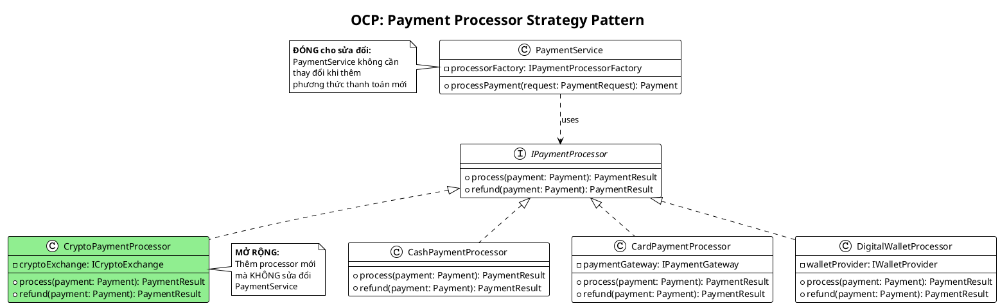

**B. Strategy Pattern cho Order Prioritization**

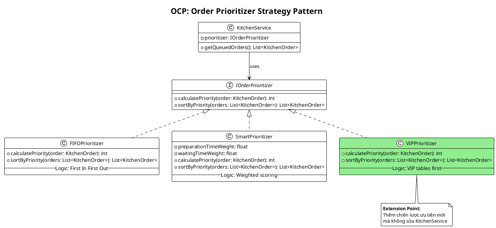

**C. Strategy Pattern cho Alert Service**

| Interface              | Implementations                         | Extension Point                                                             |
| ---------------------- | --------------------------------------- | --------------------------------------------------------------------------- |
| `IAlertService`        | `EmailAlertService`, `PushAlertService` | Thêm `SMSAlertService`, `SlackAlertService` mà không sửa `InventoryService` |
| `INotificationService` | `NotificationService`                   | Thêm channels mới (SMS, Push, Slack)                                        |

---

### 5.4. Liskov Substitution Principle (LSP)

#### 5.4.1. Định nghĩa

> **"Objects of a child class must be able to replace the parent class without changing the correctness of the program."**
> (Đối tượng của lớp con phải có khả năng thay thế lớp cha mà không làm thay đổi tính đúng đắn của chương trình.)

Theo slide, lớp con phải **duy trì hành vi của lớp cha** và không thay đổi logic khi thay thế.

#### 5.4.2. Áp dụng trong thiết kế IRMS

**A. Payment Processor tuân thủ LSP**

Tất cả các implementation của `IPaymentProcessor` đều có thể thay thế lẫn nhau mà không làm hỏng `PaymentService`:

```plantuml
@startuml LSP_Payment
!theme plain

title LSP: Payment Processors are Substitutable

interface IPaymentProcessor {
    + process(payment: Payment): PaymentResult
    + refund(payment: Payment): PaymentResult
}

note top of IPaymentProcessor
    **Contract đảm bảo:**
    1. process() trả về PaymentResult (success/fail)
    2. refund() trả về PaymentResult
    3. Không throw unexpected exceptions
    4. Không thay đổi state ngoài payment
end note

class CashPaymentProcessor {
    + process(payment: Payment): PaymentResult
    + refund(payment: Payment): PaymentResult
    -- Tuân thủ contract --
    -- Có thể thay thế bất kỳ processor nào --
}

class CardPaymentProcessor {
    + process(payment: Payment): PaymentResult
    + refund(payment: Payment): PaymentResult
    -- Tuân thủ contract --
    -- Thêm logic riêng nhưng không vi phạm --
}

class DigitalWalletProcessor {
    + process(payment: Payment): PaymentResult
    + refund(payment: Payment): PaymentResult
    -- Tuân thủ contract --
}

IPaymentProcessor <|.. CashPaymentProcessor
IPaymentProcessor <|.. CardPaymentProcessor
IPaymentProcessor <|.. DigitalWalletProcessor

class PaymentService {
    - processor: IPaymentProcessor
    + processPayment(request: PaymentRequest): Payment
}

note right of PaymentService
    PaymentService hoạt động đúng
    bất kể sử dụng processor nào:

    processor = new CashPaymentProcessor()
    processor = new CardPaymentProcessor()
    processor = new DigitalWalletProcessor()

    → Kết quả luôn nhất quán
end note

PaymentService --> IPaymentProcessor

@enduml
```

**B. Repository Pattern tuân thủ LSP**

```plantuml
@startuml LSP_Repository
!theme plain

title LSP: Repository Implementations

interface IOrderRepository {
    + save(order: Order): Order
    + findById(id: UUID): Order
    + findByStatus(status: OrderStatus): List<Order>
    + update(order: Order): Order
    + delete(id: UUID): void
}

class PostgresOrderRepository {
    + save(order: Order): Order
    + findById(id: UUID): Order
    + findByStatus(status: OrderStatus): List<Order>
    + update(order: Order): Order
    + delete(id: UUID): void
    -- Uses PostgreSQL --
}

class InMemoryOrderRepository {
    - orders: Map<UUID, Order>
    + save(order: Order): Order
    + findById(id: UUID): Order
    + findByStatus(status: OrderStatus): List<Order>
    + update(order: Order): Order
    + delete(id: UUID): void
    -- For unit testing --
}

class MongoOrderRepository #LightGreen {
    + save(order: Order): Order
    + findById(id: UUID): Order
    + findByStatus(status: OrderStatus): List<Order>
    + update(order: Order): Order
    + delete(id: UUID): void
    -- Uses MongoDB --
}

note bottom of InMemoryOrderRepository
    **LSP Compliance:**
    InMemoryOrderRepository có thể
    thay thế PostgresOrderRepository
    trong unit tests mà không
    ảnh hưởng OrderService
end note

IOrderRepository <|.. PostgresOrderRepository
IOrderRepository <|.. InMemoryOrderRepository
IOrderRepository <|.. MongoOrderRepository

@enduml
```

**C. Ví dụ vi phạm LSP và cách sửa**

```
// VI PHẠM LSP - Square không thể thay thế Rectangle
class Rectangle {
    width, height
    setWidth(w) { width = w }
    setHeight(h) { height = h }
    getArea() { return width * height }
}

class Square extends Rectangle {
    setWidth(w) { width = w; height = w }  // VI PHẠM!
    setHeight(h) { width = h; height = h } // VI PHẠM!
}

// Trong IRMS - TUÂN THỦ LSP
// Tất cả IPaymentProcessor implementations đều:
// 1. Nhận Payment input
// 2. Trả về PaymentResult
// 3. Không thay đổi contract
```

---

### 5.5. Interface Segregation Principle (ISP)

#### 5.5.1. Định nghĩa

> **"It is harmful to depend on modules that contain more than you need."**
> (Phụ thuộc vào các module chứa nhiều hơn những gì bạn cần là có hại.)

Theo slide, các interface nên **nhỏ và cụ thể**, class chỉ implement những method thực sự cần.

#### 5.5.2. Áp dụng trong thiết kế IRMS

**A. Tách biệt Service Interfaces**

Thay vì một interface `IRestaurantService` chứa tất cả, hệ thống tách thành các interface nhỏ:

```plantuml
@startuml ISP_Services
!theme plain

title ISP: Segregated Service Interfaces

package "Anti-pattern (Vi phạm ISP)" #FFCCCC {
    interface IBadRestaurantService {
        + createOrder(): Order
        + processPayment(): Payment
        + manageTable(): void
        + updateInventory(): void
        + generateReport(): void
        + manageUsers(): void
        -- Quá nhiều methods --
        -- Client phải implement tất cả --
    }

    class KitchenDisplay {
        -- Chỉ cần getOrders() --
        -- Nhưng phải biết về Payment, Inventory... --
    }

    KitchenDisplay ..> IBadRestaurantService
}

package "Good Design (Tuân thủ ISP)" #CCFFCC {
    interface IOrderService {
        + createOrder(): Order
        + getOrder(): Order
        + updateOrderStatus(): void
    }

    interface IPaymentService {
        + processPayment(): Payment
        + refundPayment(): Payment
    }

    interface ITableService {
        + getAvailableTables(): List<Table>
        + occupyTable(): void
    }

    interface IKitchenService {
        + getQueuedOrders(): List<KitchenOrder>
        + updateOrderStatus(): void
    }

    class KitchenDisplay {
        -- Chỉ cần IKitchenService --
        -- Không biết về Payment, Users... --
    }

    class POSTerminal {
        -- Cần IOrderService + IPaymentService --
        -- Không biết về Inventory, Reports... --
    }

    KitchenDisplay ..> IKitchenService : uses only
    POSTerminal ..> IOrderService : uses
    POSTerminal ..> IPaymentService : uses
}

@enduml
```

**B. Tách biệt Repository Interfaces**

```plantuml
@startuml ISP_Repository
!theme plain

title ISP: Segregated Repository Interfaces

interface IOrderReadRepository {
    + findById(id: UUID): Order
    + findByTableId(tableId: UUID): List<Order>
    + findByStatus(status: OrderStatus): List<Order>
}

interface IOrderWriteRepository {
    + save(order: Order): Order
    + update(order: Order): Order
    + delete(id: UUID): void
}

interface IOrderRepository {
}

note right of IOrderRepository
    Combines both interfaces
    for services that need
    full CRUD access
end note

IOrderRepository --|> IOrderReadRepository
IOrderRepository --|> IOrderWriteRepository

class ReportingService {
    - orderReadRepo: IOrderReadRepository
    -- Chỉ cần đọc dữ liệu --
    -- Không cần write access --
}

class OrderService {
    - orderRepo: IOrderRepository
    -- Cần cả read và write --
}

ReportingService ..> IOrderReadRepository : uses (read only)
OrderService ..> IOrderRepository : uses (full access)

@enduml
```

**C. Bảng tóm tắt tách biệt Interface**

| Fat Interface (Vi phạm)        | Segregated Interfaces (Tuân thủ)                                                            | Client sử dụng                          |
| ------------------------------ | ------------------------------------------------------------------------------------------- | --------------------------------------- |
| `IRestaurantService`           | `IOrderService`, `IPaymentService`, `ITableService`, `IKitchenService`, `IInventoryService` | Mỗi client chỉ dùng interface cần thiết |
| `IRepository` (full CRUD)      | `IReadRepository`, `IWriteRepository`                                                       | ReportingService chỉ dùng Read          |
| `INotification` (all channels) | `IEmailNotification`, `IPushNotification`, `ISMSNotification`                               | Từng service chọn channel cần           |

---

### 5.6. Dependency Inversion Principle (DIP)

#### 5.6.1. Định nghĩa

> **"High-level modules should not depend on low-level modules. Both should depend on abstractions."**
> (Module cấp cao không nên phụ thuộc vào module cấp thấp. Cả hai nên phụ thuộc vào abstraction.)

> **"Abstractions should not depend upon details. Details should depend upon abstractions."**
> (Abstraction không nên phụ thuộc vào chi tiết. Chi tiết nên phụ thuộc vào abstraction.)

#### 5.6.2. Áp dụng trong thiết kế IRMS

**A. Service Layer phụ thuộc vào Abstractions**

```plantuml
@startuml DIP_Overview
!theme plain
skinparam linetype ortho

title DIP: Dependency Inversion in IRMS

package "High-Level Module" #LightYellow {
    class OrderService {
        - orderRepository: IOrderRepository
        - menuService: IMenuService
        - eventPublisher: IEventPublisher
        + createOrder(): Order
    }

    note right of OrderService
        **High-level policy:**
        Order business logic

        Phụ thuộc vào ABSTRACTIONS,
        không phụ thuộc vào implementations
    end note
}

package "Abstractions" #LightGreen {
    interface IOrderRepository {
        + save(order: Order): Order
        + findById(id: UUID): Order
    }

    interface IMenuService {
        + getMenuItem(id: UUID): MenuItem
    }

    interface IEventPublisher {
        + publish(event: DomainEvent): void
    }

    note bottom of IOrderRepository
        **Both depend on abstractions:**
        - OrderService depends on IOrderRepository
        - PostgresOrderRepository depends on IOrderRepository
    end note
}

package "Low-Level Modules" #LightPink {
    class PostgresOrderRepository {
        - dataSource: DataSource
        + save(order: Order): Order
        + findById(id: UUID): Order
    }

    class MenuServiceImpl {
        + getMenuItem(id: UUID): MenuItem
    }

    class RabbitMQEventPublisher {
        - connection: RabbitMQConnection
        + publish(event: DomainEvent): void
    }

    note right of PostgresOrderRepository
        **Low-level details:**
        Database implementation

        Phụ thuộc vào ABSTRACTION,
        không biết về OrderService
    end note
}

' Dependencies flow TOWARDS abstractions
OrderService --> IOrderRepository
OrderService --> IMenuService
OrderService --> IEventPublisher

PostgresOrderRepository ..|> IOrderRepository : implements
MenuServiceImpl ..|> IMenuService : implements
RabbitMQEventPublisher ..|> IEventPublisher : implements

@enduml
```

**B. Factory Pattern để quản lý Dependencies**

```plantuml
@startuml DIP_Factory
!theme plain

title DIP: Factory Pattern for Dependency Management

interface IPaymentProcessorFactory {
    + createProcessor(method: PaymentMethod): IPaymentProcessor
}

class PaymentProcessorFactory {
    + createProcessor(method: PaymentMethod): IPaymentProcessor
}

note right of PaymentProcessorFactory
    **Abstract Factory:**
    Tạo concrete objects mà
    không để PaymentService
    phụ thuộc trực tiếp vào
    concrete classes
end note

interface IPaymentProcessor {
    + process(payment: Payment): PaymentResult
}

class CashPaymentProcessor
class CardPaymentProcessor
class DigitalWalletProcessor

class PaymentService {
    - processorFactory: IPaymentProcessorFactory
    + processPayment(request: PaymentRequest): Payment
}

note left of PaymentService
    PaymentService không biết về:
    - CashPaymentProcessor
    - CardPaymentProcessor
    - DigitalWalletProcessor

    Chỉ biết về abstractions:
    - IPaymentProcessorFactory
    - IPaymentProcessor
end note

IPaymentProcessorFactory <|.. PaymentProcessorFactory
IPaymentProcessor <|.. CashPaymentProcessor
IPaymentProcessor <|.. CardPaymentProcessor
IPaymentProcessor <|.. DigitalWalletProcessor

PaymentService --> IPaymentProcessorFactory : uses
PaymentProcessorFactory ..> IPaymentProcessor : creates

@enduml
```

**C. Dependency Injection trong các Services**

```plantuml
@startuml DIP_Injection
!theme plain

title DIP: Constructor Injection

class OrderService {
    - orderRepository: IOrderRepository
    - menuService: IMenuService
    - inventoryService: IInventoryService
    - eventPublisher: IEventPublisher
    ..
    + OrderService(
        orderRepository: IOrderRepository,
        menuService: IMenuService,
        inventoryService: IInventoryService,
        eventPublisher: IEventPublisher
    )
    ..
    + createOrder(): Order
}

note right of OrderService
    **Constructor Injection:**

    Dependencies được inject
    qua constructor dưới dạng
    interfaces, không phải
    concrete classes

    → Dễ test với mock objects
    → Dễ thay đổi implementation
end note

interface IOrderRepository
interface IMenuService
interface IInventoryService
interface IEventPublisher

OrderService --> IOrderRepository
OrderService --> IMenuService
OrderService --> IInventoryService
OrderService --> IEventPublisher

@enduml
```

**D. Bảng tóm tắt DIP trong IRMS**

| High-Level Module  | Abstraction (Interface) | Low-Level Module (Implementation)                    |
| ------------------ | ----------------------- | ---------------------------------------------------- |
| `OrderService`     | `IOrderRepository`      | `PostgresOrderRepository`, `InMemoryOrderRepository` |
| `OrderService`     | `IEventPublisher`       | `RabbitMQEventPublisher`, `KafkaEventPublisher`      |
| `PaymentService`   | `IPaymentProcessor`     | `CashPaymentProcessor`, `CardPaymentProcessor`       |
| `PaymentService`   | `IPaymentGateway`       | `StripeGateway`, `VNPayGateway`                      |
| `KitchenService`   | `IOrderPrioritizer`     | `FIFOPrioritizer`, `SmartPrioritizer`                |
| `InventoryService` | `IAlertService`         | `EmailAlertService`, `PushAlertService`              |
| `AuthService`      | `ITokenProvider`        | `JWTTokenProvider`, `OAuthTokenProvider`             |

---

### 5.7. Tổng kết áp dụng SOLID

```plantuml
@startuml SOLID_Summary
!theme plain

title Tổng kết: SOLID Principles trong IRMS

rectangle "**S**ingle Responsibility Principle" as SRP #FFE6CC {
    note as N1
        **Áp dụng:**
        - Mỗi Service class chỉ có 1 trách nhiệm
        - OrderService ≠ PaymentService ≠ KitchenService
        - Repository tách biệt khỏi Service
        - Event publishing tách biệt khỏi business logic
    end note
}

rectangle "**O**pen/Closed Principle" as OCP #E6FFE6 {
    note as N2
        **Áp dụng:**
        - Strategy Pattern: IPaymentProcessor, IOrderPrioritizer
        - Thêm processor mới không sửa PaymentService
        - Thêm alert channel mới không sửa InventoryService
        - Plugin architecture cho extensions
    end note
}

rectangle "**L**iskov Substitution Principle" as LSP #E6E6FF {
    note as N3
        **Áp dụng:**
        - Mọi IPaymentProcessor đều substitutable
        - InMemoryRepository thay thế PostgresRepository trong tests
        - Mọi implementation tuân thủ contract của interface
    end note
}

rectangle "**I**nterface Segregation Principle" as ISP #FFE6FF {
    note as N4
        **Áp dụng:**
        - Interfaces nhỏ, cụ thể theo domain
        - IOrderService, IPaymentService, IKitchenService riêng biệt
        - IReadRepository vs IWriteRepository
        - Client chỉ phụ thuộc interface cần thiết
    end note
}

rectangle "**D**ependency Inversion Principle" as DIP #FFFFE6 {
    note as N5
        **Áp dụng:**
        - Services phụ thuộc vào interfaces, không concrete classes
        - Constructor Injection cho dependencies
        - Factory Pattern để tạo objects
        - High-level modules không biết về low-level details
    end note
}

SRP -[hidden]down- OCP
OCP -[hidden]down- LSP
LSP -[hidden]down- ISP
ISP -[hidden]down- DIP

@enduml
```

| Nguyên lý | Classes/Interfaces áp dụng                                        | Lợi ích đạt được                                 |
| --------- | ----------------------------------------------------------------- | ------------------------------------------------ |
| **SRP**   | `OrderService`, `PaymentService`, `KitchenService`, `*Repository` | Dễ maintain, test, và thay đổi độc lập           |
| **OCP**   | `IPaymentProcessor`, `IOrderPrioritizer`, `IAlertService`         | Mở rộng tính năng mà không sửa code hiện có      |
| **LSP**   | Tất cả interface implementations                                  | Đảm bảo tính nhất quán, dễ test với mocks        |
| **ISP**   | `IOrderService`, `IPaymentService`, `IReadRepository`             | Giảm coupling, client chỉ phụ thuộc những gì cần |
| **DIP**   | Constructor injection trong tất cả Services                       | Loose coupling, dễ thay đổi implementation       |

---

---

## 6. Đánh giá khả năng mở rộng trong tương lai (Future Extensibility)

### 6.1. Giới thiệu

Một trong những tiêu chí quan trọng nhất để đánh giá chất lượng kiến trúc phần mềm là **khả năng mở rộng** (Extensibility). Theo các nguyên lý SOLID đã trình bày, đặc biệt là **Open/Closed Principle (OCP)**, hệ thống tốt phải "mở cho việc mở rộng nhưng đóng cho việc sửa đổi".

Phần này đánh giá khả năng mở rộng của kiến trúc IRMS qua các kịch bản thực tế có thể xảy ra trong tương lai.

### 6.2. Kịch bản 1: Tích hợp hệ thống Delivery (Giao hàng)

#### 6.2.1. Mô tả kịch bản

Nhà hàng muốn mở rộng kinh doanh bằng cách cung cấp dịch vụ giao hàng (Delivery). Điều này yêu cầu:

- Tích hợp với các nền tảng giao hàng (GrabFood, ShopeeFood, GoFood)
- Quản lý đơn hàng delivery riêng biệt với đơn dine-in
- Theo dõi trạng thái giao hàng
- Tính phí giao hàng và áp dụng khuyến mãi riêng

#### 6.2.2. Cách kiến trúc hiện tại đáp ứng

```plantuml
@startuml Extensibility_Delivery
!theme plain
skinparam linetype ortho

title Kịch bản 1: Mở rộng Delivery Service

package "Existing Architecture" #LightGray {
    interface IOrderService {
        + createOrder(): Order
        + getOrder(): Order
        + updateOrderStatus(): Order
    }

    class OrderService {
        - orderRepository: IOrderRepository
    }

    interface IPaymentProcessor {
        + process(): PaymentResult
    }
}

package "New Extension" #LightGreen {

    class DeliveryService <<New Service>> {
        - deliveryRepository: IDeliveryRepository
        - orderService: IOrderService
        - driverService: IDriverService
        + createDeliveryOrder(): DeliveryOrder
        + assignDriver(): void
        + trackDelivery(): DeliveryStatus
        + calculateDeliveryFee(): Decimal
    }

    interface IDeliveryPartner <<Strategy>> {
        + sendOrder(order: DeliveryOrder): void
        + getStatus(orderId: String): DeliveryStatus
        + cancelOrder(orderId: String): void
    }

    class GrabFoodAdapter {
        + sendOrder(): void
        + getStatus(): DeliveryStatus
    }

    class ShopeeFoodAdapter {
        + sendOrder(): void
        + getStatus(): DeliveryStatus
    }

    class InHouseDeliveryAdapter {
        + sendOrder(): void
        + getStatus(): DeliveryStatus
    }

    class DeliveryOrder <<New Entity>> {
        - orderId: UUID
        - deliveryAddress: Address
        - deliveryFee: Decimal
        - estimatedTime: DateTime
        - driverId: UUID
        - status: DeliveryStatus
    }
}

IDeliveryPartner <|.. GrabFoodAdapter
IDeliveryPartner <|.. ShopeeFoodAdapter
IDeliveryPartner <|.. InHouseDeliveryAdapter

DeliveryService --> IOrderService : uses existing
DeliveryService --> IDeliveryPartner : uses (OCP)

note right of DeliveryService
    **Áp dụng OCP:**
    - Thêm DeliveryService MỚI
    - KHÔNG sửa OrderService hiện có
    - Strategy Pattern cho delivery partners
end note

note bottom of IDeliveryPartner
    **Áp dụng DIP:**
    - DeliveryService phụ thuộc interface
    - Dễ thêm partner mới (Baemin, etc.)
end note

@enduml
```

#### 6.2.3. Điều chỉnh cần thiết

| Thành phần           | Thay đổi                                               | Nguyên lý áp dụng            |
| -------------------- | ------------------------------------------------------ | ---------------------------- |
| **Order Module**     | Không thay đổi - DeliveryService sử dụng qua interface | DIP, ISP                     |
| **Delivery Service** | Thêm service MỚI                                       | OCP - mở rộng không sửa đổi  |
| **IDeliveryPartner** | Interface mới với Strategy Pattern                     | OCP, DIP                     |
| **Database**         | Thêm bảng `delivery_orders`, `drivers`                 | Không ảnh hưởng bảng hiện có |
| **API Gateway**      | Thêm routes `/api/delivery/*`                          | Cấu hình, không sửa code     |

**Kết luận**: Kiến trúc hiện tại **đáp ứng tốt** kịch bản này nhờ:

- Service-Based Architecture cho phép thêm service mới độc lập
- Interface Segregation giúp DeliveryService chỉ phụ thuộc những gì cần
- Strategy Pattern sẵn sàng cho việc tích hợp nhiều delivery partners

---

### 6.3. Kịch bản 2: Mở rộng thành chuỗi nhà hàng (Multi-Branch)

#### 6.3.1. Mô tả kịch bản

Nhà hàng phát triển thành chuỗi với nhiều chi nhánh. Yêu cầu:

- Quản lý tập trung thực đơn, giá cả, khuyến mãi
- Mỗi chi nhánh có tồn kho, nhân viên, báo cáo riêng
- Dashboard tổng hợp cho cấp quản lý chuỗi
- Hỗ trợ scale horizontal để đáp ứng tải cao hơn

#### 6.3.2. Cách kiến trúc hiện tại đáp ứng

```plantuml
@startuml Extensibility_MultiBranch
!theme plain
skinparam linetype ortho

title Kịch bản 2: Mở rộng Multi-Branch Architecture

package "Current Single-Branch" #LightGray {
    component [Order Service] as OS
    component [Kitchen Service] as KS
    component [Payment Service] as PS
    component [Inventory Service] as IS
    database "Database" as DB
}

package "Multi-Branch Extension" #LightGreen {

    package "Central Management" {
        component [Menu Service\n(Centralized)] as CMS #Yellow
        component [Promotion Service\n(Centralized)] as CPS #Yellow
        component [Chain Analytics\n(New)] as CA #Green
        database "Central DB\n(Menu, Promo)" as CDB
    }

    package "Branch 1" {
        component [Order Service\nBranch 1] as OS1
        component [Kitchen Service\nBranch 1] as KS1
        component [Inventory Service\nBranch 1] as IS1
        database "Branch 1 DB" as DB1
    }

    package "Branch 2" {
        component [Order Service\nBranch 2] as OS2
        component [Kitchen Service\nBranch 2] as KS2
        component [Inventory Service\nBranch 2] as IS2
        database "Branch 2 DB" as DB2
    }

    package "Branch N" {
        component [Order Service\nBranch N] as OSN
        component [...] as etc
    }
}

' Relationships
OS1 --> CMS : get menu
OS2 --> CMS : get menu
OS1 --> DB1 : orders
OS2 --> DB2 : orders

CA --> DB1 : aggregate
CA --> DB2 : aggregate

note right of CMS
    **Centralized Services:**
    - Menu dùng chung
    - Pricing dùng chung
    - Promotions dùng chung
end note

note bottom of OS1
    **Branch-Specific:**
    - Orders
    - Kitchen workflow
    - Inventory
    - Local staff
end note

@enduml
```

#### 6.3.3. Chiến lược Scale Horizontal

```plantuml
@startuml Extensibility_Scale
!theme plain

title Kịch bản 2: Horizontal Scaling Strategy

node "Load Balancer" as LB #LightBlue

node "Service Instance 1" as S1 {
    component [Order Service] as OS1
}

node "Service Instance 2" as S2 {
    component [Order Service] as OS2
}

node "Service Instance N" as SN {
    component [Order Service] as OSN
}

database "PostgreSQL\nPrimary" as PG_P
database "PostgreSQL\nReplica 1" as PG_R1
database "PostgreSQL\nReplica 2" as PG_R2

database "Redis Cluster" as Redis

LB --> S1
LB --> S2
LB --> SN

S1 --> PG_P : write
S2 --> PG_P : write
S1 --> PG_R1 : read
S2 --> PG_R2 : read

S1 --> Redis : cache
S2 --> Redis : cache

note right of LB
    **Stateless Services:**
    - Mỗi service instance độc lập
    - Session/state lưu trong Redis
    - Có thể scale theo demand
end note

note bottom of PG_P
    **Database Scaling:**
    - Primary cho writes
    - Replicas cho reads
    - Connection pooling
end note

@enduml
```

#### 6.3.4. Điều chỉnh cần thiết

| Thành phần            | Thay đổi                                   | Mức độ        |
| --------------------- | ------------------------------------------ | ------------- |
| **Domain Entities**   | Thêm `branchId` vào Order, Inventory, User | Nhỏ           |
| **Database**          | Database sharding hoặc multi-tenant        | Trung bình    |
| **Caching**           | Upgrade Redis standalone → Redis Cluster   | Nhỏ           |
| **Menu Service**      | Tách thành Centralized service             | Trung bình    |
| **Reporting Service** | Thêm Chain Analytics module                | Mở rộng (OCP) |
| **Infrastructure**    | Kubernetes cho orchestration               | Hạ tầng       |

**Kết luận**: Kiến trúc hiện tại **cần điều chỉnh vừa phải**:

- Ưu điểm: Service-Based Architecture hỗ trợ tốt việc scale từng service
- Cần thêm: Multi-tenancy support, Database sharding strategy
- Stateless services giúp horizontal scaling dễ dàng

---

### 6.4. Kịch bản 3: Tích hợp AI/Machine Learning

#### 6.4.1. Mô tả kịch bản

Tích hợp các tính năng AI để nâng cao trải nghiệm và hiệu quả:

- **Dự đoán nhu cầu tồn kho** (Inventory Forecasting)
- **Gợi ý món ăn thông minh** (Smart Recommendations)
- **Tối ưu hóa quy trình bếp** (Kitchen Optimization)
- **Phân tích sentiment từ feedback** (Customer Feedback Analysis)

#### 6.4.2. Cách kiến trúc hiện tại đáp ứng

```plantuml
@startuml Extensibility_AI
!theme plain
skinparam linetype ortho

title Kịch bản 3: AI/ML Integration

package "Existing Services" #LightGray {
    component [Order Service] as OS
    component [Inventory Service] as IS
    component [Kitchen Service] as KS
    component [Menu Service] as MS

    interface IOrderRepository
    interface IInventoryRepository
}

package "New AI Services" #LightGreen {

    component [AI Gateway\n(New)] as AIG #Yellow

    package "ML Models" {
        component [Inventory\nForecaster] as IF
        component [Recommendation\nEngine] as RE
        component [Kitchen\nOptimizer] as KO
        component [Sentiment\nAnalyzer] as SA
    }

    database "ML Data Lake" as DL
    database "Model Registry" as MR
}

package "Data Pipeline" #LightBlue {
    queue "Event Stream\n(Kafka)" as ES
    component [ETL Service] as ETL
}

' Data flow
OS --> ES : order events
IS --> ES : inventory events
KS --> ES : kitchen events

ES --> ETL
ETL --> DL

IF --> DL : training data
RE --> DL : training data

' Service integration
OS --> AIG : get recommendations
IS --> AIG : get forecast
KS --> AIG : get optimization

AIG --> IF
AIG --> RE
AIG --> KO
AIG --> SA

note right of AIG
    **AI Gateway Pattern:**
    - Single entry point cho AI services
    - Load balancing giữa models
    - Caching predictions
    - Fallback khi model unavailable
end note

note bottom of IF
    **Áp dụng OCP:**
    - AI services là EXTENSION
    - Không sửa đổi services hiện có
    - Services hiện có publish events
    - AI services consume và analyze
end note

@enduml
```

#### 6.4.3. Chi tiết từng AI Feature

```plantuml
@startuml Extensibility_AI_Details
!theme plain

title AI Features Integration Details

package "1. Inventory Forecasting" #E6FFE6 {
    interface IInventoryAlertService {
        + sendLowStockAlert(): void
        + sendReorderAlert(): void
    }

    class AIInventoryAlertService <<New>> {
        - forecastModel: IForecastModel
        + sendLowStockAlert(): void
        + sendReorderAlert(): void
        + predictDemand(days: int): Forecast
        + suggestReorderQuantity(): Decimal
    }

    note bottom of AIInventoryAlertService
        **Áp dụng LSP:**
        AIInventoryAlertService có thể
        thay thế basic alert service
        + thêm AI predictions
    end note
}

package "2. Smart Recommendations" #E6E6FF {
    interface IRecommendationService <<New>> {
        + getRecommendations(context: OrderContext): List<MenuItem>
        + getUpsellItems(currentItems: List<MenuItem>): List<MenuItem>
    }

    class MLRecommendationService {
        - model: IRecommendationModel
        + getRecommendations(): List<MenuItem>
        + getUpsellItems(): List<MenuItem>
    }

    class RuleBasedRecommendation {
        + getRecommendations(): List<MenuItem>
        + getUpsellItems(): List<MenuItem>
    }

    IRecommendationService <|.. MLRecommendationService
    IRecommendationService <|.. RuleBasedRecommendation

    note bottom of IRecommendationService
        **Áp dụng OCP + DIP:**
        - OrderService gọi interface
        - Có thể swap ML ↔ Rule-based
        - Fallback khi ML unavailable
    end note
}

package "3. Kitchen Optimization" #FFE6E6 {
    interface IOrderPrioritizer {
        + calculatePriority(): int
        + sortByPriority(): List<KitchenOrder>
    }

    class AIKitchenOptimizer <<New>> {
        - mlModel: IOptimizationModel
        - historicalData: IDataRepository
        + calculatePriority(): int
        + sortByPriority(): List<KitchenOrder>
        + predictPrepTime(): int
        + suggestStationAssignment(): Station
    }

    IOrderPrioritizer <|.. AIKitchenOptimizer

    note bottom of AIKitchenOptimizer
        **Áp dụng LSP:**
        AIKitchenOptimizer implements
        IOrderPrioritizer interface
        → Thay thế FIFO/Smart prioritizer
    end note
}

@enduml
```

#### 6.4.4. Điều chỉnh cần thiết

| Thành phần            | Thay đổi                                      | Nguyên lý áp dụng           |
| --------------------- | --------------------------------------------- | --------------------------- |
| **Event Publishing**  | Services publish events tới Kafka             | Đã có IEventPublisher (DIP) |
| **Data Pipeline**     | Thêm ETL service và Data Lake                 | Mở rộng hạ tầng             |
| **AI Gateway**        | Service mới điều phối ML models               | OCP - thêm không sửa        |
| **IOrderPrioritizer** | Thêm `AIKitchenOptimizer` implementation      | LSP - substitutable         |
| **IAlertService**     | Thêm `AIInventoryAlertService` implementation | LSP - substitutable         |
| **Menu Service**      | Tích hợp với `IRecommendationService`         | DIP - phụ thuộc interface   |

**Kết luận**: Kiến trúc hiện tại **đáp ứng rất tốt** nhờ:

- Interface-based design (DIP) cho phép swap implementations
- Strategy Pattern sẵn có cho Prioritizer, AlertService
- Event-driven elements đã có sẵn cho data streaming
- Chỉ cần thêm AI services mới, không sửa services hiện có (OCP)

---

### 6.5. Kịch bản 4: Loyalty Program & Customer Engagement

#### 6.5.1. Mô tả kịch bản

Triển khai chương trình khách hàng thân thiết:

- Tích điểm khi mua hàng
- Đổi điểm lấy voucher/món miễn phí
- Phân hạng khách hàng (Silver, Gold, Platinum)
- Personalized promotions

#### 6.5.2. Cách kiến trúc hiện tại đáp ứng

```plantuml
@startuml Extensibility_Loyalty
!theme plain
skinparam linetype ortho

title Kịch bản 4: Loyalty Program Extension

package "Existing Payment Flow" #LightGray {
    class PaymentService {
        - eventPublisher: IEventPublisher
        + processPayment(): Payment
    }

    interface IEventPublisher {
        + publish(event: DomainEvent): void
    }

    class PaymentCompletedEvent {
        - paymentId: UUID
        - orderId: UUID
        - amount: Decimal
        - customerId: UUID
    }
}

package "New Loyalty Module" #LightGreen {

    class LoyaltyService <<New Service>> {
        - loyaltyRepository: ILoyaltyRepository
        - tierCalculator: ITierCalculator
        - rewardEngine: IRewardEngine
        + earnPoints(customerId: UUID, amount: Decimal): void
        + redeemPoints(customerId: UUID, points: int): Voucher
        + getCustomerTier(customerId: UUID): Tier
        + getAvailableRewards(customerId: UUID): List<Reward>
    }

    class LoyaltyEventHandler <<Event Subscriber>> {
        - loyaltyService: LoyaltyService
        + handle(event: PaymentCompletedEvent): void
    }

    class Customer <<New Entity>> {
        - name: String
        - phone: String
        - email: String
        - points: int
        - tier: Tier
        - totalSpent: Decimal
    }

    enum Tier {
        BRONZE
        SILVER
        GOLD
        PLATINUM
    }

    interface ITierCalculator {
        + calculateTier(totalSpent: Decimal): Tier
        + getPointMultiplier(tier: Tier): float
    }

    class StandardTierCalculator {
        + calculateTier(): Tier
        + getPointMultiplier(): float
    }
}

PaymentService --> IEventPublisher : publishes
IEventPublisher ..> PaymentCompletedEvent

LoyaltyEventHandler --> PaymentCompletedEvent : subscribes
LoyaltyEventHandler --> LoyaltyService : calls

ITierCalculator <|.. StandardTierCalculator
LoyaltyService --> ITierCalculator

note right of LoyaltyEventHandler
    **Event-Driven Integration:**
    - PaymentService KHÔNG biết về Loyalty
    - Loyalty subscribe events
    - Loose coupling hoàn toàn
end note

note bottom of ITierCalculator
    **Áp dụng OCP:**
    - Dễ thêm tier rules mới
    - VIPTierCalculator cho special cases
end note

@enduml
```

#### 6.5.3. Điều chỉnh cần thiết

| Thành phần          | Thay đổi                                                 | Mức độ     |
| ------------------- | -------------------------------------------------------- | ---------- |
| **Payment Service** | Không thay đổi - đã publish events                       | Không      |
| **Loyalty Service** | Thêm service MỚI hoàn toàn                               | OCP        |
| **Customer Entity** | Thêm domain entity mới                                   | Mở rộng    |
| **Database**        | Thêm bảng `customers`, `loyalty_transactions`, `rewards` | Schema mới |
| **Frontend**        | Thêm UI cho loyalty (points, rewards)                    | Mở rộng    |

**Kết luận**: Kiến trúc **đáp ứng xuất sắc** nhờ:

- Event-driven architecture sẵn có
- PaymentService không cần sửa đổi
- Loyalty module hoàn toàn độc lập

---

### 6.6. Tổng kết khả năng mở rộng

#### 6.6.1. Ma trận đánh giá

| Kịch bản                 | Độ phức tạp | Sửa code hiện có         | SOLID áp dụng      | Đánh giá   |
| ------------------------ | ----------- | ------------------------ | ------------------ | ---------- |
| **Delivery Integration** | Trung bình  | Không                    | OCP, DIP, Strategy | ⭐⭐⭐⭐⭐ |
| **Multi-Branch**         | Cao         | Một phần (thêm branchId) | SRP, DIP           | ⭐⭐⭐⭐   |
| **AI/ML Integration**    | Cao         | Không                    | OCP, LSP, DIP      | ⭐⭐⭐⭐⭐ |
| **Loyalty Program**      | Thấp        | Không                    | OCP, Event-driven  | ⭐⭐⭐⭐⭐ |

#### 6.6.2. Điểm mạnh của kiến trúc

```plantuml
@startuml Extensibility_Summary
!theme plain

title Tổng kết: Điểm mạnh về Extensibility

rectangle "Service-Based Architecture" as SBA #LightBlue {
    note as N1
        ✓ Services độc lập, deploy riêng
        ✓ Thêm service mới không ảnh hưởng hiện có
        ✓ Scale từng service theo nhu cầu
    end note
}

rectangle "Interface-Driven Design (DIP)" as IDD #LightGreen {
    note as N2
        ✓ Services phụ thuộc abstractions
        ✓ Dễ swap implementations
        ✓ Hỗ trợ testing với mocks
    end note
}

rectangle "Strategy Pattern (OCP)" as SP #LightYellow {
    note as N3
        ✓ IPaymentProcessor → thêm payment methods
        ✓ IOrderPrioritizer → thêm algorithms
        ✓ IAlertService → thêm channels
    end note
}

rectangle "Event-Driven Elements" as EDE #LightPink {
    note as N4
        ✓ Loose coupling giữa modules
        ✓ Async processing
        ✓ Dễ thêm event subscribers
    end note
}

rectangle "Domain Separation (SRP)" as DS #LightCyan {
    note as N5
        ✓ Mỗi service một domain
        ✓ Clear boundaries
        ✓ Team independence
    end note
}

SBA -[hidden]down- IDD
IDD -[hidden]down- SP
SP -[hidden]down- EDE
EDE -[hidden]down- DS

@enduml
```

#### 6.6.3. Khuyến nghị cho tương lai

| Khía cạnh                 | Khuyến nghị                                                 | Ưu tiên    |
| ------------------------- | ----------------------------------------------------------- | ---------- |
| **API Versioning**        | Implement API versioning (v1, v2) để backward compatibility | Cao        |
| **Feature Flags**         | Sử dụng feature flags để gradual rollout                    | Trung bình |
| **Contract Testing**      | Consumer-driven contract testing giữa services              | Cao        |
| **Event Schema Registry** | Schema registry cho domain events (Avro/Protobuf)           | Trung bình |
| **Monitoring**            | Distributed tracing (Jaeger/Zipkin) khi scale               | Cao        |
| **Documentation**         | OpenAPI specs cho tất cả services                           | Cao        |

#### 6.6.4. Kết luận

Kiến trúc Service-Based Architecture được thiết kế cho IRMS có **khả năng mở rộng tốt** nhờ việc áp dụng nhất quán các nguyên lý SOLID:

1. **SRP** đảm bảo các service có trách nhiệm rõ ràng, dễ thay đổi độc lập
2. **OCP** thông qua Strategy Pattern cho phép thêm tính năng mà không sửa code hiện có
3. **LSP** đảm bảo các implementation có thể thay thế lẫn nhau
4. **ISP** giúp các service chỉ phụ thuộc những gì cần thiết
5. **DIP** tạo loose coupling thông qua dependency injection

Với thiết kế này, IRMS sẵn sàng đáp ứng các yêu cầu mở rộng trong tương lai với **chi phí thay đổi tối thiểu** và **rủi ro thấp** cho hệ thống hiện có.

---

_[Kết thúc Task 1: Software Architecture Design]_

---

# TASK 3: DOCUMENTATION AND REPORTING (5%)

## 1. Reflection Report - Báo cáo Phản ánh (3%)

### 1.1. Tổng quan

Báo cáo này phản ánh quá trình thiết kế và triển khai hệ thống IRMS (Intelligent Restaurant Management System) theo các nguyên tắc SOLID. Qua project này, nhóm đã có được những bài học quý giá về kiến trúc phần mềm cũng như những thách thức thực tế khi áp dụng lý thuyết vào code.

### 1.2. Những bài học đã học được

#### A. Về Kiến trúc phần mềm

| Khía cạnh               | Bài học                                                                                                                                       |
| ----------------------- | --------------------------------------------------------------------------------------------------------------------------------------------- |
| **Architecture Styles** | Service-Based Architecture là lựa chọn cân bằng tốt giữa độ phức tạp của Monolith và Microservices. Phù hợp cho hệ thống cỡ vừa như nhà hàng. |
| **Architecture Views**  | Việc trình bày kiến trúc qua nhiều góc nhìn (Module, C&C, Allocation) giúp stakeholders khác nhau hiểu hệ thống từ góc độ phù hợp với họ.     |
| **Trade-offs**          | Không có kiến trúc "hoàn hảo" - mọi quyết định đều có trade-off. Ví dụ: chọn shared database giúp đơn giản nhưng giảm khả năng scale độc lập. |
| **Documentation**       | PlantUML là công cụ mạnh mẽ cho diagram-as-code, giúp version control và maintain dễ dàng hơn visual tools.                                   |

#### B. Về SOLID Principles

| Nguyên tắc | Bài học thực tiễn                                                                                                    |
| ---------- | -------------------------------------------------------------------------------------------------------------------- |
| **SRP**    | Tách Controller/Service/Repository không chỉ là pattern mà thực sự giúp code dễ test và maintain hơn nhiều.          |
| **OCP**    | Strategy Pattern là weapon mạnh nhất để đạt OCP. AlertService với nhiều implementation là ví dụ điển hình.           |
| **LSP**    | LSP không chỉ về inheritance mà về behavioral compatibility. Các implementation của interface phải có cùng contract. |
| **ISP**    | Interface nhỏ, focused (IMenuReadService, IMenuWriteService) giúp client chỉ depend vào những gì cần.                |
| **DIP**    | Constructor Injection + Interface = flexibility cao. Việc swap implementation chỉ cần thay đổi ở configuration.      |

#### C. Về quy trình phát triển

- **Design First**: Việc thiết kế kiến trúc trước khi code giúp tránh được nhiều rework.
- **Incremental Development**: Implement từng module một, test kỹ trước khi tiến tới module tiếp theo.
- **Documentation**: Viết documentation song song với code, không để đến cuối mới viết.

### 1.3. Thách thức và Giải pháp

#### Thách thức 1: Mapping lý thuyết vào code thực tế

**Vấn đề:** Khó khăn khi chuyển từ class diagram sang code thực, đặc biệt là các relationship và dependency.

**Giải pháp:**

- Sử dụng Dependency Injection container (Spring) để quản lý dependencies
- Tạo interfaces trước khi implement concrete classes
- Follow từng bước trong implementation_guide.md

#### Thách thức 2: Conflict giữa các nguyên tắc SOLID

**Vấn đề:** Đôi khi các nguyên tắc SOLID có vẻ xung đột. Ví dụ: tách nhỏ interface (ISP) có thể làm tăng số lượng files và phức tạp hệ thống.

**Giải pháp:**

- Cân bằng giữa các nguyên tắc dựa trên context cụ thể
- Không over-engineer: chỉ áp dụng pattern khi thực sự cần thiết
- Refactor dần dần khi codebase grow

#### Thách thức 3: Real-time communication giữa Front-end và Kitchen

**Vấn đề:** Làm sao để Kitchen Display System nhận được order mới ngay lập tức?

**Giải pháp:**

- Sử dụng Message Queue (RabbitMQ) cho async communication
- WebSocket cho real-time push notification đến KDS client
- Event-driven architecture cho loose coupling

#### Thách thức 4: Chọn scope module phù hợp

**Vấn đề:** Phân chia module quá nhỏ → overhead lớn. Quá lớn → vi phạm SRP.

**Giải pháp:**

- Áp dụng nguyên tắc "high cohesion, low coupling"
- Mỗi module focus vào một business domain (Menu, Inventory, Kitchen...)
- Share common utilities qua Common module

### 1.4. SOLID đã cải thiện thiết kế như thế nào

| Trước SOLID                   | Sau khi áp dụng SOLID                                  | Cải thiện                                |
| ----------------------------- | ------------------------------------------------------ | ---------------------------------------- |
| Fat Controller làm nhiều việc | Controller chỉ handle HTTP, delegate logic cho Service | **+Testability**, **+Maintainability**   |
| Hard-coded alert logic        | Strategy Pattern với IAlertService                     | **+Extensibility**, **+Flexibility**     |
| Class implement interface lớn | Interface nhỏ, focused                                 | **+Cohesion**, **-Unnecessary coupling** |
| Direct dependencies           | Depend on abstractions via DI                          | **+Testability**, **+Swappability**      |
| Concrete class inheritance    | Interface-based polymorphism                           | **+Flexibility**, **+LSP compliance**    |

### 1.5. Những cải tiến cho tương lai

1. **Testing**: Bổ sung unit tests với coverage > 80%
2. **CI/CD**: Setup automated pipeline cho build và deploy
3. **Documentation**: Thêm API documentation với Swagger/OpenAPI
4. **Monitoring**: Integrate logging và metrics collection
5. **Security**: Implement OAuth2/JWT authentication đầy đủ

---

## 2. Division of Work - Phân công công việc (2%)

### 2.1. Thông tin nhóm

| Thành viên   | MSSV    | Email                 | Vai trò chính                   |
| ------------ | ------- | --------------------- | ------------------------------- |
| Nguyễn Văn A | 21xxxxx | a.nguyen@hcmut.edu.vn | Team Lead, Backend Developer    |
| Trần Thị B   | 21xxxxx | b.tran@hcmut.edu.vn   | System Architect, Documentation |
| Lê Văn C     | 21xxxxx | c.le@hcmut.edu.vn     | Frontend Developer, Tester      |

### 2.2. Bảng phân công chi tiết

| Task             | Subtask                            | Nguyễn Văn A | Trần Thị B     | Lê Văn C   |
| ---------------- | ---------------------------------- | ------------ | -------------- | ---------- |
| **Task 1**       | Section 1: Context Description     | 🔵 Review    | ✅ Primary     | 🔵 Review  |
|                  | Section 2: Architecture Comparison | 🔵 Review    | ✅ Primary     | ⚪ -       |
|                  | Section 3.1: Module View           | ✅ Primary   | 🔵 Support     | ⚪ -       |
|                  | Section 3.2: C&C View              | ✅ Primary   | 🔵 Support     | ⚪ -       |
|                  | Section 3.3: Allocation View       | 🔵 Support   | ✅ Primary     | ⚪ -       |
|                  | Section 4: UML Class Diagram       | ✅ Primary   | 🔵 Review      | ⚪ -       |
|                  | Section 5: SOLID Principles        | 🔵 Support   | ✅ Primary     | 🔵 Review  |
|                  | Section 6: Future Extensibility    | 🔵 Support   | ✅ Primary     | ⚪ -       |
| **Task 2**       | Menu Module Implementation         | ✅ Primary   | ⚪ -           | 🔵 Test    |
|                  | Inventory Module Implementation    | ✅ Primary   | 🔵 Code Review | 🔵 Test    |
|                  | API Testing                        | 🔵 Support   | ⚪ -           | ✅ Primary |
|                  | Sample Data Creation               | ⚪ -         | 🔵 Support     | ✅ Primary |
| **Task 3**       | Reflection Report                  | 🔵 Support   | ✅ Primary     | 🔵 Review  |
|                  | Division of Work                   | 🔵 Support   | ✅ Primary     | ⚪ -       |
| **Presentation** | Slides Design                      | ⚪ -         | ✅ Primary     | 🔵 Support |
|                  | Demo Preparation                   | ✅ Primary   | 🔵 Support     | ✅ Primary |
|                  | Q&A Preparation                    | ✅ Primary   | ✅ Primary     | ✅ Primary |

**Chú thích:**

- ✅ Primary: Người chịu trách nhiệm chính
- 🔵 Support/Review: Hỗ trợ hoặc review
- ⚪ - : Không tham gia trực tiếp

### 2.3. Timeline thực hiện

```
Week 1-2: Phân tích yêu cầu, thiết kế kiến trúc (Section 1-2)
Week 3-4: Hoàn thành Architecture Views, UML Diagrams (Section 3-4)
Week 5-6: SOLID Principles, Future Extensibility (Section 5-6)
Week 7-8: Code Implementation (Task 2)
Week 9-10: Testing, Documentation, Slides (Task 3 + Presentation)
Week 11: Review, Demo preparation
```

### 2.4. RACI Matrix

| Deliverable         | Responsible  | Accountable  | Consulted    | Informed |
| ------------------- | ------------ | ------------ | ------------ | -------- |
| Architecture Design | Trần Thị B   | Nguyễn Văn A | All          | All      |
| Code Implementation | Nguyễn Văn A | Nguyễn Văn A | Trần Thị B   | All      |
| Testing             | Lê Văn C     | Nguyễn Văn A | All          | All      |
| Documentation       | Trần Thị B   | Trần Thị B   | Nguyễn Văn A | All      |
| Presentation        | All          | Trần Thị B   | -            | -        |

### 2.5. Tỷ lệ đóng góp

| Thành viên   | Task 1 (55%) | Task 2 (30%) | Task 3 (5%) | Presentation (10%) | **Tổng** |
| ------------ | ------------ | ------------ | ----------- | ------------------ | -------- |
| Nguyễn Văn A | 35%          | 50%          | 20%         | 33%                | **~37%** |
| Trần Thị B   | 45%          | 20%          | 60%         | 40%                | **~38%** |
| Lê Văn C     | 20%          | 30%          | 20%         | 27%                | **~25%** |

### 2.6. Công cụ sử dụng

| Mục đích           | Công cụ                |
| ------------------ | ---------------------- |
| Version Control    | Git, GitHub            |
| Communication      | Discord, Zalo          |
| Documentation      | Markdown, PlantUML     |
| IDE                | IntelliJ IDEA, VS Code |
| API Testing        | Postman, curl          |
| Diagram Drawing    | PlantUML, Draw.io      |
| Project Management | GitHub Issues, Notion  |

---

## 3. Kết luận

Project IRMS đã được thiết kế và triển khai theo đúng yêu cầu của bài tập:

1. **Task 1 - Software Architecture Design (55%):** Hoàn thành đầy đủ 6 phần từ mô tả context, so sánh architecture styles, các views (Module, C&C, Allocation), UML class diagrams, áp dụng SOLID principles, đến đánh giá khả năng mở rộng.

2. **Task 2 - Code Implementation (30%):** Triển khai 2 modules (Menu và Inventory) với đầy đủ CRUD operations, áp dụng Strategy Pattern cho alert system, và demo rõ ràng 5 nguyên tắc SOLID trong code.

3. **Task 3 - Documentation and Reporting (5%):** Hoàn thành Reflection Report phản ánh quá trình học tập và phân công công việc chi tiết cho các thành viên.

Nhóm đã học được nhiều kiến thức thực tiễn về software architecture, đặc biệt là cách cân bằng giữa theory và practice, cũng như tầm quan trọng của việc thiết kế trước khi code.

---

_[Kết thúc Report - IRMS Project]_
